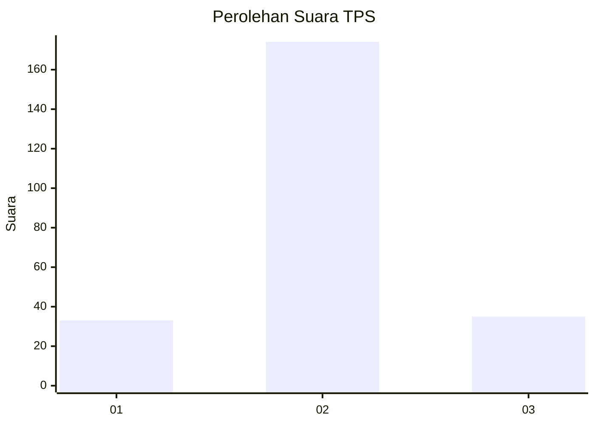
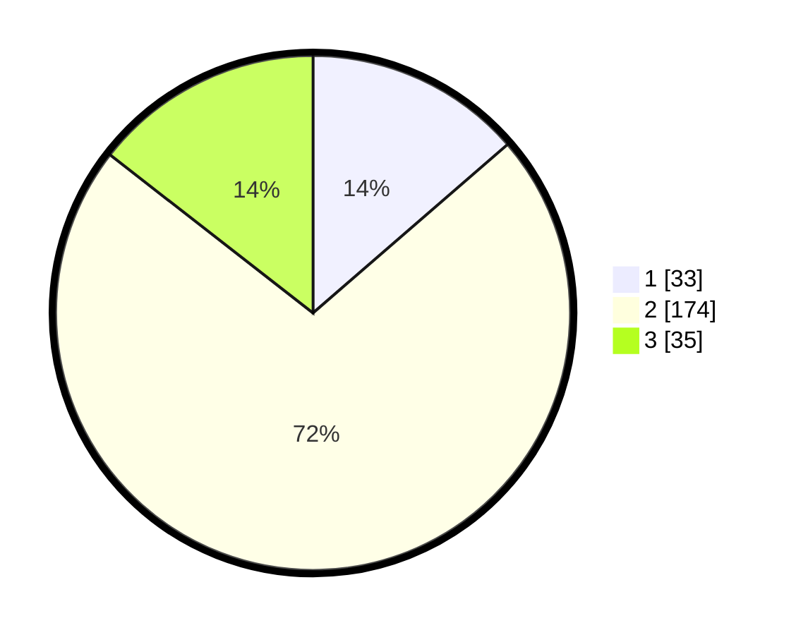

# Hasil

## Grafik

## Tabel

| No. | Nama Paslon    | Suara | Suara (raw) | Persentase |
|:--- |:-------------- | -----:| -----------:| ----------:|
| 1   | ANIES MUHAIMIN | 33    | [33][p-1]   | 13,64      |
| 2   | PRABOWO GIBRAN | 174   | [174][p-2]  | 71,90      |
| 3   | GANJAR MAHFUD  | 35    | [35][p-3]   | 14,46      |

[p-1]: https://github.com/gigit-pemilu/pemilu-2024/blob/main/pilpres/hitung-suara/sub/35-jawa-timur/sub/09-jember/sub/20-patrang/sub/1003-gebang/sub/027-tps/sub/paslon-1.txt
[p-2]: https://github.com/gigit-pemilu/pemilu-2024/blob/main/pilpres/hitung-suara/sub/35-jawa-timur/sub/09-jember/sub/20-patrang/sub/1003-gebang/sub/027-tps/sub/paslon-2.txt
[p-3]: https://github.com/gigit-pemilu/pemilu-2024/blob/main/pilpres/hitung-suara/sub/35-jawa-timur/sub/09-jember/sub/20-patrang/sub/1003-gebang/sub/027-tps/sub/paslon-3.txt

## Foto C Plano

https://sirekap-obj-formc.kpu.go.id/35cb/pemilu/ppwp/35/09/20/10/03/3509201003027-20240214-195520--8fc4a3fc-e1e8-4161-8afd-51bf0d39201d.jpg

https://sirekap-obj-formc.kpu.go.id/35cb/pemilu/ppwp/35/09/20/10/03/3509201003027-20240214-195643--8dc6b08f-9722-4d8a-bc78-55b449772138.jpg

https://sirekap-obj-formc.kpu.go.id/35cb/pemilu/ppwp/35/09/20/10/03/3509201003027-20240214-195730--8ee4de7f-d4be-4d4c-9fdb-d30226458438.jpg

## Metadata

| Key        | Value               |
| ---------- | ------------------- |
| Time Stamp | 2024-02-15 23:29:50 |

