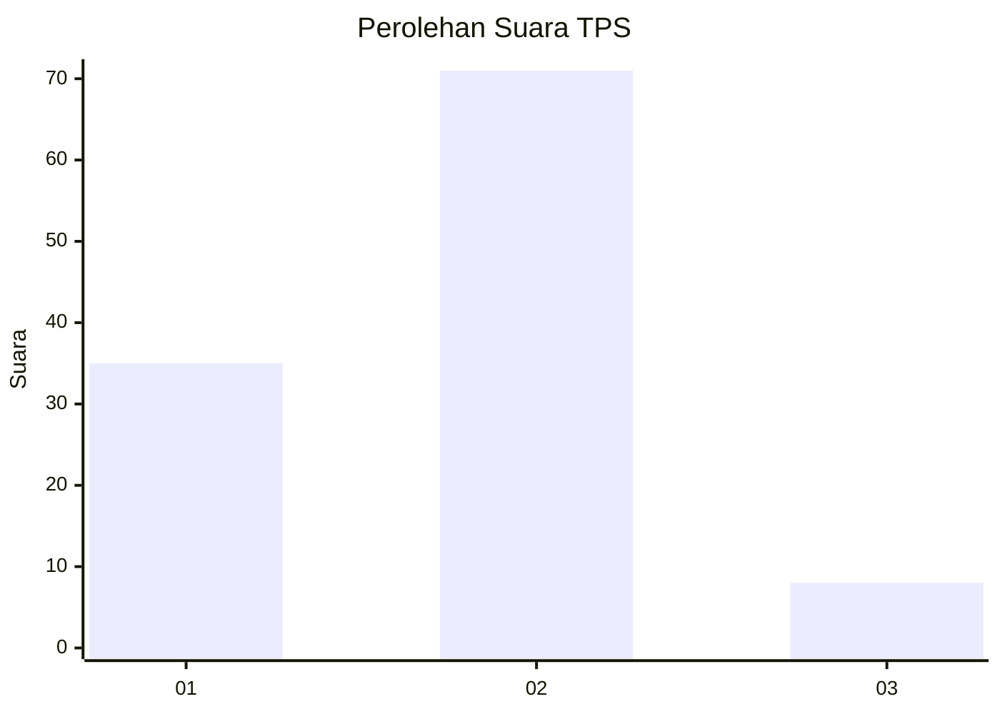
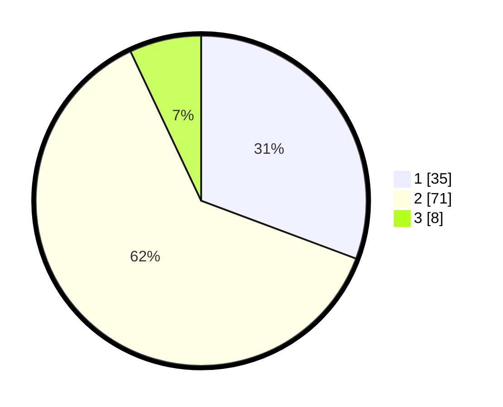

# Hasil

## Grafik

## Tabel

| No. | Nama Paslon    | Suara | Suara (raw) | Persentase |
|:--- |:-------------- | -----:| -----------:| ----------:|
| 1   | ANIES MUHAIMIN | 35    | [35][p-1]   | 30,70      |
| 2   | PRABOWO GIBRAN | 71    | [71][p-2]   | 62,28      |
| 3   | GANJAR MAHFUD  | 8     | [8][p-3]    | 7,02       |

[p-1]: https://github.com/gigit-pemilu/pemilu-2024/blob/main/pilpres/hitung-suara/sub/35-jawa-timur/sub/09-jember/sub/20-patrang/sub/1003-gebang/sub/072-tps/sub/paslon-1.txt
[p-2]: https://github.com/gigit-pemilu/pemilu-2024/blob/main/pilpres/hitung-suara/sub/35-jawa-timur/sub/09-jember/sub/20-patrang/sub/1003-gebang/sub/072-tps/sub/paslon-2.txt
[p-3]: https://github.com/gigit-pemilu/pemilu-2024/blob/main/pilpres/hitung-suara/sub/35-jawa-timur/sub/09-jember/sub/20-patrang/sub/1003-gebang/sub/072-tps/sub/paslon-3.txt

## Foto C Plano

https://sirekap-obj-formc.kpu.go.id/09a4/pemilu/ppwp/35/09/20/10/03/3509201003072-20240214-204435--fb2e9e3d-ae6d-4ef8-b161-28157dd2cedf.jpg

https://sirekap-obj-formc.kpu.go.id/09a4/pemilu/ppwp/35/09/20/10/03/3509201003072-20240214-204503--00a6943d-542e-4675-adf4-1e62d7d0fc58.jpg

https://sirekap-obj-formc.kpu.go.id/09a4/pemilu/ppwp/35/09/20/10/03/3509201003072-20240214-204541--bea9e64e-574c-421c-bc2e-c6f36001db4a.jpg

## Metadata

| Key        | Value               |
| ---------- | ------------------- |
| Time Stamp | 2024-02-25 13:00:00 |

