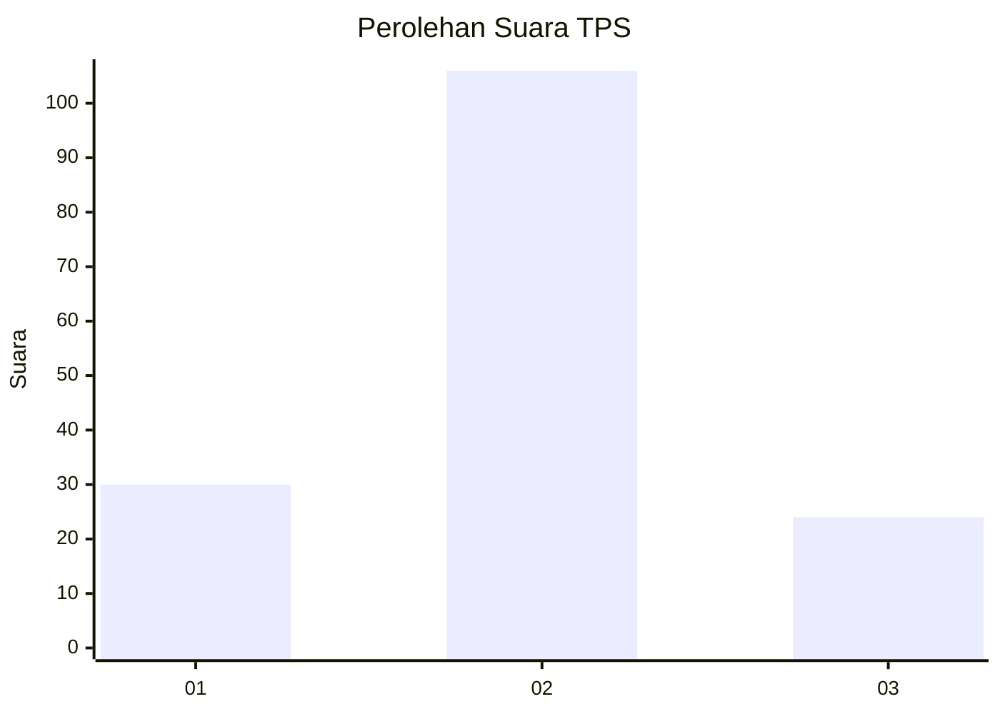
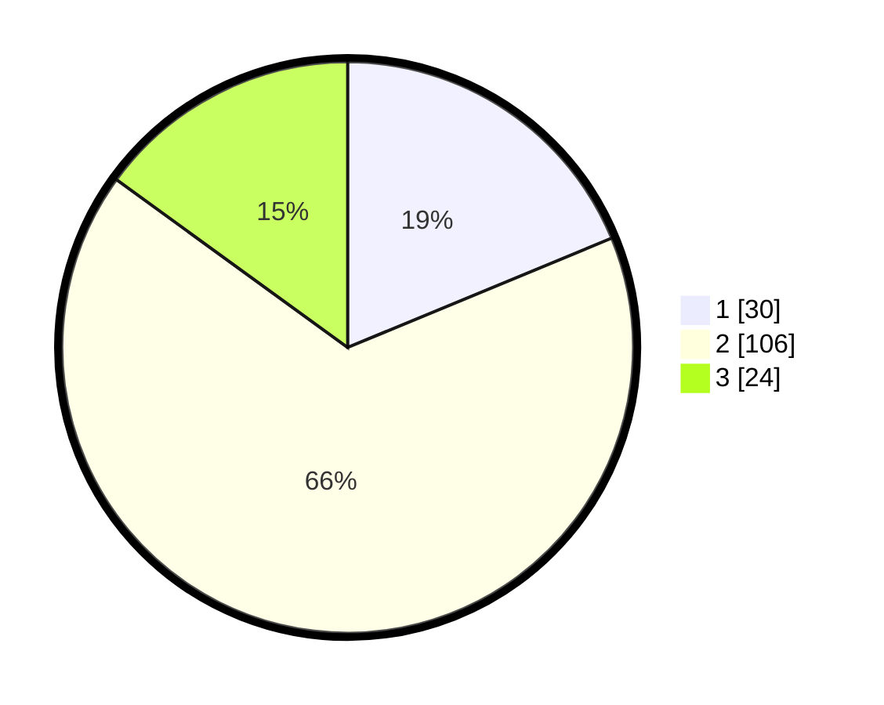

# Hasil

## Grafik

## Tabel

| No. | Nama Paslon    | Suara | Suara (raw) | Persentase |
|:--- |:-------------- | -----:| -----------:| ----------:|
| 1   | ANIES MUHAIMIN | 30    | [30][p-1]   | 18,75      |
| 2   | PRABOWO GIBRAN | 106   | [106][p-2]  | 66,25      |
| 3   | GANJAR MAHFUD  | 24    | [24][p-3]   | 15,00      |

[p-1]: https://github.com/gigit-pemilu/pemilu-2024/blob/main/pilpres/hitung-suara/sub/35-jawa-timur/sub/09-jember/sub/20-patrang/sub/1004-slawu/sub/016-tps/sub/paslon-1.txt
[p-2]: https://github.com/gigit-pemilu/pemilu-2024/blob/main/pilpres/hitung-suara/sub/35-jawa-timur/sub/09-jember/sub/20-patrang/sub/1004-slawu/sub/016-tps/sub/paslon-2.txt
[p-3]: https://github.com/gigit-pemilu/pemilu-2024/blob/main/pilpres/hitung-suara/sub/35-jawa-timur/sub/09-jember/sub/20-patrang/sub/1004-slawu/sub/016-tps/sub/paslon-3.txt

## Foto C Plano

https://sirekap-obj-formc.kpu.go.id/e06c/pemilu/ppwp/35/09/20/10/04/3509201004016-20240214-215033--354b06eb-e0aa-4add-a476-be33ce39b6d9.jpg

https://sirekap-obj-formc.kpu.go.id/e06c/pemilu/ppwp/35/09/20/10/04/3509201004016-20240214-202200--b23886e7-beca-4c5d-9008-ecea18d3d4bb.jpg

https://sirekap-obj-formc.kpu.go.id/e06c/pemilu/ppwp/35/09/20/10/04/3509201004016-20240214-202319--7855c1c3-c799-4814-9486-70d688adda3f.jpg

## Metadata

| Key        | Value               |
| ---------- | ------------------- |
| Time Stamp | 2024-02-15 04:00:24 |

