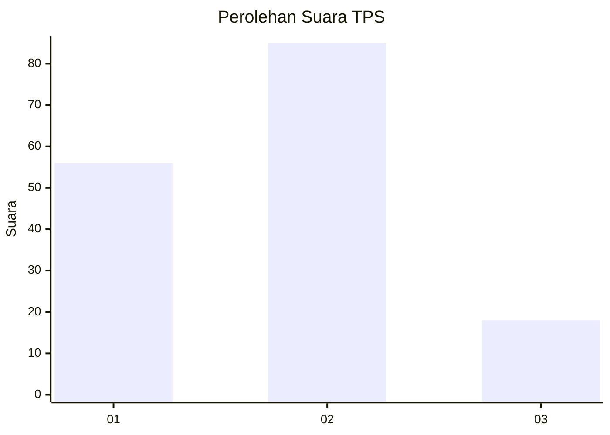
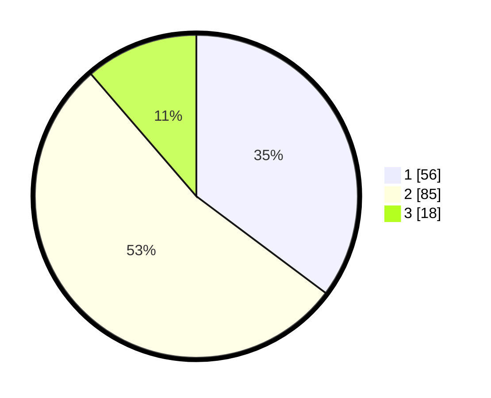

# Hasil

## Grafik

## Tabel

| No. | Nama Paslon    | Suara | Suara (raw) | Persentase |
|:--- |:-------------- | -----:| -----------:| ----------:|
| 1   | ANIES MUHAIMIN | 56    | [56][p-1]   | 35,22      |
| 2   | PRABOWO GIBRAN | 85    | [85][p-2]   | 53,46      |
| 3   | GANJAR MAHFUD  | 18    | [18][p-3]   | 11,32      |

[p-1]: https://github.com/gigit-pemilu/pemilu-2024/blob/main/pilpres/hitung-suara/sub/35-jawa-timur/sub/09-jember/sub/20-patrang/sub/1005-bintoro/sub/016-tps/sub/paslon-1.txt
[p-2]: https://github.com/gigit-pemilu/pemilu-2024/blob/main/pilpres/hitung-suara/sub/35-jawa-timur/sub/09-jember/sub/20-patrang/sub/1005-bintoro/sub/016-tps/sub/paslon-2.txt
[p-3]: https://github.com/gigit-pemilu/pemilu-2024/blob/main/pilpres/hitung-suara/sub/35-jawa-timur/sub/09-jember/sub/20-patrang/sub/1005-bintoro/sub/016-tps/sub/paslon-3.txt

## Foto C Plano

https://sirekap-obj-formc.kpu.go.id/38e5/pemilu/ppwp/35/09/20/10/05/3509201005016-20240214-215702--7a7637f8-1b28-4e08-b18b-3a0f46badbde.jpg

https://sirekap-obj-formc.kpu.go.id/38e5/pemilu/ppwp/35/09/20/10/05/3509201005016-20240214-220026--79850d78-81f3-427f-8731-daf9276d7ca7.jpg

https://sirekap-obj-formc.kpu.go.id/38e5/pemilu/ppwp/35/09/20/10/05/3509201005016-20240214-224422--68a7f018-c99b-4eb0-a724-f96941a17d23.jpg

## Metadata

| Key        | Value               |
| ---------- | ------------------- |
| Time Stamp | 2024-02-25 21:00:00 |

