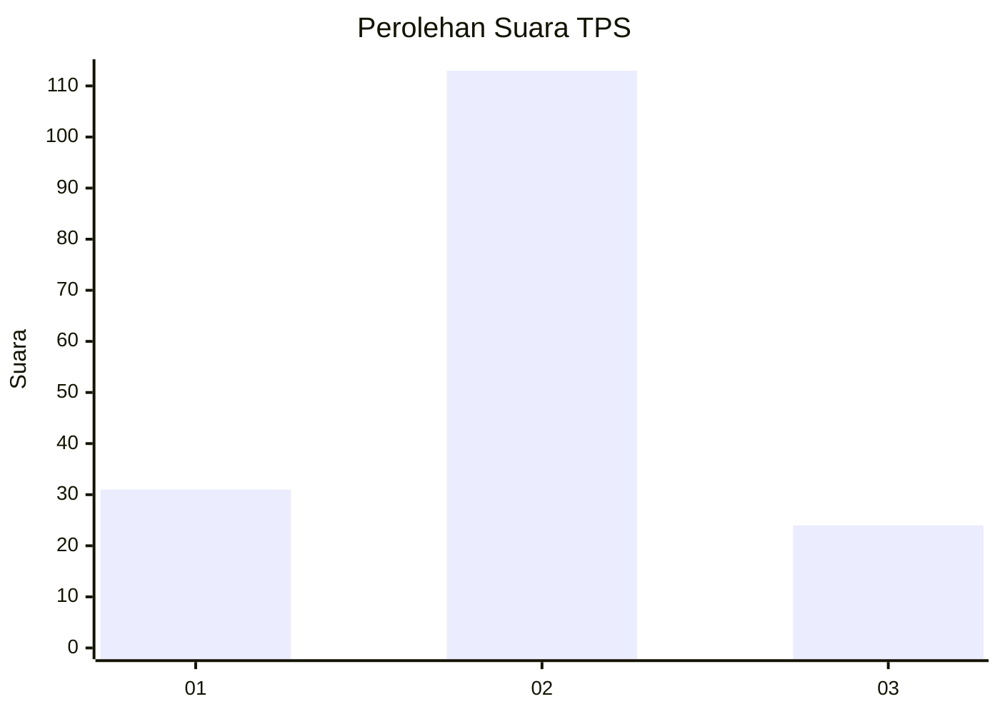
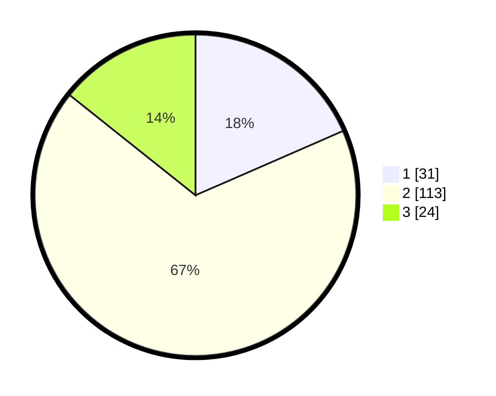

# Hasil

## Grafik

## Tabel

| No. | Nama Paslon    | Suara | Suara (raw) | Persentase |
|:--- |:-------------- | -----:| -----------:| ----------:|
| 1   | ANIES MUHAIMIN | 31    | [31][p-1]   | 18,45      |
| 2   | PRABOWO GIBRAN | 113   | [113][p-2]  | 67,26      |
| 3   | GANJAR MAHFUD  | 24    | [24][p-3]   | 14,29      |

[p-1]: https://github.com/gigit-pemilu/pemilu-2024-35-jawa-timur/blob/main/pilpres/hitung-suara/sub/35-jawa-timur/sub/09-jember/sub/20-patrang/sub/1005-bintoro/sub/031-tps/sub/paslon-1.txt
[p-2]: https://github.com/gigit-pemilu/pemilu-2024-35-jawa-timur/blob/main/pilpres/hitung-suara/sub/35-jawa-timur/sub/09-jember/sub/20-patrang/sub/1005-bintoro/sub/031-tps/sub/paslon-2.txt
[p-3]: https://github.com/gigit-pemilu/pemilu-2024-35-jawa-timur/blob/main/pilpres/hitung-suara/sub/35-jawa-timur/sub/09-jember/sub/20-patrang/sub/1005-bintoro/sub/031-tps/sub/paslon-3.txt

## Foto C Plano

https://sirekap-obj-formc.kpu.go.id/1131/pemilu/ppwp/35/09/20/10/05/3509201005031-20240215-152923--edf83287-d530-44eb-9fd4-8fbc61a3f625.jpg

https://sirekap-obj-formc.kpu.go.id/1131/pemilu/ppwp/35/09/20/10/05/3509201005031-20240215-152932--5e89c256-0f26-46fe-b52b-0c769b2c143e.jpg

https://sirekap-obj-formc.kpu.go.id/1131/pemilu/ppwp/35/09/20/10/05/3509201005031-20240215-152939--f57890b6-a4bb-4798-8b4e-c7f601262853.jpg

## Metadata

| Key        | Value               |
| ---------- | ------------------- |
| Time Stamp | 2024-02-25 12:00:00 |

