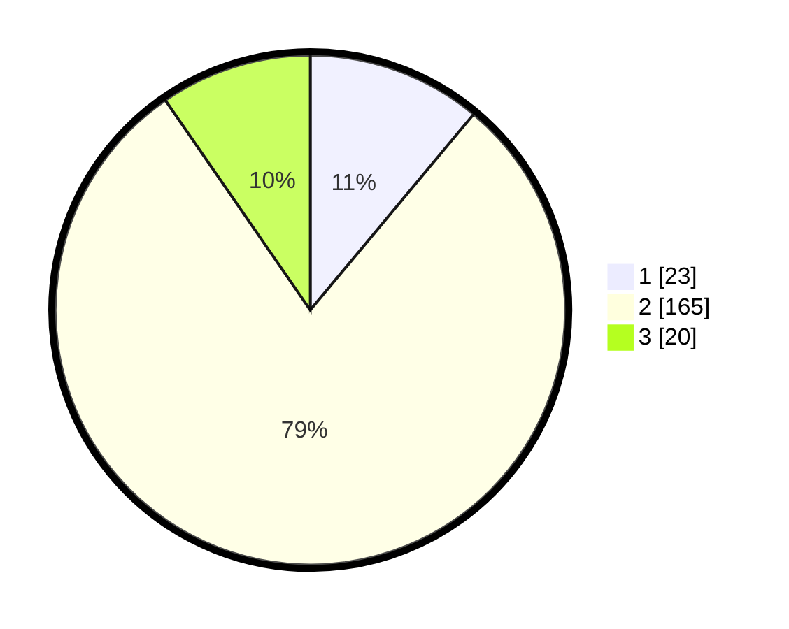

# Hasil

## Grafik

## Tabel

| No. | Nama Paslon    | Suara | Suara (raw) | Persentase |
|:--- |:-------------- | -----:| -----------:| ----------:|
| 1   | ANIES MUHAIMIN | 23    | [23][p-1]   | 11,06      |
| 2   | PRABOWO GIBRAN | 165   | [165][p-2]  | 79,33      |
| 3   | GANJAR MAHFUD  | 20    | [20][p-3]   | 9,62       |

[p-1]: https://github.com/gigit-pemilu/pemilu-2024-35-jawa-timur/blob/main/pilpres/hitung-suara/sub/35-jawa-timur/sub/09-jember/sub/20-patrang/sub/1006-jemberlor/sub/003-tps/sub/paslon-1.txt
[p-2]: https://github.com/gigit-pemilu/pemilu-2024-35-jawa-timur/blob/main/pilpres/hitung-suara/sub/35-jawa-timur/sub/09-jember/sub/20-patrang/sub/1006-jemberlor/sub/003-tps/sub/paslon-2.txt
[p-3]: https://github.com/gigit-pemilu/pemilu-2024-35-jawa-timur/blob/main/pilpres/hitung-suara/sub/35-jawa-timur/sub/09-jember/sub/20-patrang/sub/1006-jemberlor/sub/003-tps/sub/paslon-3.txt

## Foto C Plano

https://sirekap-obj-formc.kpu.go.id/1ba0/pemilu/ppwp/35/09/20/10/06/3509201006003-20240215-062245--4c43ae3c-7ee4-431b-bf7b-d3f2c7e2d0c3.jpg

https://sirekap-obj-formc.kpu.go.id/1ba0/pemilu/ppwp/35/09/20/10/06/3509201006003-20240215-064730--abf64cfe-2cf0-4a00-9dfa-8051a07b0681.jpg

https://sirekap-obj-formc.kpu.go.id/1ba0/pemilu/ppwp/35/09/20/10/06/3509201006003-20240215-065005--68cdce2b-7c60-447d-bd3a-42b9e11328b1.jpg

## Metadata

| Key        | Value               |
| ---------- | ------------------- |
| Time Stamp | 2024-02-15 15:00:29 |

