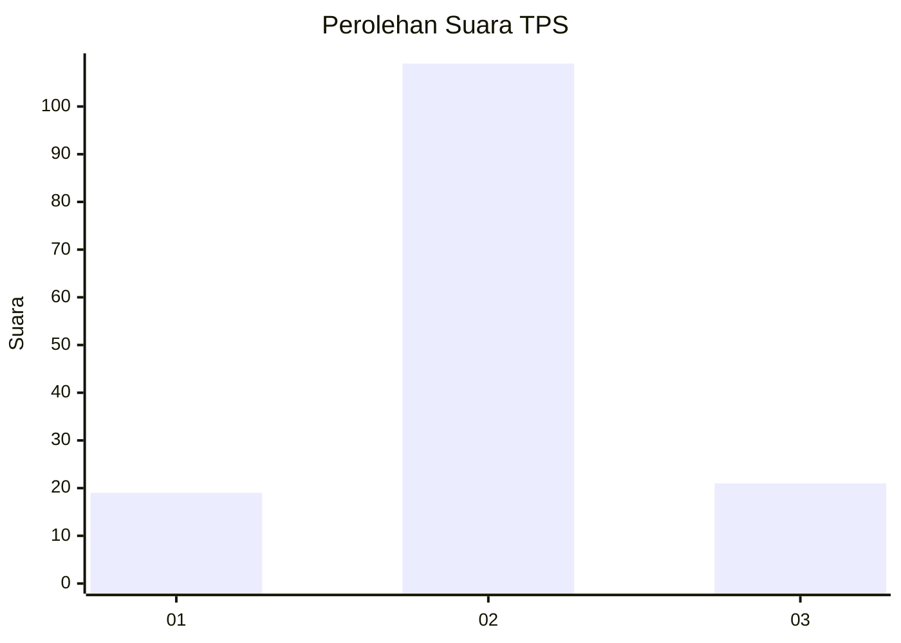
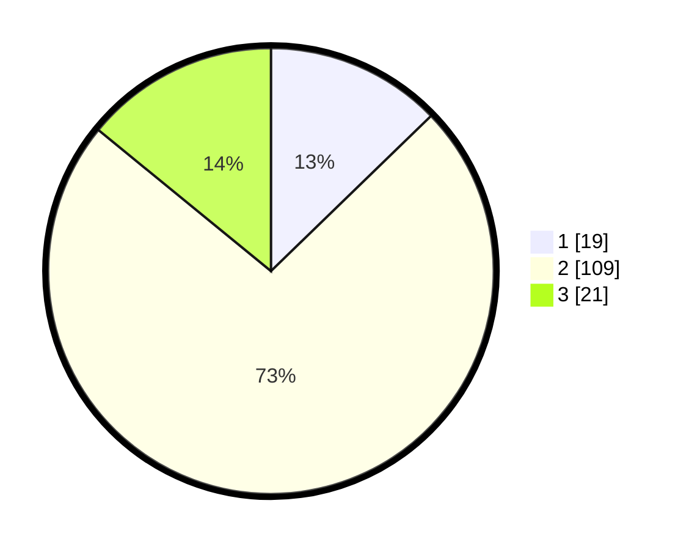

# Hasil

## Grafik

## Tabel

| No. | Nama Paslon    | Suara | Suara (raw) | Persentase |
|:--- |:-------------- | -----:| -----------:| ----------:|
| 1   | ANIES MUHAIMIN | 19    | [19][p-1]   | 12,75      |
| 2   | PRABOWO GIBRAN | 109   | [109][p-2]  | 73,15      |
| 3   | GANJAR MAHFUD  | 21    | [21][p-3]   | 14,09      |

[p-1]: https://github.com/gigit-pemilu/pemilu-2024-35-jawa-timur/blob/main/pilpres/hitung-suara/sub/35-jawa-timur/sub/09-jember/sub/20-patrang/sub/1006-jemberlor/sub/004-tps/sub/paslon-1.txt
[p-2]: https://github.com/gigit-pemilu/pemilu-2024-35-jawa-timur/blob/main/pilpres/hitung-suara/sub/35-jawa-timur/sub/09-jember/sub/20-patrang/sub/1006-jemberlor/sub/004-tps/sub/paslon-2.txt
[p-3]: https://github.com/gigit-pemilu/pemilu-2024-35-jawa-timur/blob/main/pilpres/hitung-suara/sub/35-jawa-timur/sub/09-jember/sub/20-patrang/sub/1006-jemberlor/sub/004-tps/sub/paslon-3.txt

## Foto C Plano

https://sirekap-obj-formc.kpu.go.id/2eaa/pemilu/ppwp/35/09/20/10/06/3509201006004-20240214-215621--2645c34e-4a34-4009-9787-a318cb9b701f.jpg

https://sirekap-obj-formc.kpu.go.id/2eaa/pemilu/ppwp/35/09/20/10/06/3509201006004-20240214-215756--d2ec43f0-53c3-40f6-a97e-f764e335c3b7.jpg

https://sirekap-obj-formc.kpu.go.id/2eaa/pemilu/ppwp/35/09/20/10/06/3509201006004-20240214-215948--b864288b-6ebb-41e1-8394-45cc3e89cd2f.jpg

## Metadata

| Key        | Value               |
| ---------- | ------------------- |
| Time Stamp | 2024-02-15 15:00:29 |

