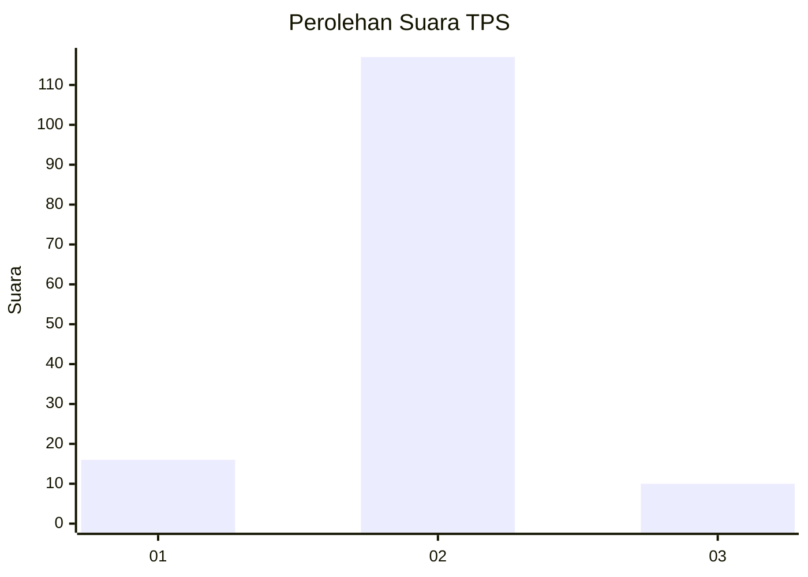
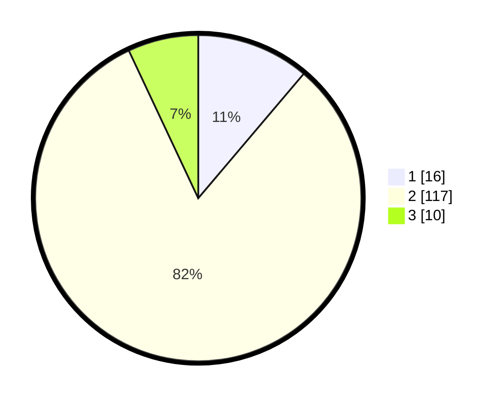

# Hasil

## Grafik

## Tabel

| No. | Nama Paslon    | Suara | Suara (raw) | Persentase |
|:--- |:-------------- | -----:| -----------:| ----------:|
| 1   | ANIES MUHAIMIN | 16    | [16][p-1]   | 11,19      |
| 2   | PRABOWO GIBRAN | 117   | [117][p-2]  | 81,82      |
| 3   | GANJAR MAHFUD  | 10    | [10][p-3]   | 6,99       |

[p-1]: https://github.com/gigit-pemilu/pemilu-2024-35-jawa-timur/blob/main/pilpres/hitung-suara/sub/35-jawa-timur/sub/09-jember/sub/20-patrang/sub/1006-jemberlor/sub/005-tps/sub/paslon-1.txt
[p-2]: https://github.com/gigit-pemilu/pemilu-2024-35-jawa-timur/blob/main/pilpres/hitung-suara/sub/35-jawa-timur/sub/09-jember/sub/20-patrang/sub/1006-jemberlor/sub/005-tps/sub/paslon-2.txt
[p-3]: https://github.com/gigit-pemilu/pemilu-2024-35-jawa-timur/blob/main/pilpres/hitung-suara/sub/35-jawa-timur/sub/09-jember/sub/20-patrang/sub/1006-jemberlor/sub/005-tps/sub/paslon-3.txt

## Foto C Plano

https://sirekap-obj-formc.kpu.go.id/3ac7/pemilu/ppwp/35/09/20/10/06/3509201006005-20240214-232514--7072c401-7729-4480-96a6-91598192e338.jpg

https://sirekap-obj-formc.kpu.go.id/3ac7/pemilu/ppwp/35/09/20/10/06/3509201006005-20240214-202032--de0093e1-495d-451c-835e-c29df50f1b9d.jpg

https://sirekap-obj-formc.kpu.go.id/3ac7/pemilu/ppwp/35/09/20/10/06/3509201006005-20240214-202039--74a3c320-7d32-40ab-b272-4a522a4ef5ee.jpg

## Metadata

| Key        | Value               |
| ---------- | ------------------- |
| Time Stamp | 2024-02-15 15:00:29 |

