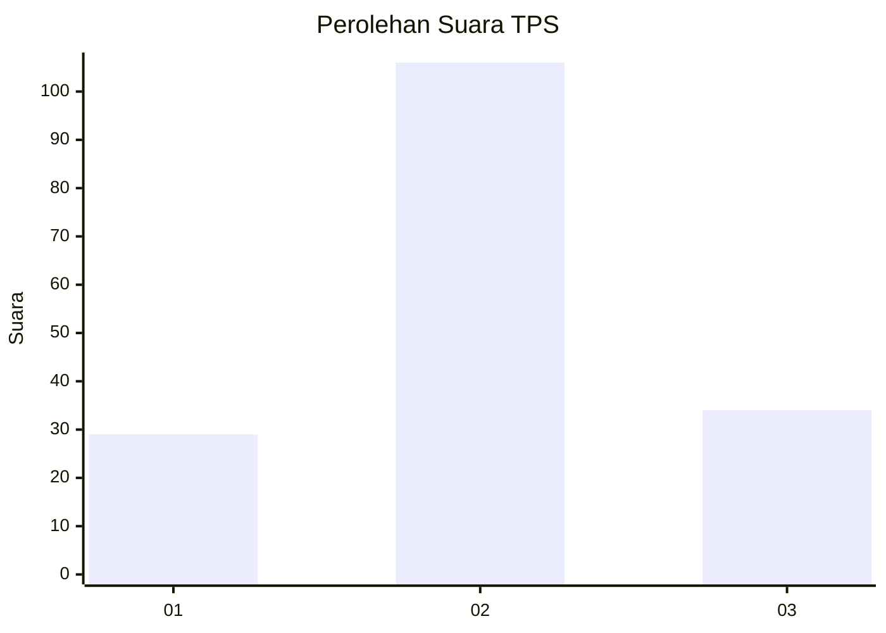
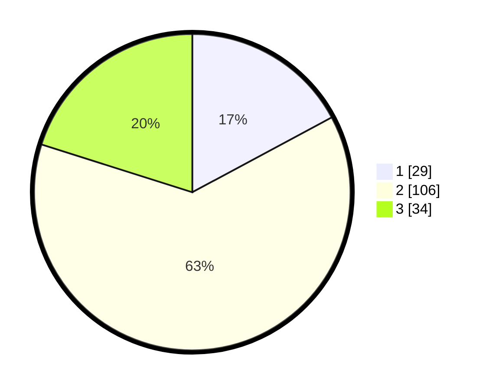

# Hasil

## Grafik

## Tabel

| No. | Nama Paslon    | Suara | Suara (raw) | Persentase |
|:--- |:-------------- | -----:| -----------:| ----------:|
| 1   | ANIES MUHAIMIN | 29    | [29][p-1]   | 17,16      |
| 2   | PRABOWO GIBRAN | 106   | [106][p-2]  | 62,72      |
| 3   | GANJAR MAHFUD  | 34    | [34][p-3]   | 20,12      |

[p-1]: https://github.com/gigit-pemilu/pemilu-2024-35-jawa-timur/blob/main/pilpres/hitung-suara/sub/35-jawa-timur/sub/09-jember/sub/20-patrang/sub/1006-jemberlor/sub/014-tps/sub/paslon-1.txt
[p-2]: https://github.com/gigit-pemilu/pemilu-2024-35-jawa-timur/blob/main/pilpres/hitung-suara/sub/35-jawa-timur/sub/09-jember/sub/20-patrang/sub/1006-jemberlor/sub/014-tps/sub/paslon-2.txt
[p-3]: https://github.com/gigit-pemilu/pemilu-2024-35-jawa-timur/blob/main/pilpres/hitung-suara/sub/35-jawa-timur/sub/09-jember/sub/20-patrang/sub/1006-jemberlor/sub/014-tps/sub/paslon-3.txt

## Foto C Plano

https://sirekap-obj-formc.kpu.go.id/7d0a/pemilu/ppwp/35/09/20/10/06/3509201006014-20240215-021651--dbb35070-cedc-4425-af51-0137e56b5a1f.jpg

https://sirekap-obj-formc.kpu.go.id/7d0a/pemilu/ppwp/35/09/20/10/06/3509201006014-20240215-021731--d822bbe3-3c72-412d-b735-31400f18ee2f.jpg

https://sirekap-obj-formc.kpu.go.id/7d0a/pemilu/ppwp/35/09/20/10/06/3509201006014-20240215-021831--58315a9a-365b-49d2-866f-829bcbdc910c.jpg

## Metadata

| Key        | Value               |
| ---------- | ------------------- |
| Time Stamp | 2024-02-15 15:00:29 |

