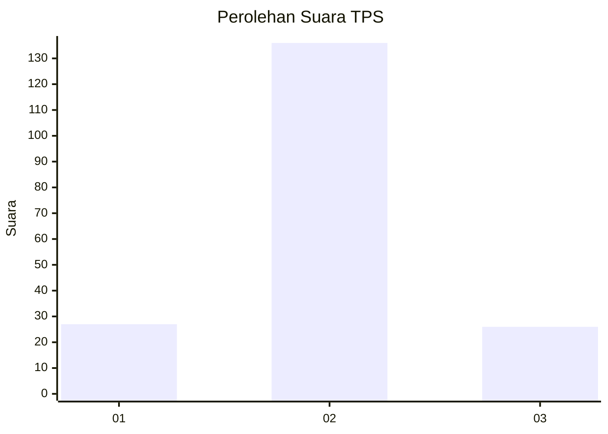
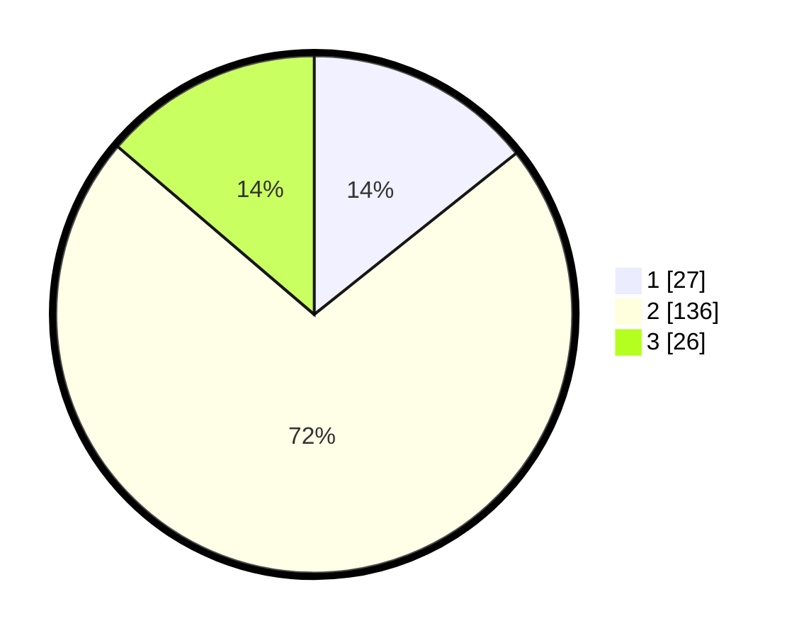

# Hasil

## Grafik

## Tabel

| No. | Nama Paslon    | Suara | Suara (raw) | Persentase |
|:--- |:-------------- | -----:| -----------:| ----------:|
| 1   | ANIES MUHAIMIN | 27    | [27][p-1]   | 14,29      |
| 2   | PRABOWO GIBRAN | 136   | [136][p-2]  | 71,96      |
| 3   | GANJAR MAHFUD  | 26    | [26][p-3]   | 13,76      |

[p-1]: https://github.com/gigit-pemilu/pemilu-2024/blob/main/pilpres/hitung-suara/sub/35-jawa-timur/sub/09-jember/sub/20-patrang/sub/1006-jemberlor/sub/044-tps/sub/paslon-1.txt
[p-2]: https://github.com/gigit-pemilu/pemilu-2024/blob/main/pilpres/hitung-suara/sub/35-jawa-timur/sub/09-jember/sub/20-patrang/sub/1006-jemberlor/sub/044-tps/sub/paslon-2.txt
[p-3]: https://github.com/gigit-pemilu/pemilu-2024/blob/main/pilpres/hitung-suara/sub/35-jawa-timur/sub/09-jember/sub/20-patrang/sub/1006-jemberlor/sub/044-tps/sub/paslon-3.txt

## Foto C Plano

https://sirekap-obj-formc.kpu.go.id/39a7/pemilu/ppwp/35/09/20/10/06/3509201006044-20240214-225949--30ba5d07-345c-4e10-824c-4bd514537ef1.jpg

https://sirekap-obj-formc.kpu.go.id/39a7/pemilu/ppwp/35/09/20/10/06/3509201006044-20240214-211301--309bbe45-a55e-4f16-9836-33a5d9aa0d8d.jpg

https://sirekap-obj-formc.kpu.go.id/39a7/pemilu/ppwp/35/09/20/10/06/3509201006044-20240214-225756--3c79a306-aeeb-495e-ae7a-18cc5c5908dd.jpg

## Metadata

| Key        | Value               |
| ---------- | ------------------- |
| Time Stamp | 2024-02-24 22:31:28 |

