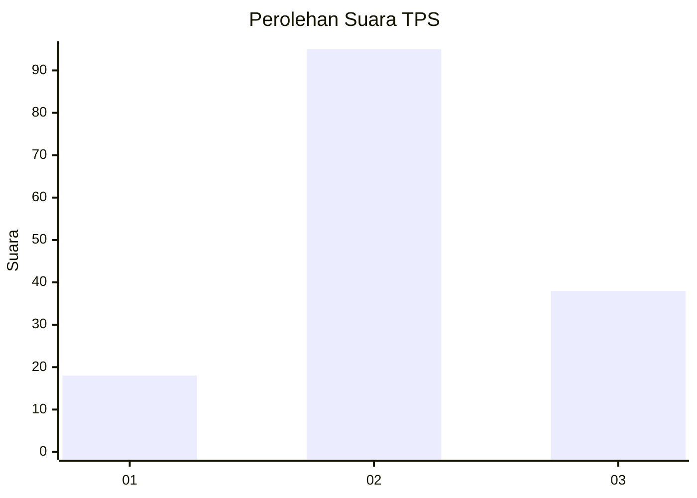
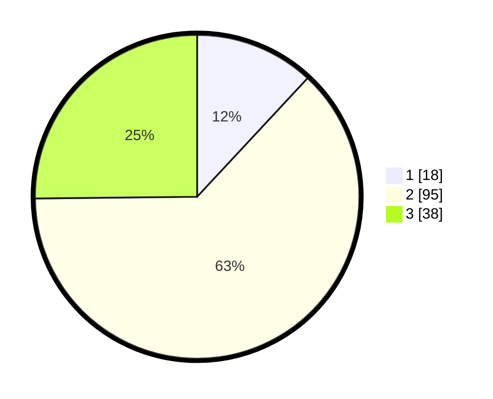

# Hasil

## Grafik

## Tabel

| No. | Nama Paslon    | Suara | Suara (raw) | Persentase |
|:--- |:-------------- | -----:| -----------:| ----------:|
| 1   | ANIES MUHAIMIN | 18    | [18][p-1]   | 11,92      |
| 2   | PRABOWO GIBRAN | 95    | [95][p-2]   | 62,91      |
| 3   | GANJAR MAHFUD  | 38    | [38][p-3]   | 25,17      |

[p-1]: https://github.com/gigit-pemilu/pemilu-2024/blob/main/pilpres/hitung-suara/sub/35-jawa-timur/sub/09-jember/sub/20-patrang/sub/1006-jemberlor/sub/048-tps/sub/paslon-1.txt
[p-2]: https://github.com/gigit-pemilu/pemilu-2024/blob/main/pilpres/hitung-suara/sub/35-jawa-timur/sub/09-jember/sub/20-patrang/sub/1006-jemberlor/sub/048-tps/sub/paslon-2.txt
[p-3]: https://github.com/gigit-pemilu/pemilu-2024/blob/main/pilpres/hitung-suara/sub/35-jawa-timur/sub/09-jember/sub/20-patrang/sub/1006-jemberlor/sub/048-tps/sub/paslon-3.txt

## Foto C Plano

https://sirekap-obj-formc.kpu.go.id/6335/pemilu/ppwp/35/09/20/10/06/3509201006048-20240214-220856--26e1c88c-a0cd-4c1f-a516-c90f8820e2db.jpg

https://sirekap-obj-formc.kpu.go.id/6335/pemilu/ppwp/35/09/20/10/06/3509201006048-20240214-220907--21255cff-79b8-4ef3-bbaf-9d8e8eb41f50.jpg

https://sirekap-obj-formc.kpu.go.id/6335/pemilu/ppwp/35/09/20/10/06/3509201006048-20240214-220916--a5f136c8-de8d-490f-b9af-5a431b2fcca2.jpg

## Metadata

| Key        | Value               |
| ---------- | ------------------- |
| Time Stamp | 2024-02-24 22:31:28 |

