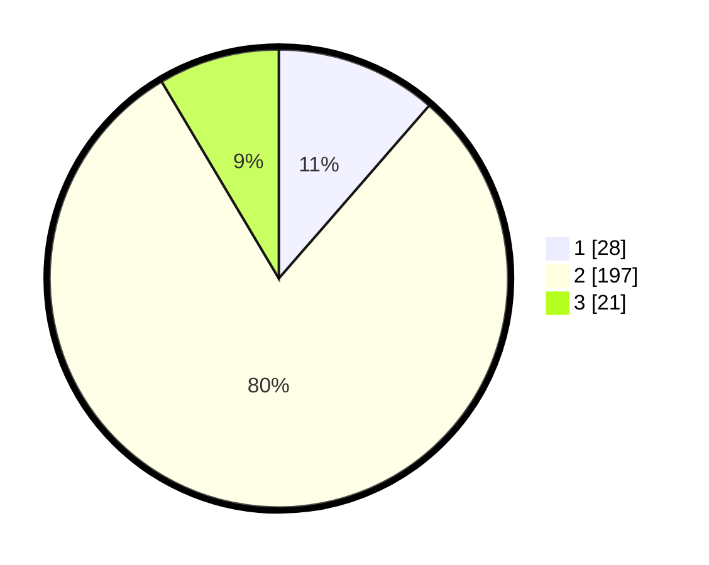

# Hasil

## Grafik

## Tabel

| No. | Nama Paslon    | Suara | Suara (raw) | Persentase |
|:--- |:-------------- | -----:| -----------:| ----------:|
| 1   | ANIES MUHAIMIN | 28    | [28][p-1]   | 11,38      |
| 2   | PRABOWO GIBRAN | 197   | [197][p-2]  | 80,08      |
| 3   | GANJAR MAHFUD  | 21    | [21][p-3]   | 8,54       |

[p-1]: https://github.com/gigit-pemilu/pemilu-2024-35-jawa-timur/blob/main/pilpres/hitung-suara/sub/35-jawa-timur/sub/09-jember/sub/20-patrang/sub/1006-jemberlor/sub/051-tps/sub/paslon-1.txt
[p-2]: https://github.com/gigit-pemilu/pemilu-2024-35-jawa-timur/blob/main/pilpres/hitung-suara/sub/35-jawa-timur/sub/09-jember/sub/20-patrang/sub/1006-jemberlor/sub/051-tps/sub/paslon-2.txt
[p-3]: https://github.com/gigit-pemilu/pemilu-2024-35-jawa-timur/blob/main/pilpres/hitung-suara/sub/35-jawa-timur/sub/09-jember/sub/20-patrang/sub/1006-jemberlor/sub/051-tps/sub/paslon-3.txt

## Foto C Plano

https://sirekap-obj-formc.kpu.go.id/4666/pemilu/ppwp/35/09/20/10/06/3509201006051-20240215-005637--ab47ad1c-9acf-48b4-b786-eab46737a5fa.jpg

https://sirekap-obj-formc.kpu.go.id/4666/pemilu/ppwp/35/09/20/10/06/3509201006051-20240215-005947--5fc34681-29c3-4dae-b0a8-233f8ca341a7.jpg

https://sirekap-obj-formc.kpu.go.id/4666/pemilu/ppwp/35/09/20/10/06/3509201006051-20240215-010105--6a3403cf-1cf1-403c-b76b-ba9a262dcbc2.jpg

## Metadata

| Key        | Value               |
| ---------- | ------------------- |
| Time Stamp | 2024-02-25 12:00:00 |

