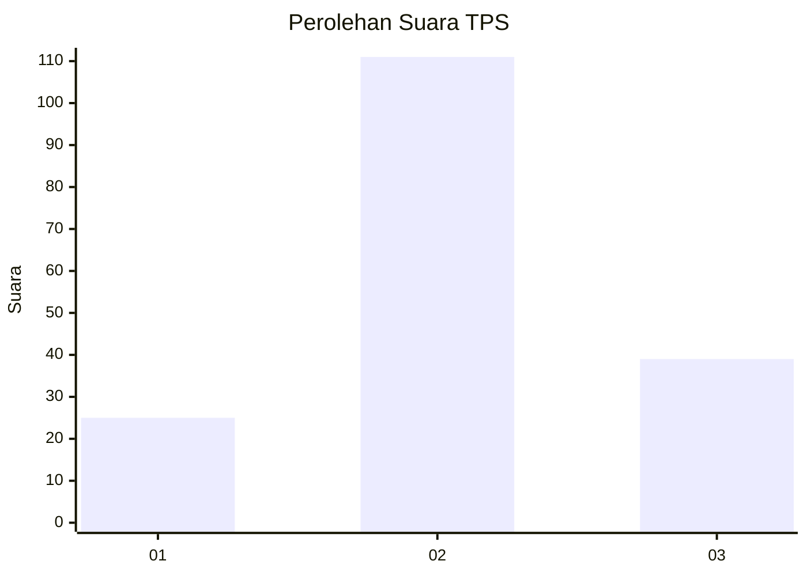
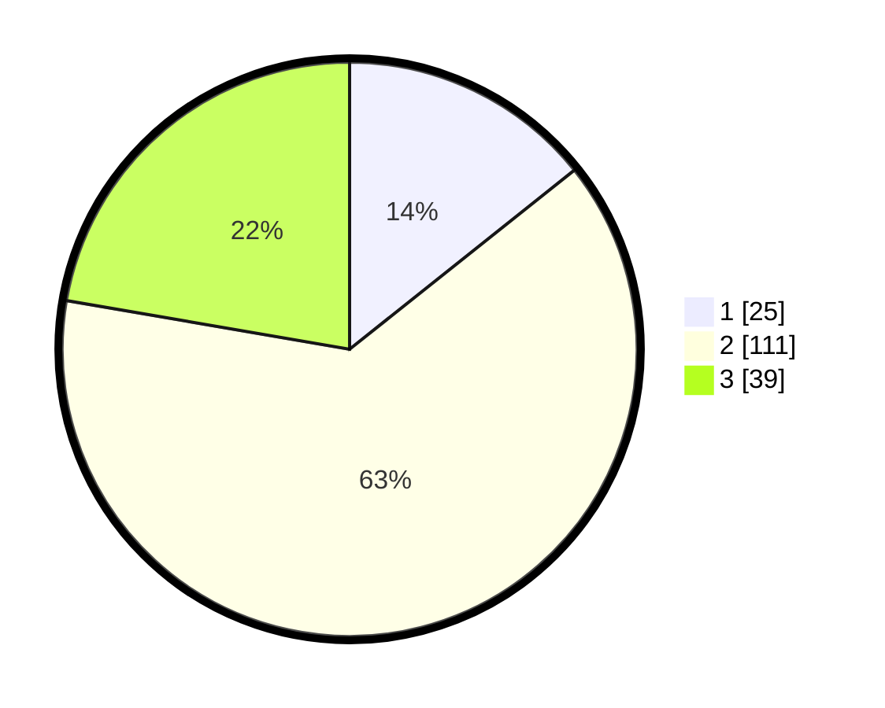

# Hasil

## Grafik

## Tabel

| No. | Nama Paslon    | Suara | Suara (raw) | Persentase |
|:--- |:-------------- | -----:| -----------:| ----------:|
| 1   | ANIES MUHAIMIN | 25    | [25][p-1]   | 14,29      |
| 2   | PRABOWO GIBRAN | 111   | [111][p-2]  | 63,43      |
| 3   | GANJAR MAHFUD  | 39    | [39][p-3]   | 22,29      |

[p-1]: https://github.com/gigit-pemilu/pemilu-2024/blob/main/pilpres/hitung-suara/sub/35-jawa-timur/sub/09-jember/sub/20-patrang/sub/1006-jemberlor/sub/052-tps/sub/paslon-1.txt
[p-2]: https://github.com/gigit-pemilu/pemilu-2024/blob/main/pilpres/hitung-suara/sub/35-jawa-timur/sub/09-jember/sub/20-patrang/sub/1006-jemberlor/sub/052-tps/sub/paslon-2.txt
[p-3]: https://github.com/gigit-pemilu/pemilu-2024/blob/main/pilpres/hitung-suara/sub/35-jawa-timur/sub/09-jember/sub/20-patrang/sub/1006-jemberlor/sub/052-tps/sub/paslon-3.txt

## Foto C Plano

https://sirekap-obj-formc.kpu.go.id/e3bf/pemilu/ppwp/35/09/20/10/06/3509201006052-20240224-222826--18443506-4fe8-4b5f-8a86-062f6766f1b9.jpg

https://sirekap-obj-formc.kpu.go.id/e3bf/pemilu/ppwp/35/09/20/10/06/3509201006052-20240215-021320--a7c29783-611c-4d1e-9a4f-6d3d5021cf02.jpg

https://sirekap-obj-formc.kpu.go.id/e3bf/pemilu/ppwp/35/09/20/10/06/3509201006052-20240215-001507--3d8385cb-1a73-411a-8d18-85a0bb4b9ac1.jpg

## Metadata

| Key        | Value               |
| ---------- | ------------------- |
| Time Stamp | 2024-02-24 22:31:28 |

