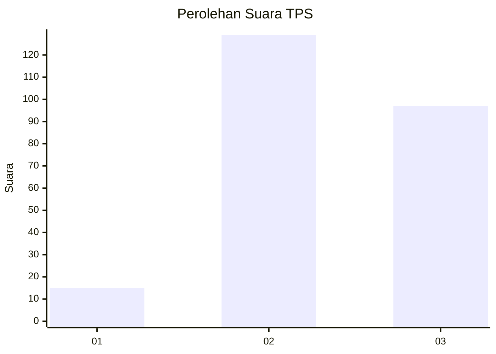
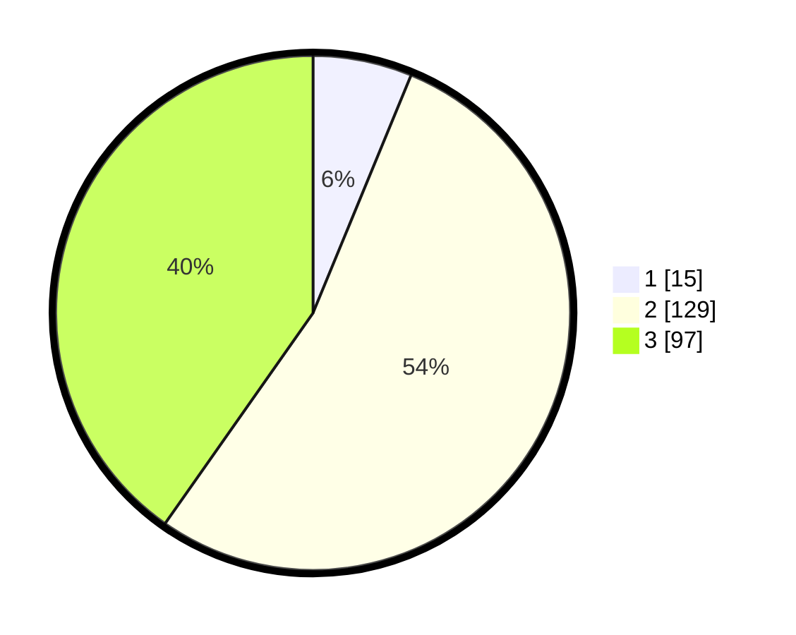

# Hasil

## Grafik

## Tabel

| No. | Nama Paslon    | Suara | Suara (raw) | Persentase |
|:--- |:-------------- | -----:| -----------:| ----------:|
| 1   | ANIES MUHAIMIN | 15    | [15][p-1]   | 6,22       |
| 2   | PRABOWO GIBRAN | 129   | [129][p-2]  | 53,53      |
| 3   | GANJAR MAHFUD  | 97    | [97][p-3]   | 40,25      |

[p-1]: https://github.com/gigit-pemilu/pemilu-2024-35-jawa-timur/blob/main/pilpres/hitung-suara/sub/35-jawa-timur/sub/09-jember/sub/20-patrang/sub/1006-jemberlor/sub/903-tps/sub/paslon-1.txt
[p-2]: https://github.com/gigit-pemilu/pemilu-2024-35-jawa-timur/blob/main/pilpres/hitung-suara/sub/35-jawa-timur/sub/09-jember/sub/20-patrang/sub/1006-jemberlor/sub/903-tps/sub/paslon-2.txt
[p-3]: https://github.com/gigit-pemilu/pemilu-2024-35-jawa-timur/blob/main/pilpres/hitung-suara/sub/35-jawa-timur/sub/09-jember/sub/20-patrang/sub/1006-jemberlor/sub/903-tps/sub/paslon-3.txt

## Foto C Plano

https://sirekap-obj-formc.kpu.go.id/5351/pemilu/ppwp/35/09/20/10/06/3509201006903-20240215-015533--021f2bd8-65ad-44e6-980c-ea8bc54c32f4.jpg

https://sirekap-obj-formc.kpu.go.id/5351/pemilu/ppwp/35/09/20/10/06/3509201006903-20240215-015653--46a7c764-8be6-4565-a0eb-fc122466a7d4.jpg

https://sirekap-obj-formc.kpu.go.id/5351/pemilu/ppwp/35/09/20/10/06/3509201006903-20240215-015745--855f658a-f428-4fcc-b9a7-15af917cf79c.jpg

## Metadata

| Key        | Value               |
| ---------- | ------------------- |
| Time Stamp | 2024-02-25 11:00:00 |

