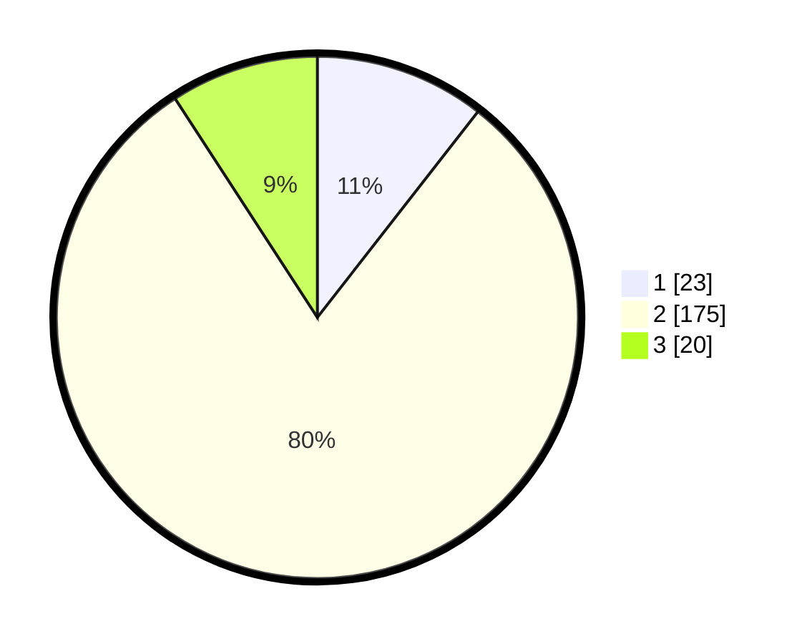

# Hasil

## Grafik

## Tabel

| No. | Nama Paslon    | Suara | Suara (raw) | Persentase |
|:--- |:-------------- | -----:| -----------:| ----------:|
| 1   | ANIES MUHAIMIN | 23    | [23][p-1]   | 10,55      |
| 2   | PRABOWO GIBRAN | 175   | [175][p-2]  | 80,28      |
| 3   | GANJAR MAHFUD  | 20    | [20][p-3]   | 9,17       |

[p-1]: https://github.com/gigit-pemilu/pemilu-2024-35-jawa-timur/blob/main/pilpres/hitung-suara/sub/35-jawa-timur/sub/09-jember/sub/20-patrang/sub/1007-patrang/sub/022-tps/sub/paslon-1.txt
[p-2]: https://github.com/gigit-pemilu/pemilu-2024-35-jawa-timur/blob/main/pilpres/hitung-suara/sub/35-jawa-timur/sub/09-jember/sub/20-patrang/sub/1007-patrang/sub/022-tps/sub/paslon-2.txt
[p-3]: https://github.com/gigit-pemilu/pemilu-2024-35-jawa-timur/blob/main/pilpres/hitung-suara/sub/35-jawa-timur/sub/09-jember/sub/20-patrang/sub/1007-patrang/sub/022-tps/sub/paslon-3.txt

## Foto C Plano

https://sirekap-obj-formc.kpu.go.id/d9b5/pemilu/ppwp/35/09/20/10/07/3509201007022-20240215-005124--da1a3729-a307-4af7-8e87-100674bbb4c9.jpg

https://sirekap-obj-formc.kpu.go.id/d9b5/pemilu/ppwp/35/09/20/10/07/3509201007022-20240216-130124--3c057aea-a9a6-46a9-83c3-fa4a96568b35.jpg

https://sirekap-obj-formc.kpu.go.id/d9b5/pemilu/ppwp/35/09/20/10/07/3509201007022-20240216-130009--00ad1057-32f4-4794-994b-baa8383eb454.jpg

## Metadata

| Key        | Value               |
| ---------- | ------------------- |
| Time Stamp | 2024-02-25 21:00:00 |

