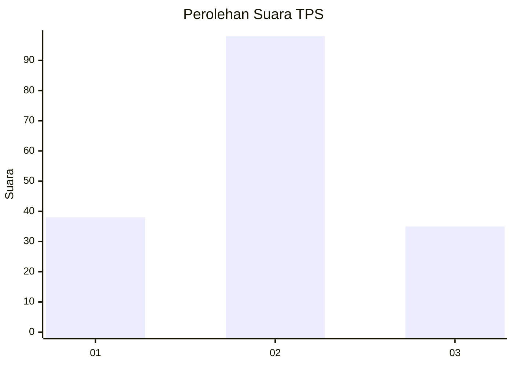
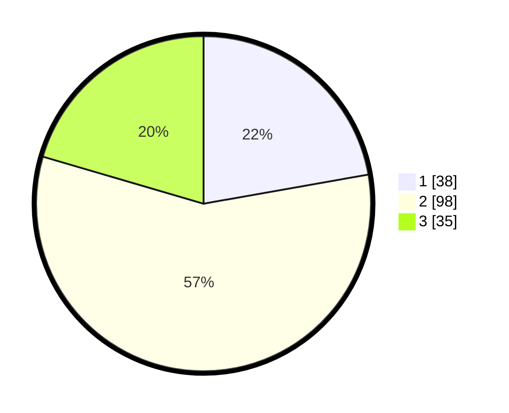

# Hasil

## Grafik

## Tabel

| No. | Nama Paslon    | Suara | Suara (raw) | Persentase |
|:--- |:-------------- | -----:| -----------:| ----------:|
| 1   | ANIES MUHAIMIN | 38    | [38][p-1]   | 22,22      |
| 2   | PRABOWO GIBRAN | 98    | [98][p-2]   | 57,31      |
| 3   | GANJAR MAHFUD  | 35    | [35][p-3]   | 20,47      |

[p-1]: https://github.com/gigit-pemilu/pemilu-2024/blob/main/pilpres/hitung-suara/sub/35-jawa-timur/sub/09-jember/sub/20-patrang/sub/1007-patrang/sub/027-tps/sub/paslon-1.txt
[p-2]: https://github.com/gigit-pemilu/pemilu-2024/blob/main/pilpres/hitung-suara/sub/35-jawa-timur/sub/09-jember/sub/20-patrang/sub/1007-patrang/sub/027-tps/sub/paslon-2.txt
[p-3]: https://github.com/gigit-pemilu/pemilu-2024/blob/main/pilpres/hitung-suara/sub/35-jawa-timur/sub/09-jember/sub/20-patrang/sub/1007-patrang/sub/027-tps/sub/paslon-3.txt

## Foto C Plano

https://sirekap-obj-formc.kpu.go.id/5cd2/pemilu/ppwp/35/09/20/10/07/3509201007027-20240214-230246--382c7a1d-e744-4b90-9d43-127c8fe36f2a.jpg

https://sirekap-obj-formc.kpu.go.id/5cd2/pemilu/ppwp/35/09/20/10/07/3509201007027-20240214-230320--39b5a000-d676-46b9-99d0-064437d7a70b.jpg

https://sirekap-obj-formc.kpu.go.id/5cd2/pemilu/ppwp/35/09/20/10/07/3509201007027-20240214-230344--fca1674a-f13c-4bde-92f5-4365083e963a.jpg

## Metadata

| Key        | Value               |
| ---------- | ------------------- |
| Time Stamp | 2024-02-25 21:00:00 |

