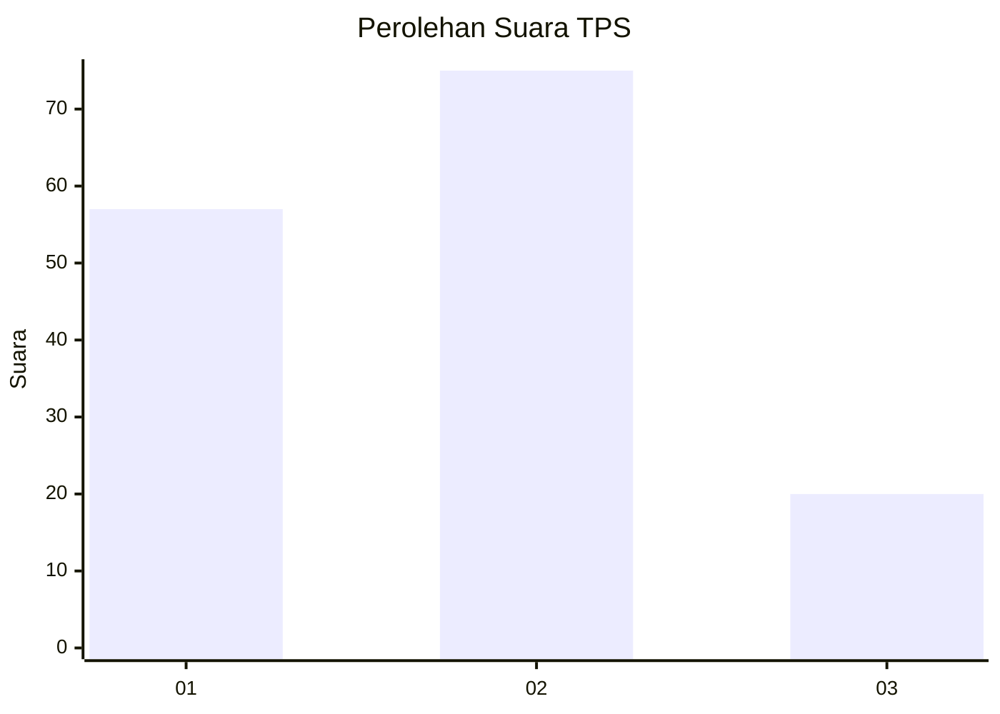
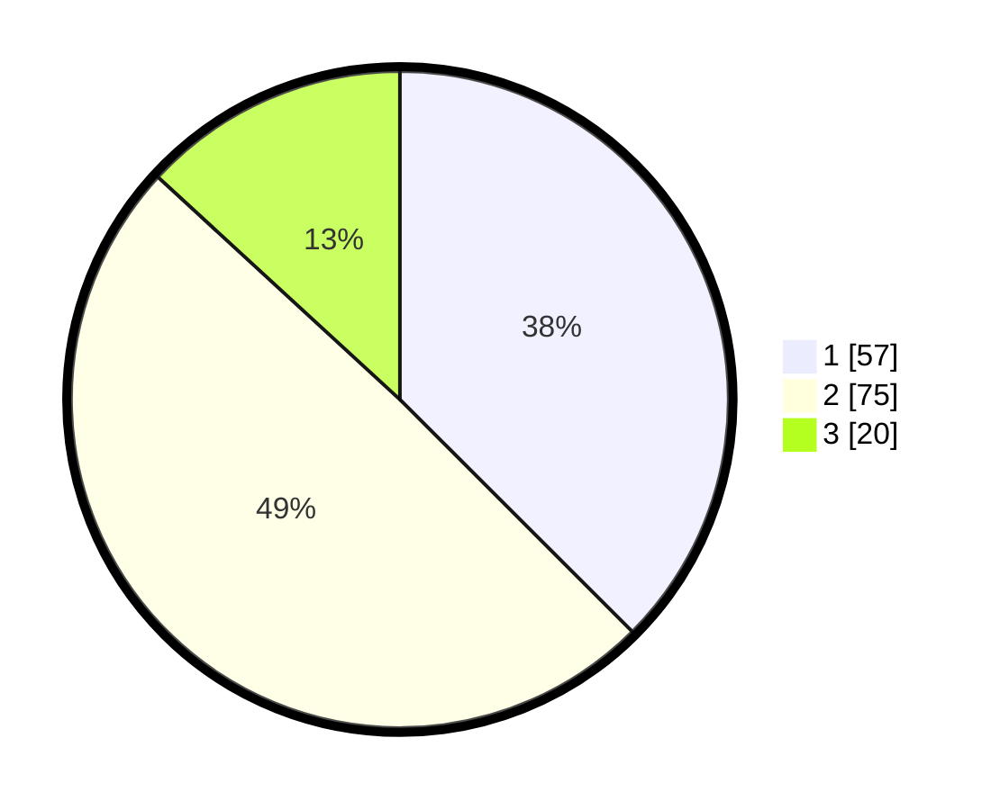

# Hasil

## Grafik

## Tabel

| No. | Nama Paslon    | Suara | Suara (raw) | Persentase |
|:--- |:-------------- | -----:| -----------:| ----------:|
| 1   | ANIES MUHAIMIN | 57    | [57][p-1]   | 37,50      |
| 2   | PRABOWO GIBRAN | 75    | [75][p-2]   | 49,34      |
| 3   | GANJAR MAHFUD  | 20    | [20][p-3]   | 13,16      |

[p-1]: https://github.com/gigit-pemilu/pemilu-2024/blob/main/pilpres/hitung-suara/sub/35-jawa-timur/sub/09-jember/sub/20-patrang/sub/1007-patrang/sub/047-tps/sub/paslon-1.txt
[p-2]: https://github.com/gigit-pemilu/pemilu-2024/blob/main/pilpres/hitung-suara/sub/35-jawa-timur/sub/09-jember/sub/20-patrang/sub/1007-patrang/sub/047-tps/sub/paslon-2.txt
[p-3]: https://github.com/gigit-pemilu/pemilu-2024/blob/main/pilpres/hitung-suara/sub/35-jawa-timur/sub/09-jember/sub/20-patrang/sub/1007-patrang/sub/047-tps/sub/paslon-3.txt

## Foto C Plano

https://sirekap-obj-formc.kpu.go.id/45e5/pemilu/ppwp/35/09/20/10/07/3509201007047-20240215-012510--d3a1ab6a-86c0-41dc-b3c5-611cb5fbfa31.jpg

https://sirekap-obj-formc.kpu.go.id/45e5/pemilu/ppwp/35/09/20/10/07/3509201007047-20240215-012633--6964f42d-48af-48fa-b5ce-8e3d1f900c24.jpg

https://sirekap-obj-formc.kpu.go.id/45e5/pemilu/ppwp/35/09/20/10/07/3509201007047-20240215-012746--bd646cd3-fd20-4f39-b688-7590ba9189f6.jpg

## Metadata

| Key        | Value               |
| ---------- | ------------------- |
| Time Stamp | 2024-02-25 16:00:00 |

