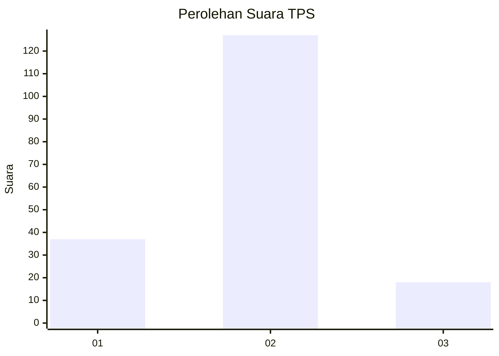

# Hasil

## Grafik

## Tabel

| No. | Nama Paslon    | Suara | Suara (raw) | Persentase |
|:--- |:-------------- | -----:| -----------:| ----------:|
| 1   | ANIES MUHAIMIN | 37    | [37][p-1]   | 20,33      |
| 2   | PRABOWO GIBRAN | 127   | [127][p-2]  | 69,78      |
| 3   | GANJAR MAHFUD  | 18    | [18][p-3]   | 9,89       |

[p-1]: https://github.com/gigit-pemilu/pemilu-2024-35-jawa-timur/blob/main/pilpres/hitung-suara/sub/35-jawa-timur/sub/09-jember/sub/20-patrang/sub/1008-baratan/sub/010-tps/sub/paslon-1.txt
[p-2]: https://github.com/gigit-pemilu/pemilu-2024-35-jawa-timur/blob/main/pilpres/hitung-suara/sub/35-jawa-timur/sub/09-jember/sub/20-patrang/sub/1008-baratan/sub/010-tps/sub/paslon-2.txt
[p-3]: https://github.com/gigit-pemilu/pemilu-2024-35-jawa-timur/blob/main/pilpres/hitung-suara/sub/35-jawa-timur/sub/09-jember/sub/20-patrang/sub/1008-baratan/sub/010-tps/sub/paslon-3.txt

## Foto C Plano

https://sirekap-obj-formc.kpu.go.id/e36a/pemilu/ppwp/35/09/20/10/08/3509201008010-20240214-231310--3a5493c9-d431-4c15-8009-8b6f176ccb1f.jpg

https://sirekap-obj-formc.kpu.go.id/e36a/pemilu/ppwp/35/09/20/10/08/3509201008010-20240214-233755--38c2e752-ec60-4410-ab98-b4cad4dc5125.jpg

https://sirekap-obj-formc.kpu.go.id/e36a/pemilu/ppwp/35/09/20/10/08/3509201008010-20240214-233845--4db34324-c515-41f6-8473-c5aa7b7bb14d.jpg

## Metadata

| Key        | Value               |
| ---------- | ------------------- |
| Time Stamp | 2024-02-15 09:00:24 |

