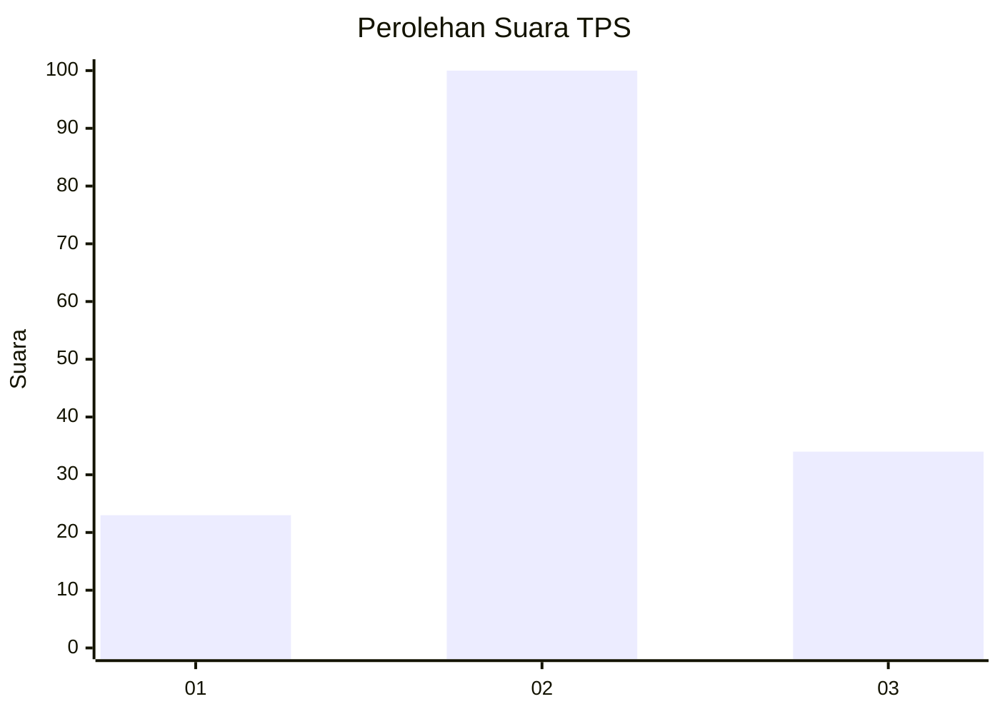
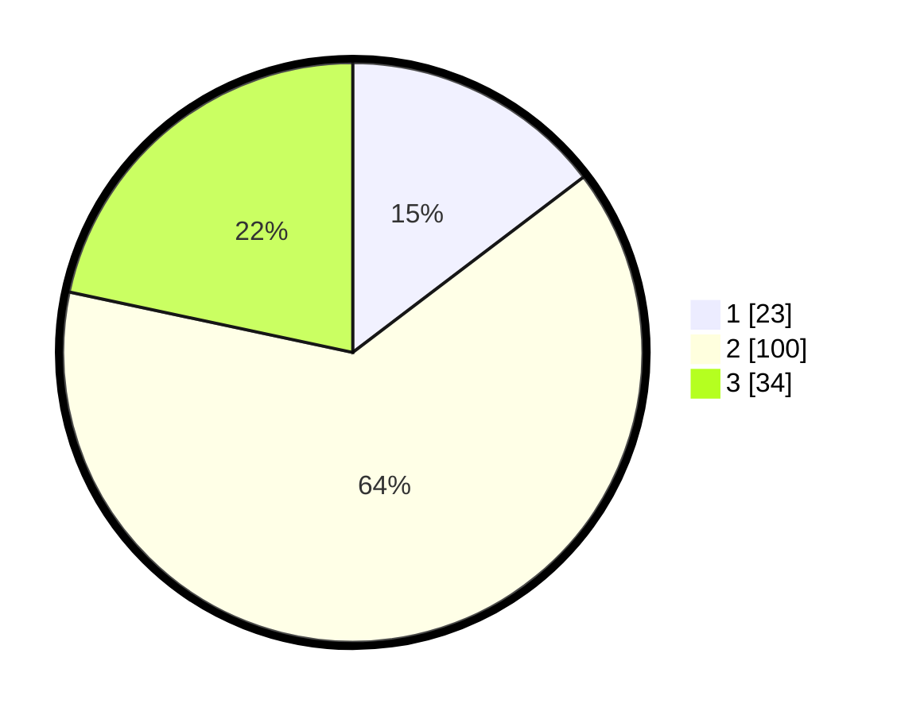

# Hasil

## Grafik

## Tabel

| No. | Nama Paslon    | Suara | Suara (raw) | Persentase |
|:--- |:-------------- | -----:| -----------:| ----------:|
| 1   | ANIES MUHAIMIN | 23    | [23][p-1]   | 14,65      |
| 2   | PRABOWO GIBRAN | 100   | [100][p-2]  | 63,69      |
| 3   | GANJAR MAHFUD  | 34    | [34][p-3]   | 21,66      |

[p-1]: https://github.com/gigit-pemilu/pemilu-2024-35-jawa-timur/blob/main/pilpres/hitung-suara/sub/35-jawa-timur/sub/09-jember/sub/20-patrang/sub/1008-baratan/sub/012-tps/sub/paslon-1.txt
[p-2]: https://github.com/gigit-pemilu/pemilu-2024-35-jawa-timur/blob/main/pilpres/hitung-suara/sub/35-jawa-timur/sub/09-jember/sub/20-patrang/sub/1008-baratan/sub/012-tps/sub/paslon-2.txt
[p-3]: https://github.com/gigit-pemilu/pemilu-2024-35-jawa-timur/blob/main/pilpres/hitung-suara/sub/35-jawa-timur/sub/09-jember/sub/20-patrang/sub/1008-baratan/sub/012-tps/sub/paslon-3.txt

## Foto C Plano

https://sirekap-obj-formc.kpu.go.id/e671/pemilu/ppwp/35/09/20/10/08/3509201008012-20240214-215357--add3f67d-ed82-4544-8016-7b3d6714bcd5.jpg

https://sirekap-obj-formc.kpu.go.id/e671/pemilu/ppwp/35/09/20/10/08/3509201008012-20240214-220859--f3e04d5c-7881-40f0-8623-d79c6400e81e.jpg

https://sirekap-obj-formc.kpu.go.id/e671/pemilu/ppwp/35/09/20/10/08/3509201008012-20240214-220652--f6e4c9ed-50a9-4596-a245-bcc73c647d2c.jpg

## Metadata

| Key        | Value               |
| ---------- | ------------------- |
| Time Stamp | 2024-02-15 15:30:25 |

