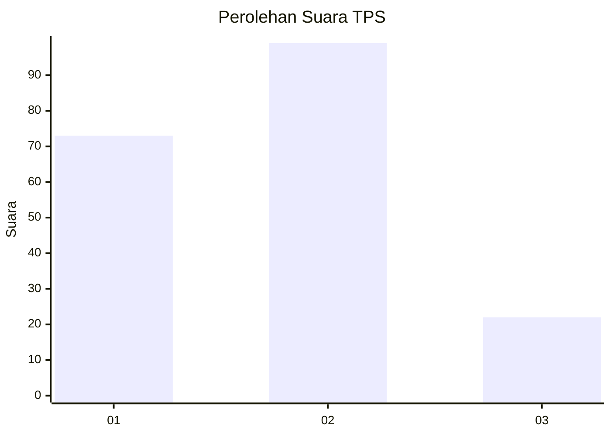
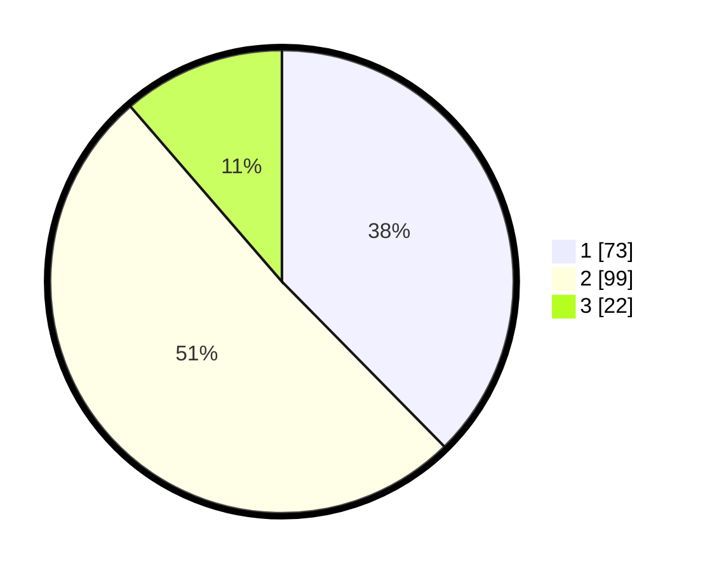

# Hasil

## Grafik

## Tabel

| No. | Nama Paslon    | Suara | Suara (raw) | Persentase |
|:--- |:-------------- | -----:| -----------:| ----------:|
| 1   | ANIES MUHAIMIN | 73    | [73][p-1]   | 37,63      |
| 2   | PRABOWO GIBRAN | 99    | [99][p-2]   | 51,03      |
| 3   | GANJAR MAHFUD  | 22    | [22][p-3]   | 11,34      |

[p-1]: https://github.com/gigit-pemilu/pemilu-2024/blob/main/pilpres/hitung-suara/sub/35-jawa-timur/sub/09-jember/sub/20-patrang/sub/1008-baratan/sub/013-tps/sub/paslon-1.txt
[p-2]: https://github.com/gigit-pemilu/pemilu-2024/blob/main/pilpres/hitung-suara/sub/35-jawa-timur/sub/09-jember/sub/20-patrang/sub/1008-baratan/sub/013-tps/sub/paslon-2.txt
[p-3]: https://github.com/gigit-pemilu/pemilu-2024/blob/main/pilpres/hitung-suara/sub/35-jawa-timur/sub/09-jember/sub/20-patrang/sub/1008-baratan/sub/013-tps/sub/paslon-3.txt

## Foto C Plano

https://sirekap-obj-formc.kpu.go.id/1b61/pemilu/ppwp/35/09/20/10/08/3509201008013-20240214-220044--39b959e5-0279-4c52-9c96-2ff8d687ebdd.jpg

https://sirekap-obj-formc.kpu.go.id/1b61/pemilu/ppwp/35/09/20/10/08/3509201008013-20240214-220802--db0d039b-3064-4f9e-8481-5f56e3760d8c.jpg

https://sirekap-obj-formc.kpu.go.id/1b61/pemilu/ppwp/35/09/20/10/08/3509201008013-20240214-220911--79ab6a50-35b9-4ba4-9fdb-44fe6bdfd075.jpg

## Metadata

| Key        | Value               |
| ---------- | ------------------- |
| Time Stamp | 2024-02-25 11:00:00 |

