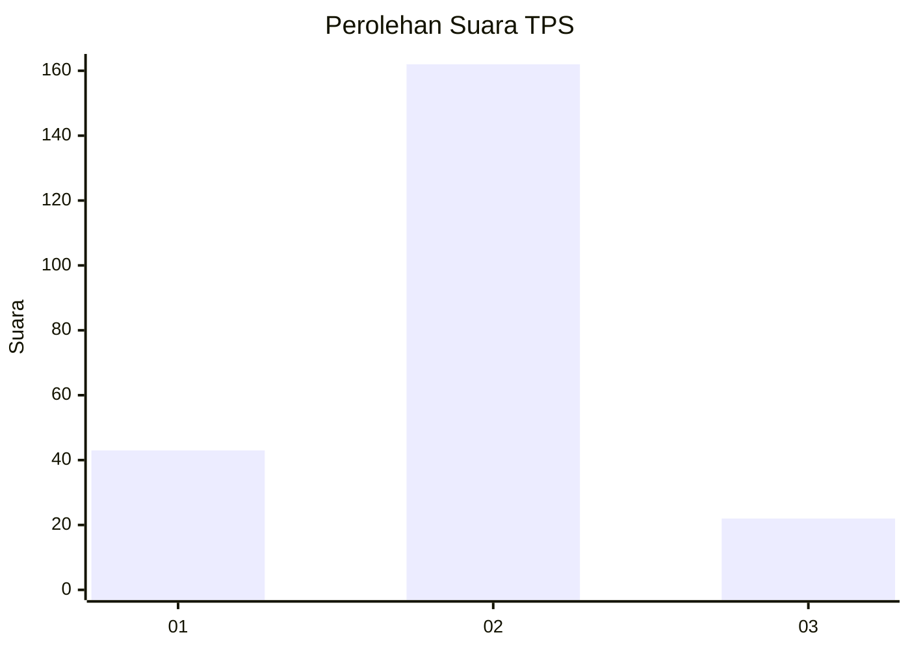
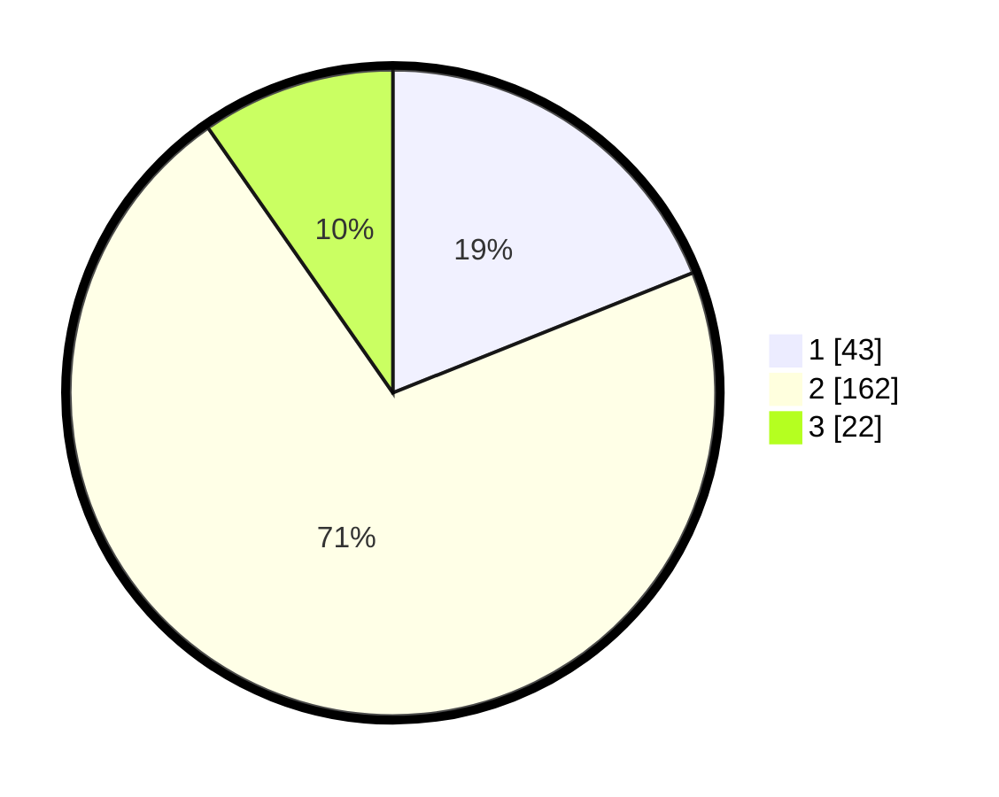

# Hasil

## Grafik

## Tabel

| No. | Nama Paslon    | Suara | Suara (raw) | Persentase |
|:--- |:-------------- | -----:| -----------:| ----------:|
| 1   | ANIES MUHAIMIN | 43    | [43][p-1]   | 18,94      |
| 2   | PRABOWO GIBRAN | 162   | [162][p-2]  | 71,37      |
| 3   | GANJAR MAHFUD  | 22    | [22][p-3]   | 9,69       |

[p-1]: https://github.com/gigit-pemilu/pemilu-2024/blob/main/pilpres/hitung-suara/sub/35-jawa-timur/sub/09-jember/sub/20-patrang/sub/1008-baratan/sub/027-tps/sub/paslon-1.txt
[p-2]: https://github.com/gigit-pemilu/pemilu-2024/blob/main/pilpres/hitung-suara/sub/35-jawa-timur/sub/09-jember/sub/20-patrang/sub/1008-baratan/sub/027-tps/sub/paslon-2.txt
[p-3]: https://github.com/gigit-pemilu/pemilu-2024/blob/main/pilpres/hitung-suara/sub/35-jawa-timur/sub/09-jember/sub/20-patrang/sub/1008-baratan/sub/027-tps/sub/paslon-3.txt

## Foto C Plano

https://sirekap-obj-formc.kpu.go.id/67f4/pemilu/ppwp/35/09/20/10/08/3509201008027-20240214-214318--c3a5f5f9-f689-42dd-9bd9-dac6b139abe8.jpg

https://sirekap-obj-formc.kpu.go.id/67f4/pemilu/ppwp/35/09/20/10/08/3509201008027-20240214-214344--6a41ab10-1ecd-4415-8637-e02a95c9f529.jpg

https://sirekap-obj-formc.kpu.go.id/67f4/pemilu/ppwp/35/09/20/10/08/3509201008027-20240214-214411--87a6b510-0d7f-4ac0-b5d7-b5ea369f22e3.jpg

## Metadata

| Key        | Value               |
| ---------- | ------------------- |
| Time Stamp | 2024-02-25 03:00:00 |

