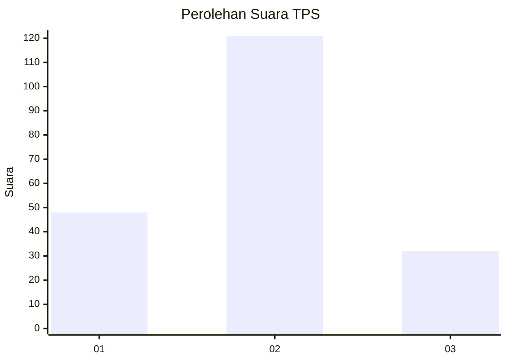

# Hasil

## Grafik

## Tabel

| No. | Nama Paslon    | Suara | Suara (raw) | Persentase |
|:--- |:-------------- | -----:| -----------:| ----------:|
| 1   | ANIES MUHAIMIN | 48    | [48][p-1]   | 23,88      |
| 2   | PRABOWO GIBRAN | 121   | [121][p-2]  | 60,20      |
| 3   | GANJAR MAHFUD  | 32    | [32][p-3]   | 15,92      |

[p-1]: https://github.com/gigit-pemilu/pemilu-2024-35-jawa-timur/blob/main/pilpres/hitung-suara/sub/35-jawa-timur/sub/09-jember/sub/21-sumbersari/sub/1001-kebonsari/sub/019-tps/sub/paslon-1.txt
[p-2]: https://github.com/gigit-pemilu/pemilu-2024-35-jawa-timur/blob/main/pilpres/hitung-suara/sub/35-jawa-timur/sub/09-jember/sub/21-sumbersari/sub/1001-kebonsari/sub/019-tps/sub/paslon-2.txt
[p-3]: https://github.com/gigit-pemilu/pemilu-2024-35-jawa-timur/blob/main/pilpres/hitung-suara/sub/35-jawa-timur/sub/09-jember/sub/21-sumbersari/sub/1001-kebonsari/sub/019-tps/sub/paslon-3.txt

## Foto C Plano

https://sirekap-obj-formc.kpu.go.id/0fe2/pemilu/ppwp/35/09/21/10/01/3509211001019-20240214-213614--20851e0d-8369-4ed1-a7ec-27deb5aae186.jpg

https://sirekap-obj-formc.kpu.go.id/0fe2/pemilu/ppwp/35/09/21/10/01/3509211001019-20240214-213654--a9dd0822-f4aa-472b-83de-4ff8c880cb29.jpg

https://sirekap-obj-formc.kpu.go.id/0fe2/pemilu/ppwp/35/09/21/10/01/3509211001019-20240214-213729--8ff9d816-a5b8-4ddd-b062-cb836542e9f2.jpg

## Metadata

| Key        | Value               |
| ---------- | ------------------- |
| Time Stamp | 2024-02-15 20:00:44 |

