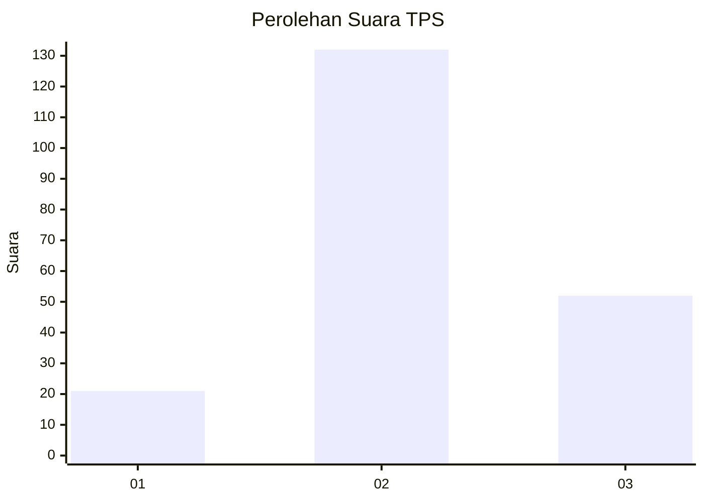
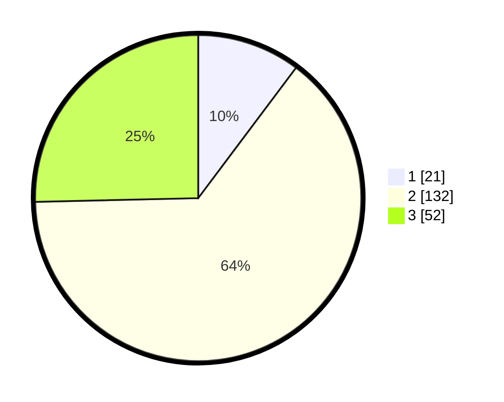

# Hasil

## Grafik

## Tabel

| No. | Nama Paslon    | Suara | Suara (raw) | Persentase |
|:--- |:-------------- | -----:| -----------:| ----------:|
| 1   | ANIES MUHAIMIN | 21    | [21][p-1]   | 10,24      |
| 2   | PRABOWO GIBRAN | 132   | [132][p-2]  | 64,39      |
| 3   | GANJAR MAHFUD  | 52    | [52][p-3]   | 25,37      |

[p-1]: https://github.com/gigit-pemilu/pemilu-2024-35-jawa-timur/blob/main/pilpres/hitung-suara/sub/35-jawa-timur/sub/09-jember/sub/21-sumbersari/sub/1001-kebonsari/sub/023-tps/sub/paslon-1.txt
[p-2]: https://github.com/gigit-pemilu/pemilu-2024-35-jawa-timur/blob/main/pilpres/hitung-suara/sub/35-jawa-timur/sub/09-jember/sub/21-sumbersari/sub/1001-kebonsari/sub/023-tps/sub/paslon-2.txt
[p-3]: https://github.com/gigit-pemilu/pemilu-2024-35-jawa-timur/blob/main/pilpres/hitung-suara/sub/35-jawa-timur/sub/09-jember/sub/21-sumbersari/sub/1001-kebonsari/sub/023-tps/sub/paslon-3.txt

## Foto C Plano

https://sirekap-obj-formc.kpu.go.id/5d82/pemilu/ppwp/35/09/21/10/01/3509211001023-20240215-102903--175f0b2d-c6d0-4f02-9bf2-f9e793a7ed3a.jpg

https://sirekap-obj-formc.kpu.go.id/5d82/pemilu/ppwp/35/09/21/10/01/3509211001023-20240215-103240--827e2cc4-70f7-4a93-9e04-ff2eac1b7c49.jpg

https://sirekap-obj-formc.kpu.go.id/5d82/pemilu/ppwp/35/09/21/10/01/3509211001023-20240215-104338--ae0b58e1-581e-49da-a920-67db1a323734.jpg

## Metadata

| Key        | Value               |
| ---------- | ------------------- |
| Time Stamp | 2024-02-15 20:00:44 |

