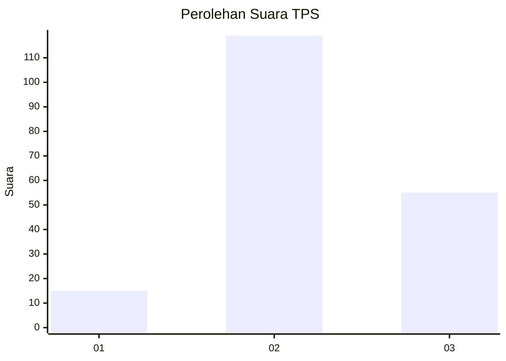
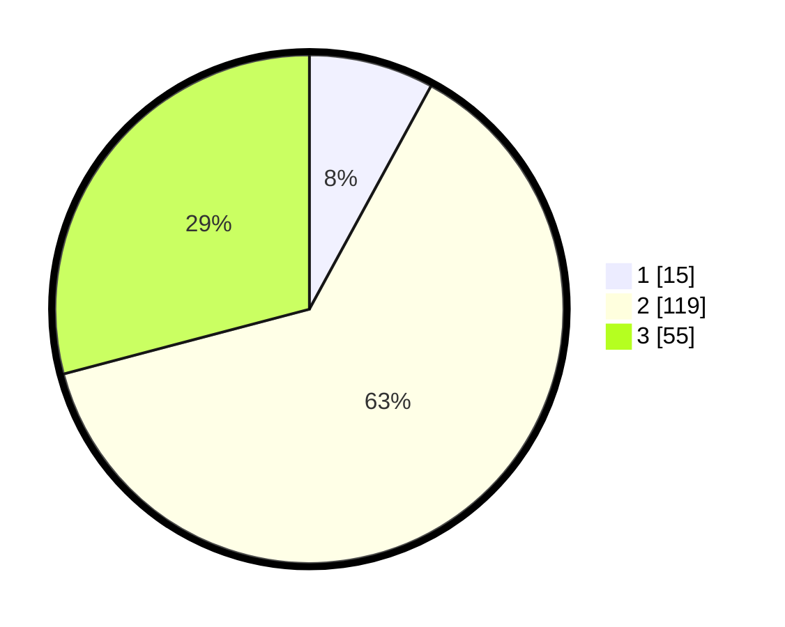

# Hasil

## Grafik

## Tabel

| No. | Nama Paslon    | Suara | Suara (raw) | Persentase |
|:--- |:-------------- | -----:| -----------:| ----------:|
| 1   | ANIES MUHAIMIN | 15    | [15][p-1]   | 7,94       |
| 2   | PRABOWO GIBRAN | 119   | [119][p-2]  | 62,96      |
| 3   | GANJAR MAHFUD  | 55    | [55][p-3]   | 29,10      |

[p-1]: https://github.com/gigit-pemilu/pemilu-2024/blob/main/pilpres/hitung-suara/sub/35-jawa-timur/sub/09-jember/sub/21-sumbersari/sub/1001-kebonsari/sub/025-tps/sub/paslon-1.txt
[p-2]: https://github.com/gigit-pemilu/pemilu-2024/blob/main/pilpres/hitung-suara/sub/35-jawa-timur/sub/09-jember/sub/21-sumbersari/sub/1001-kebonsari/sub/025-tps/sub/paslon-2.txt
[p-3]: https://github.com/gigit-pemilu/pemilu-2024/blob/main/pilpres/hitung-suara/sub/35-jawa-timur/sub/09-jember/sub/21-sumbersari/sub/1001-kebonsari/sub/025-tps/sub/paslon-3.txt

## Foto C Plano

https://sirekap-obj-formc.kpu.go.id/5f39/pemilu/ppwp/35/09/21/10/01/3509211001025-20240215-061500--4a091414-4603-4e1b-97d0-53b07f04ff7d.jpg

https://sirekap-obj-formc.kpu.go.id/5f39/pemilu/ppwp/35/09/21/10/01/3509211001025-20240215-061544--f71f3f7b-0a97-4aec-a7d3-f6c024cd9200.jpg

https://sirekap-obj-formc.kpu.go.id/5f39/pemilu/ppwp/35/09/21/10/01/3509211001025-20240215-061435--b98cb1f2-5aa2-44c0-b403-a603cb9d7958.jpg

## Metadata

| Key        | Value               |
| ---------- | ------------------- |
| Time Stamp | 2024-02-15 20:00:44 |

