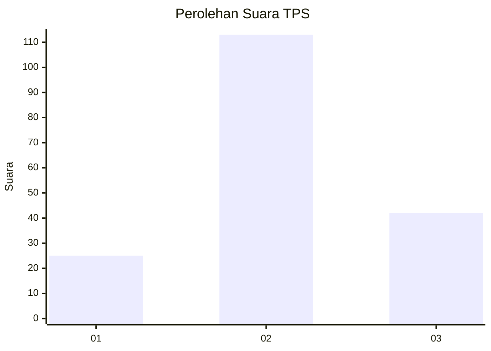
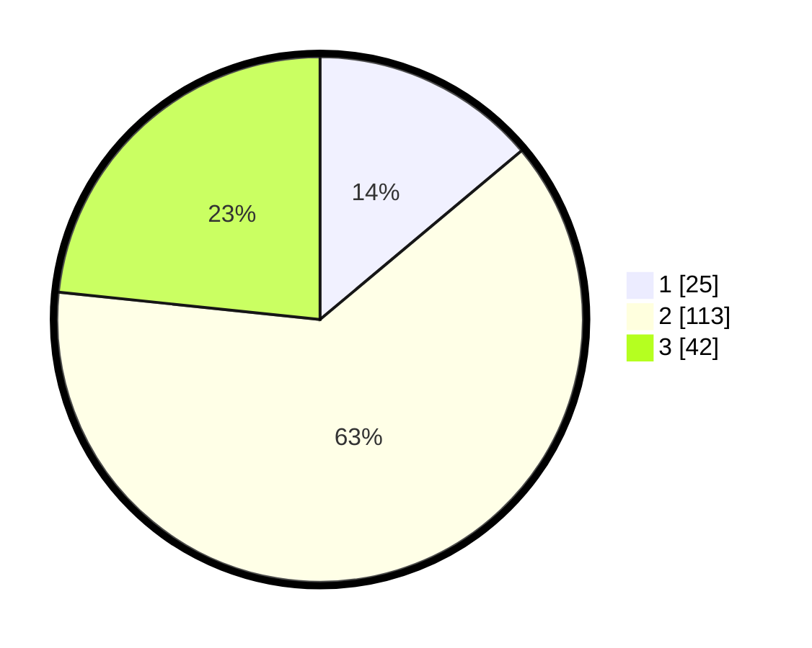

# Hasil

## Grafik

## Tabel

| No. | Nama Paslon    | Suara | Suara (raw) | Persentase |
|:--- |:-------------- | -----:| -----------:| ----------:|
| 1   | ANIES MUHAIMIN | 25    | [25][p-1]   | 13,89      |
| 2   | PRABOWO GIBRAN | 113   | [113][p-2]  | 62,78      |
| 3   | GANJAR MAHFUD  | 42    | [42][p-3]   | 23,33      |

[p-1]: https://github.com/gigit-pemilu/pemilu-2024-35-jawa-timur/blob/main/pilpres/hitung-suara/sub/35-jawa-timur/sub/09-jember/sub/21-sumbersari/sub/1001-kebonsari/sub/027-tps/sub/paslon-1.txt
[p-2]: https://github.com/gigit-pemilu/pemilu-2024-35-jawa-timur/blob/main/pilpres/hitung-suara/sub/35-jawa-timur/sub/09-jember/sub/21-sumbersari/sub/1001-kebonsari/sub/027-tps/sub/paslon-2.txt
[p-3]: https://github.com/gigit-pemilu/pemilu-2024-35-jawa-timur/blob/main/pilpres/hitung-suara/sub/35-jawa-timur/sub/09-jember/sub/21-sumbersari/sub/1001-kebonsari/sub/027-tps/sub/paslon-3.txt

## Foto C Plano

https://sirekap-obj-formc.kpu.go.id/162d/pemilu/ppwp/35/09/21/10/01/3509211001027-20240214-160108--8f5e5a10-1731-4a91-befa-b7bde6c49bd3.jpg

https://sirekap-obj-formc.kpu.go.id/162d/pemilu/ppwp/35/09/21/10/01/3509211001027-20240214-160118--56a76992-2ff3-4967-a8d7-4c6a3e736e75.jpg

https://sirekap-obj-formc.kpu.go.id/162d/pemilu/ppwp/35/09/21/10/01/3509211001027-20240214-160122--ae1dc8d7-74cc-405f-bdc6-92928134f8ff.jpg

## Metadata

| Key        | Value               |
| ---------- | ------------------- |
| Time Stamp | 2024-02-15 20:00:44 |

