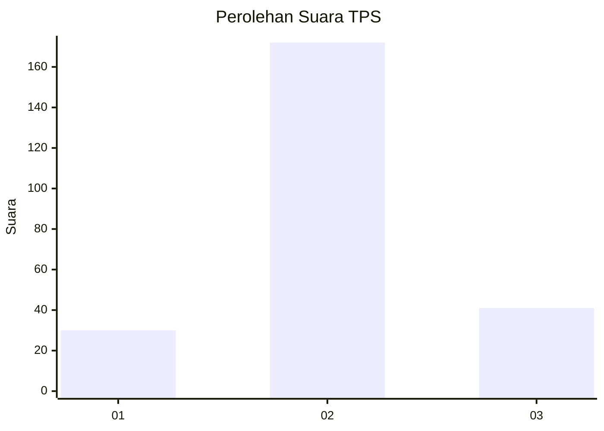
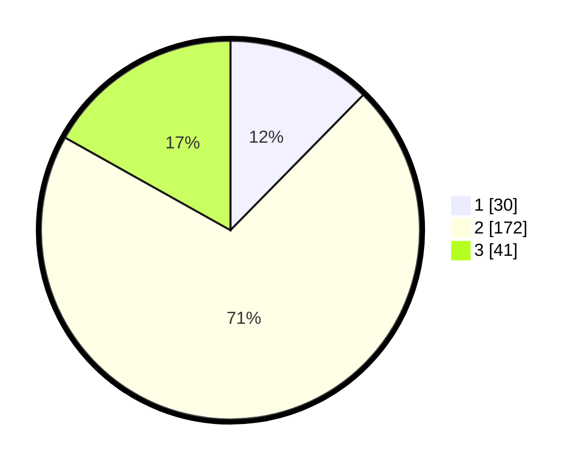

# Hasil

## Grafik

## Tabel

| No. | Nama Paslon    | Suara | Suara (raw) | Persentase |
|:--- |:-------------- | -----:| -----------:| ----------:|
| 1   | ANIES MUHAIMIN | 30    | [30][p-1]   | 12,35      |
| 2   | PRABOWO GIBRAN | 172   | [172][p-2]  | 70,78      |
| 3   | GANJAR MAHFUD  | 41    | [41][p-3]   | 16,87      |

[p-1]: https://github.com/gigit-pemilu/pemilu-2024/blob/main/pilpres/hitung-suara/sub/35-jawa-timur/sub/09-jember/sub/21-sumbersari/sub/1001-kebonsari/sub/030-tps/sub/paslon-1.txt
[p-2]: https://github.com/gigit-pemilu/pemilu-2024/blob/main/pilpres/hitung-suara/sub/35-jawa-timur/sub/09-jember/sub/21-sumbersari/sub/1001-kebonsari/sub/030-tps/sub/paslon-2.txt
[p-3]: https://github.com/gigit-pemilu/pemilu-2024/blob/main/pilpres/hitung-suara/sub/35-jawa-timur/sub/09-jember/sub/21-sumbersari/sub/1001-kebonsari/sub/030-tps/sub/paslon-3.txt

## Foto C Plano

https://sirekap-obj-formc.kpu.go.id/9c3d/pemilu/ppwp/35/09/21/10/01/3509211001030-20240214-234102--4afabd11-0e48-4915-989e-e53a50978a24.jpg

https://sirekap-obj-formc.kpu.go.id/9c3d/pemilu/ppwp/35/09/21/10/01/3509211001030-20240214-234226--40eceb11-93fb-4a0c-9041-b648f31f7760.jpg

https://sirekap-obj-formc.kpu.go.id/9c3d/pemilu/ppwp/35/09/21/10/01/3509211001030-20240214-234339--eea5d308-e48a-4d35-8fb0-b7d12af22d8e.jpg

## Metadata

| Key        | Value               |
| ---------- | ------------------- |
| Time Stamp | 2024-02-15 20:30:46 |

