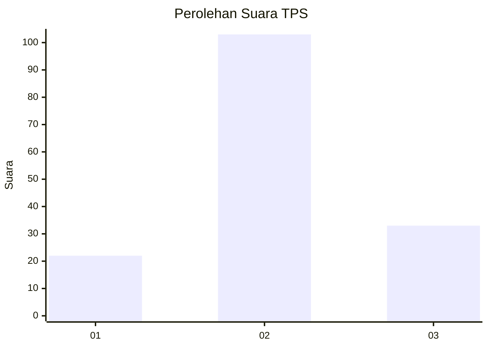
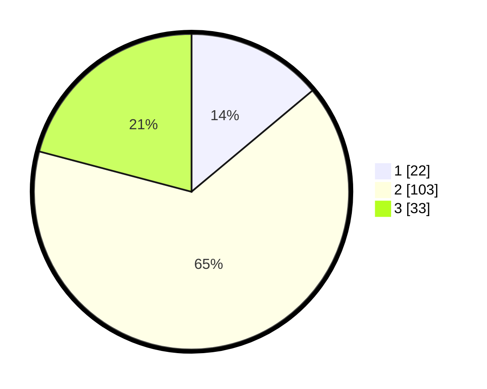

# Hasil

## Grafik

## Tabel

| No. | Nama Paslon    | Suara | Suara (raw) | Persentase |
|:--- |:-------------- | -----:| -----------:| ----------:|
| 1   | ANIES MUHAIMIN | 22    | [22][p-1]   | 13,92      |
| 2   | PRABOWO GIBRAN | 103   | [103][p-2]  | 65,19      |
| 3   | GANJAR MAHFUD  | 33    | [33][p-3]   | 20,89      |

[p-1]: https://github.com/gigit-pemilu/pemilu-2024/blob/main/pilpres/hitung-suara/sub/35-jawa-timur/sub/09-jember/sub/21-sumbersari/sub/1001-kebonsari/sub/032-tps/sub/paslon-1.txt
[p-2]: https://github.com/gigit-pemilu/pemilu-2024/blob/main/pilpres/hitung-suara/sub/35-jawa-timur/sub/09-jember/sub/21-sumbersari/sub/1001-kebonsari/sub/032-tps/sub/paslon-2.txt
[p-3]: https://github.com/gigit-pemilu/pemilu-2024/blob/main/pilpres/hitung-suara/sub/35-jawa-timur/sub/09-jember/sub/21-sumbersari/sub/1001-kebonsari/sub/032-tps/sub/paslon-3.txt

## Foto C Plano

https://sirekap-obj-formc.kpu.go.id/7bff/pemilu/ppwp/35/09/21/10/01/3509211001032-20240214-141131--5f3a409a-055f-474b-9cea-f2ff42c82f30.jpg

https://sirekap-obj-formc.kpu.go.id/7bff/pemilu/ppwp/35/09/21/10/01/3509211001032-20240214-141230--cc265805-4e43-418a-8b40-04e802cdfbe2.jpg

https://sirekap-obj-formc.kpu.go.id/7bff/pemilu/ppwp/35/09/21/10/01/3509211001032-20240214-141315--3fbdb86d-f1d8-44c5-a2f7-cf5e0a24c1e7.jpg

## Metadata

| Key        | Value               |
| ---------- | ------------------- |
| Time Stamp | 2024-02-15 20:30:46 |

