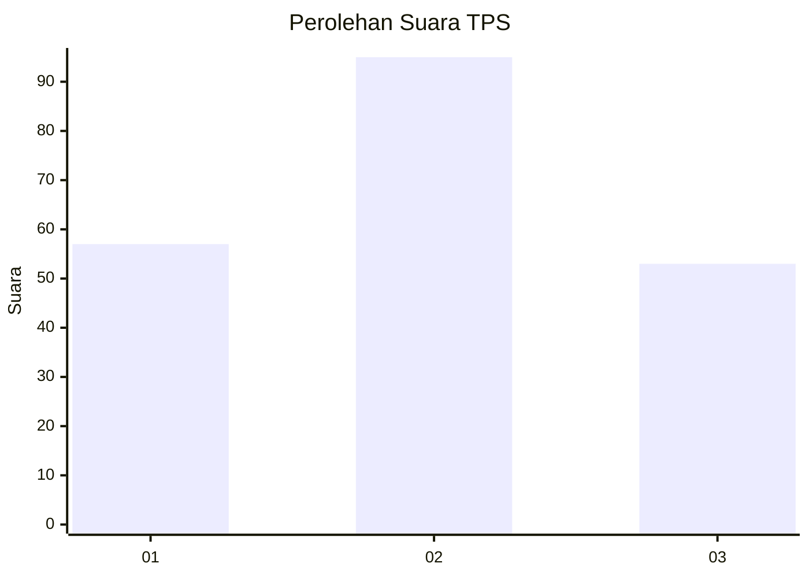
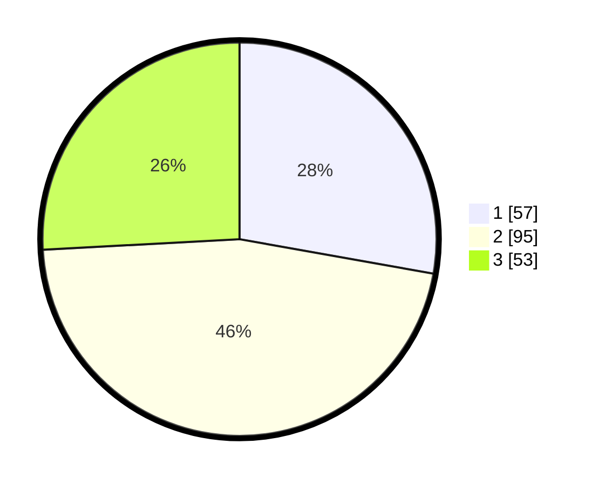

# Hasil

## Grafik

## Tabel

| No. | Nama Paslon    | Suara | Suara (raw) | Persentase |
|:--- |:-------------- | -----:| -----------:| ----------:|
| 1   | ANIES MUHAIMIN | 57    | [57][p-1]   | 27,80      |
| 2   | PRABOWO GIBRAN | 95    | [95][p-2]   | 46,34      |
| 3   | GANJAR MAHFUD  | 53    | [53][p-3]   | 25,85      |

[p-1]: https://github.com/gigit-pemilu/pemilu-2024/blob/main/pilpres/hitung-suara/sub/35-jawa-timur/sub/09-jember/sub/21-sumbersari/sub/1002-sumbersari/sub/009-tps/sub/paslon-1.txt
[p-2]: https://github.com/gigit-pemilu/pemilu-2024/blob/main/pilpres/hitung-suara/sub/35-jawa-timur/sub/09-jember/sub/21-sumbersari/sub/1002-sumbersari/sub/009-tps/sub/paslon-2.txt
[p-3]: https://github.com/gigit-pemilu/pemilu-2024/blob/main/pilpres/hitung-suara/sub/35-jawa-timur/sub/09-jember/sub/21-sumbersari/sub/1002-sumbersari/sub/009-tps/sub/paslon-3.txt

## Foto C Plano

https://sirekap-obj-formc.kpu.go.id/6770/pemilu/ppwp/35/09/21/10/02/3509211002009-20240214-201011--0ac40ca7-28e6-443a-99b2-f7936631cf34.jpg

https://sirekap-obj-formc.kpu.go.id/6770/pemilu/ppwp/35/09/21/10/02/3509211002009-20240214-201403--70d46ea2-4817-42cd-8531-8f5afa392268.jpg

https://sirekap-obj-formc.kpu.go.id/6770/pemilu/ppwp/35/09/21/10/02/3509211002009-20240214-201436--72e882ed-8006-461a-a268-49196da92db7.jpg

## Metadata

| Key        | Value               |
| ---------- | ------------------- |
| Time Stamp | 2024-02-15 22:00:27 |

