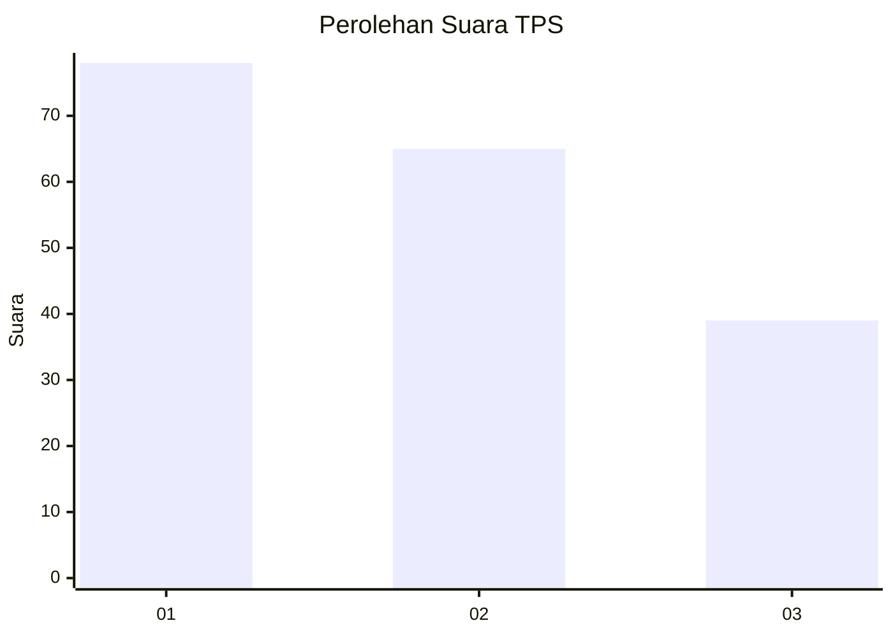
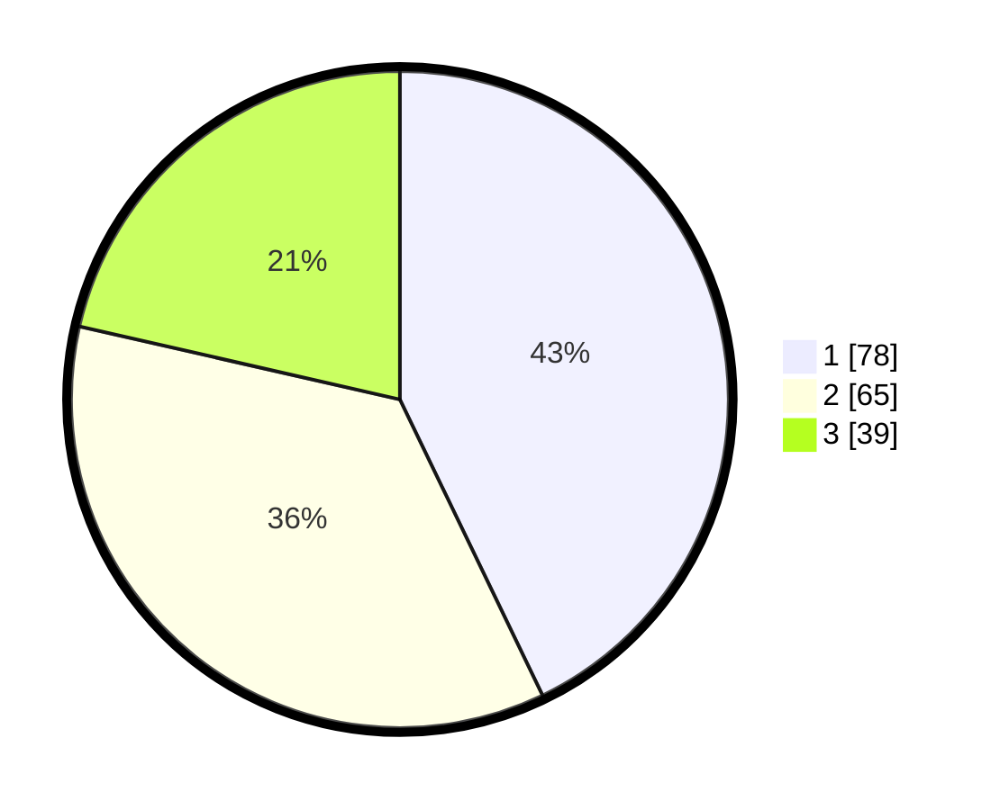

# Hasil

## Grafik

## Tabel

| No. | Nama Paslon    | Suara | Suara (raw) | Persentase |
|:--- |:-------------- | -----:| -----------:| ----------:|
| 1   | ANIES MUHAIMIN | 78    | [78][p-1]   | 42,86      |
| 2   | PRABOWO GIBRAN | 65    | [65][p-2]   | 35,71      |
| 3   | GANJAR MAHFUD  | 39    | [39][p-3]   | 21,43      |

[p-1]: https://github.com/gigit-pemilu/pemilu-2024-35-jawa-timur/blob/main/pilpres/hitung-suara/sub/35-jawa-timur/sub/09-jember/sub/21-sumbersari/sub/1002-sumbersari/sub/010-tps/sub/paslon-1.txt
[p-2]: https://github.com/gigit-pemilu/pemilu-2024-35-jawa-timur/blob/main/pilpres/hitung-suara/sub/35-jawa-timur/sub/09-jember/sub/21-sumbersari/sub/1002-sumbersari/sub/010-tps/sub/paslon-2.txt
[p-3]: https://github.com/gigit-pemilu/pemilu-2024-35-jawa-timur/blob/main/pilpres/hitung-suara/sub/35-jawa-timur/sub/09-jember/sub/21-sumbersari/sub/1002-sumbersari/sub/010-tps/sub/paslon-3.txt

## Foto C Plano

https://sirekap-obj-formc.kpu.go.id/f52a/pemilu/ppwp/35/09/21/10/02/3509211002010-20240215-033751--48cd898d-b91b-4d16-9940-6d3a04b22f94.jpg

https://sirekap-obj-formc.kpu.go.id/f52a/pemilu/ppwp/35/09/21/10/02/3509211002010-20240215-033838--1c611119-d514-456c-9e86-0cc1a98c3ece.jpg

https://sirekap-obj-formc.kpu.go.id/f52a/pemilu/ppwp/35/09/21/10/02/3509211002010-20240215-033923--3937f14a-ff8f-4358-b09b-6f7061f602e3.jpg

## Metadata

| Key        | Value               |
| ---------- | ------------------- |
| Time Stamp | 2024-02-15 12:00:28 |

