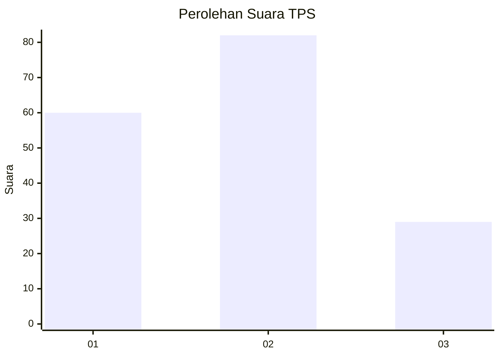
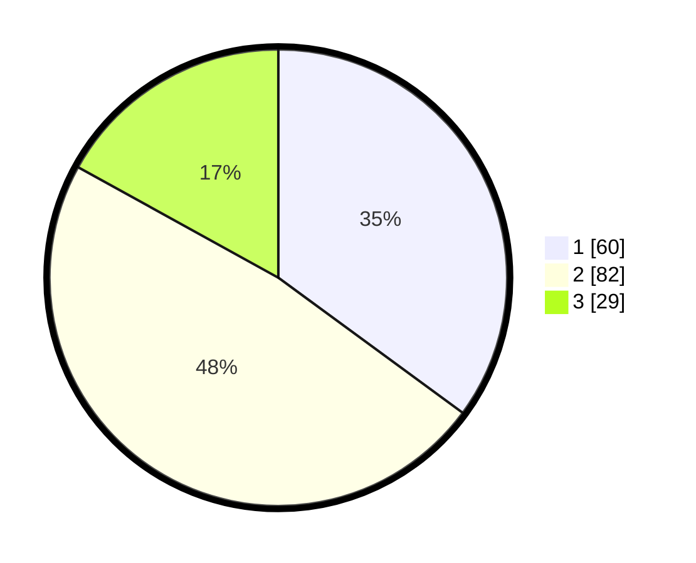

# Hasil

## Grafik

## Tabel

| No. | Nama Paslon    | Suara | Suara (raw) | Persentase |
|:--- |:-------------- | -----:| -----------:| ----------:|
| 1   | ANIES MUHAIMIN | 60    | [60][p-1]   | 35,09      |
| 2   | PRABOWO GIBRAN | 82    | [82][p-2]   | 47,95      |
| 3   | GANJAR MAHFUD  | 29    | [29][p-3]   | 16,96      |

[p-1]: https://github.com/gigit-pemilu/pemilu-2024/blob/main/pilpres/hitung-suara/sub/35-jawa-timur/sub/09-jember/sub/21-sumbersari/sub/1002-sumbersari/sub/012-tps/sub/paslon-1.txt
[p-2]: https://github.com/gigit-pemilu/pemilu-2024/blob/main/pilpres/hitung-suara/sub/35-jawa-timur/sub/09-jember/sub/21-sumbersari/sub/1002-sumbersari/sub/012-tps/sub/paslon-2.txt
[p-3]: https://github.com/gigit-pemilu/pemilu-2024/blob/main/pilpres/hitung-suara/sub/35-jawa-timur/sub/09-jember/sub/21-sumbersari/sub/1002-sumbersari/sub/012-tps/sub/paslon-3.txt

## Foto C Plano

https://sirekap-obj-formc.kpu.go.id/8b6a/pemilu/ppwp/35/09/21/10/02/3509211002012-20240214-141646--ca0923b9-aaba-4b39-83e9-69ece045cb15.jpg

https://sirekap-obj-formc.kpu.go.id/8b6a/pemilu/ppwp/35/09/21/10/02/3509211002012-20240214-160100--800a4d65-c967-47d0-b2fd-5fe8ed62d8ff.jpg

https://sirekap-obj-formc.kpu.go.id/8b6a/pemilu/ppwp/35/09/21/10/02/3509211002012-20240214-155814--5161b8ef-ed71-44d7-96ef-551bce48761d.jpg

## Metadata

| Key        | Value               |
| ---------- | ------------------- |
| Time Stamp | 2024-02-15 22:30:27 |

