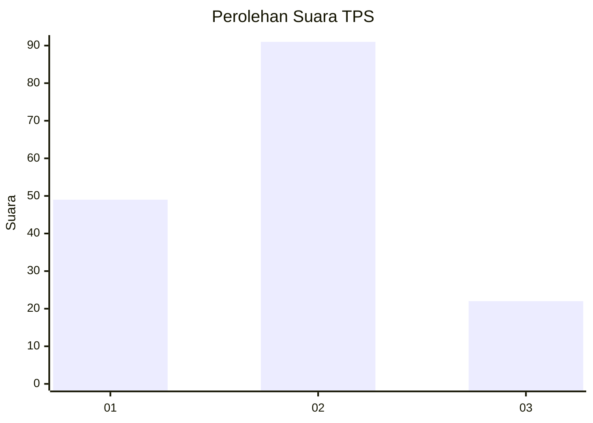
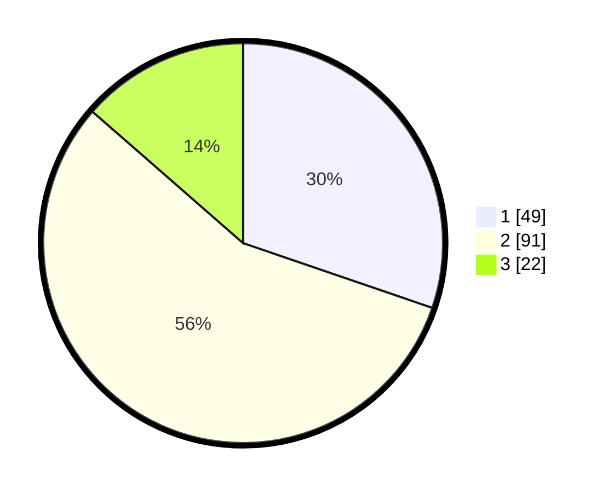

# Hasil

## Grafik

## Tabel

| No. | Nama Paslon    | Suara | Suara (raw) | Persentase |
|:--- |:-------------- | -----:| -----------:| ----------:|
| 1   | ANIES MUHAIMIN | 49    | [49][p-1]   | 30,25      |
| 2   | PRABOWO GIBRAN | 91    | [91][p-2]   | 56,17      |
| 3   | GANJAR MAHFUD  | 22    | [22][p-3]   | 13,58      |

[p-1]: https://github.com/gigit-pemilu/pemilu-2024-35-jawa-timur/blob/main/pilpres/hitung-suara/sub/35-jawa-timur/sub/09-jember/sub/21-sumbersari/sub/1002-sumbersari/sub/037-tps/sub/paslon-1.txt
[p-2]: https://github.com/gigit-pemilu/pemilu-2024-35-jawa-timur/blob/main/pilpres/hitung-suara/sub/35-jawa-timur/sub/09-jember/sub/21-sumbersari/sub/1002-sumbersari/sub/037-tps/sub/paslon-2.txt
[p-3]: https://github.com/gigit-pemilu/pemilu-2024-35-jawa-timur/blob/main/pilpres/hitung-suara/sub/35-jawa-timur/sub/09-jember/sub/21-sumbersari/sub/1002-sumbersari/sub/037-tps/sub/paslon-3.txt

## Foto C Plano

https://sirekap-obj-formc.kpu.go.id/b948/pemilu/ppwp/35/09/21/10/02/3509211002037-20240214-212855--8050a7f5-cc83-479b-92ee-defbeb619430.jpg

https://sirekap-obj-formc.kpu.go.id/b948/pemilu/ppwp/35/09/21/10/02/3509211002037-20240214-213032--c185f929-f4bb-48f4-a9c1-71dfdbb059de.jpg

https://sirekap-obj-formc.kpu.go.id/b948/pemilu/ppwp/35/09/21/10/02/3509211002037-20240214-213205--450d095b-f72a-4e8b-a09d-7143e3484f0a.jpg

## Metadata

| Key        | Value               |
| ---------- | ------------------- |
| Time Stamp | 2024-02-15 15:00:29 |

