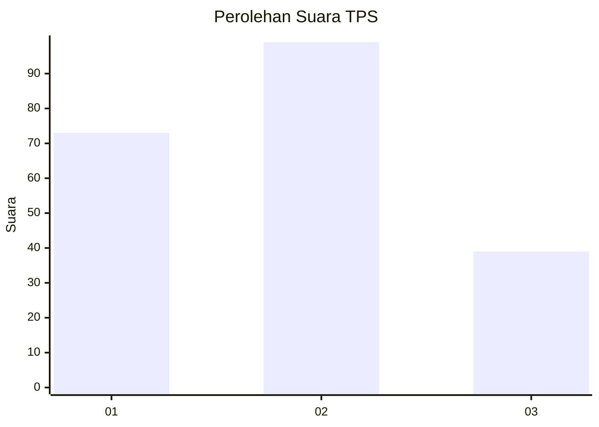
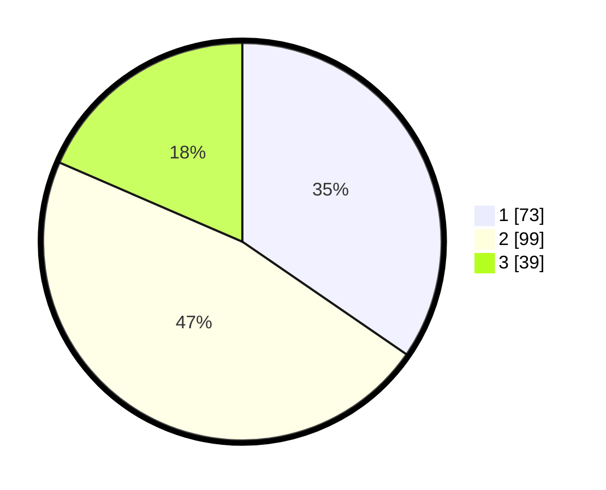

# Hasil

## Grafik

## Tabel

| No. | Nama Paslon    | Suara | Suara (raw) | Persentase |
|:--- |:-------------- | -----:| -----------:| ----------:|
| 1   | ANIES MUHAIMIN | 73    | [73][p-1]   | 34,60      |
| 2   | PRABOWO GIBRAN | 99    | [99][p-2]   | 46,92      |
| 3   | GANJAR MAHFUD  | 39    | [39][p-3]   | 18,48      |

[p-1]: https://github.com/gigit-pemilu/pemilu-2024/blob/main/pilpres/hitung-suara/sub/35-jawa-timur/sub/09-jember/sub/21-sumbersari/sub/1002-sumbersari/sub/042-tps/sub/paslon-1.txt
[p-2]: https://github.com/gigit-pemilu/pemilu-2024/blob/main/pilpres/hitung-suara/sub/35-jawa-timur/sub/09-jember/sub/21-sumbersari/sub/1002-sumbersari/sub/042-tps/sub/paslon-2.txt
[p-3]: https://github.com/gigit-pemilu/pemilu-2024/blob/main/pilpres/hitung-suara/sub/35-jawa-timur/sub/09-jember/sub/21-sumbersari/sub/1002-sumbersari/sub/042-tps/sub/paslon-3.txt

## Foto C Plano

https://sirekap-obj-formc.kpu.go.id/1691/pemilu/ppwp/35/09/21/10/02/3509211002042-20240215-003218--3b242a5b-3625-41d8-9516-4806fe6c716e.jpg

https://sirekap-obj-formc.kpu.go.id/1691/pemilu/ppwp/35/09/21/10/02/3509211002042-20240215-041921--cf8f8b74-52de-441f-9a7c-cf401a97be77.jpg

https://sirekap-obj-formc.kpu.go.id/1691/pemilu/ppwp/35/09/21/10/02/3509211002042-20240215-042040--832648f0-b1fa-4d70-9acd-7d084a75de2f.jpg

## Metadata

| Key        | Value               |
| ---------- | ------------------- |
| Time Stamp | 2024-02-15 22:30:27 |

