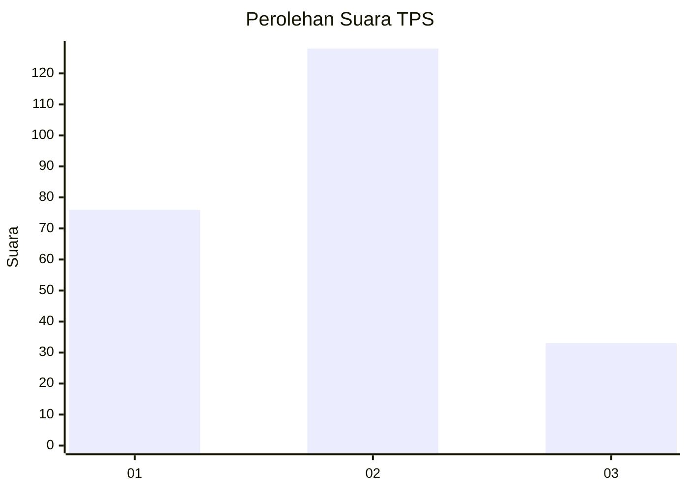
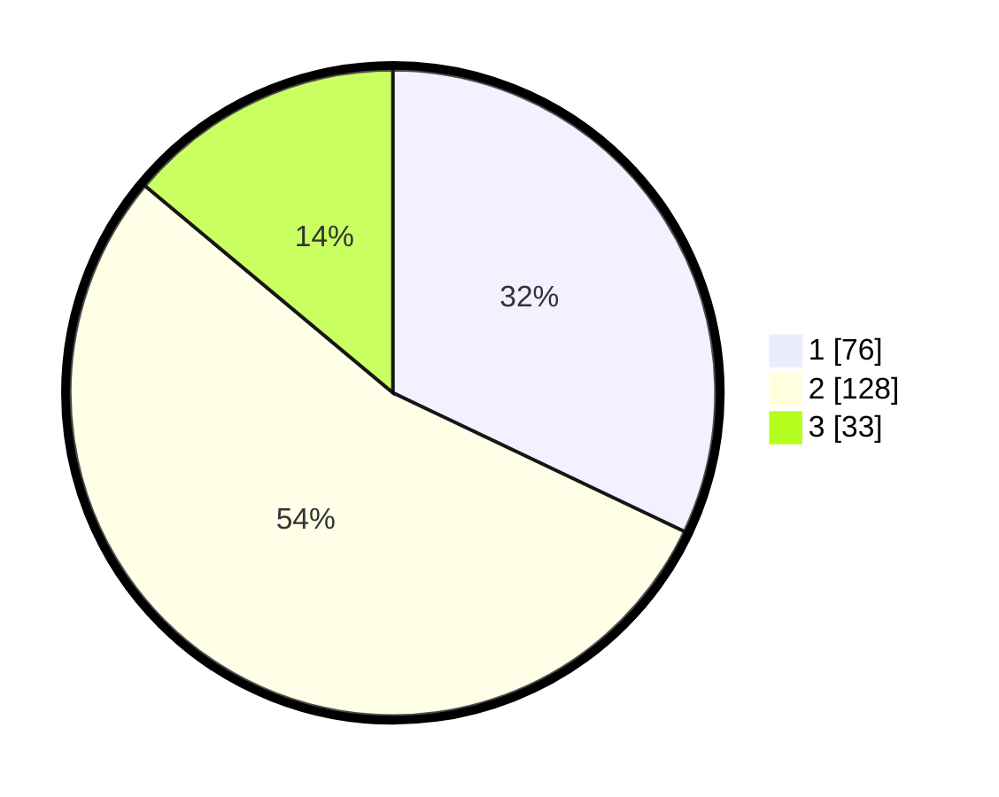

# Hasil

## Grafik

## Tabel

| No. | Nama Paslon    | Suara | Suara (raw) | Persentase |
|:--- |:-------------- | -----:| -----------:| ----------:|
| 1   | ANIES MUHAIMIN | 76    | [76][p-1]   | 32,07      |
| 2   | PRABOWO GIBRAN | 128   | [128][p-2]  | 54,01      |
| 3   | GANJAR MAHFUD  | 33    | [33][p-3]   | 13,92      |

[p-1]: https://github.com/gigit-pemilu/pemilu-2024/blob/main/pilpres/hitung-suara/sub/35-jawa-timur/sub/09-jember/sub/21-sumbersari/sub/1002-sumbersari/sub/052-tps/sub/paslon-1.txt
[p-2]: https://github.com/gigit-pemilu/pemilu-2024/blob/main/pilpres/hitung-suara/sub/35-jawa-timur/sub/09-jember/sub/21-sumbersari/sub/1002-sumbersari/sub/052-tps/sub/paslon-2.txt
[p-3]: https://github.com/gigit-pemilu/pemilu-2024/blob/main/pilpres/hitung-suara/sub/35-jawa-timur/sub/09-jember/sub/21-sumbersari/sub/1002-sumbersari/sub/052-tps/sub/paslon-3.txt

## Foto C Plano

https://sirekap-obj-formc.kpu.go.id/d076/pemilu/ppwp/35/09/21/10/02/3509211002052-20240214-221657--d7354764-ca6c-487b-8d5d-0a11c47d1a91.jpg

https://sirekap-obj-formc.kpu.go.id/d076/pemilu/ppwp/35/09/21/10/02/3509211002052-20240214-222107--bace54bc-afc1-482b-88b2-48095a1aa3a9.jpg

https://sirekap-obj-formc.kpu.go.id/d076/pemilu/ppwp/35/09/21/10/02/3509211002052-20240214-222247--245018b3-c305-432e-bceb-91467230cdd6.jpg

## Metadata

| Key        | Value               |
| ---------- | ------------------- |
| Time Stamp | 2024-02-15 22:30:27 |

