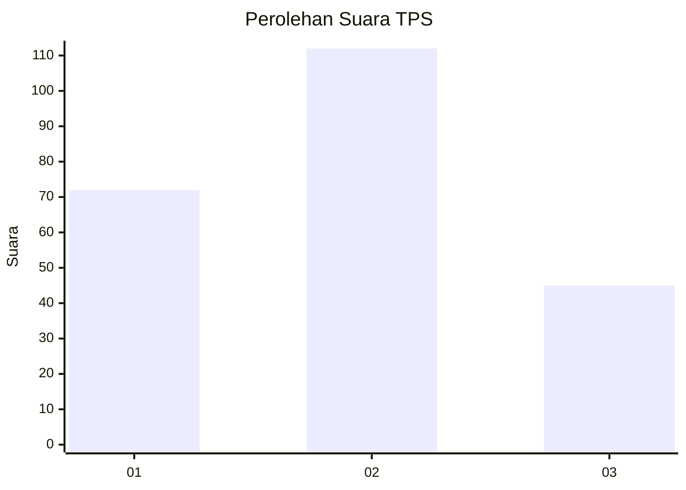
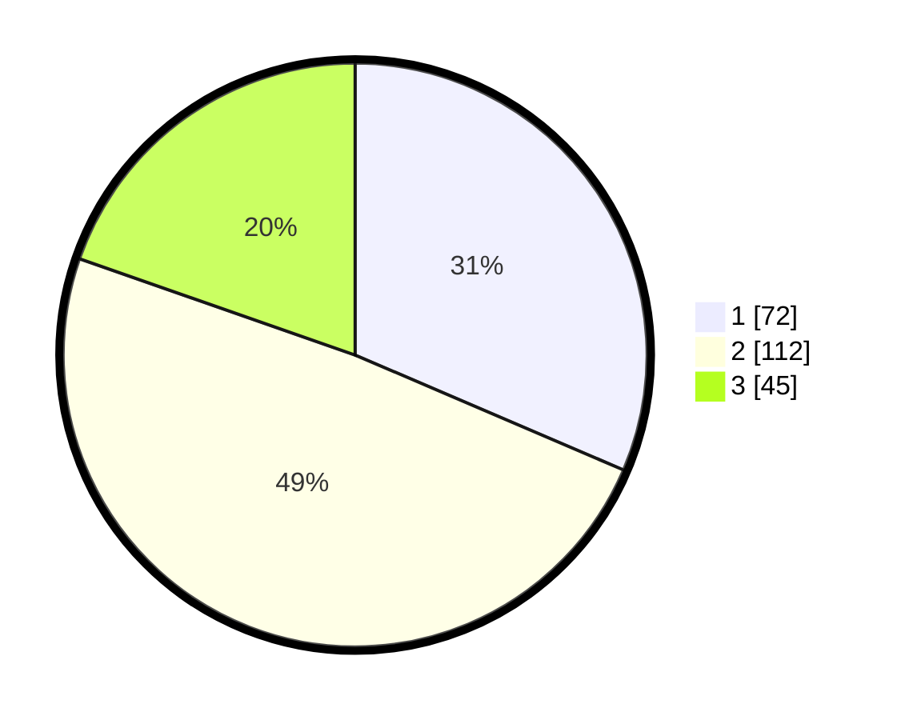

# Hasil

## Grafik

## Tabel

| No. | Nama Paslon    | Suara | Suara (raw) | Persentase |
|:--- |:-------------- | -----:| -----------:| ----------:|
| 1   | ANIES MUHAIMIN | 72    | [72][p-1]   | 31,44      |
| 2   | PRABOWO GIBRAN | 112   | [112][p-2]  | 48,91      |
| 3   | GANJAR MAHFUD  | 45    | [45][p-3]   | 19,65      |

[p-1]: https://github.com/gigit-pemilu/pemilu-2024/blob/main/pilpres/hitung-suara/sub/35-jawa-timur/sub/09-jember/sub/21-sumbersari/sub/1002-sumbersari/sub/054-tps/sub/paslon-1.txt
[p-2]: https://github.com/gigit-pemilu/pemilu-2024/blob/main/pilpres/hitung-suara/sub/35-jawa-timur/sub/09-jember/sub/21-sumbersari/sub/1002-sumbersari/sub/054-tps/sub/paslon-2.txt
[p-3]: https://github.com/gigit-pemilu/pemilu-2024/blob/main/pilpres/hitung-suara/sub/35-jawa-timur/sub/09-jember/sub/21-sumbersari/sub/1002-sumbersari/sub/054-tps/sub/paslon-3.txt

## Foto C Plano

https://sirekap-obj-formc.kpu.go.id/26d2/pemilu/ppwp/35/09/21/10/02/3509211002054-20240215-015945--83ba2ccd-3307-4fc4-aa7f-cd3093ff1852.jpg

https://sirekap-obj-formc.kpu.go.id/26d2/pemilu/ppwp/35/09/21/10/02/3509211002054-20240215-015810--aa5cad81-da8d-44eb-91be-d2c1c0d71ffa.jpg

https://sirekap-obj-formc.kpu.go.id/26d2/pemilu/ppwp/35/09/21/10/02/3509211002054-20240215-015827--c47ae542-4b82-46c6-8e49-82963044394f.jpg

## Metadata

| Key        | Value               |
| ---------- | ------------------- |
| Time Stamp | 2024-02-15 15:00:29 |

