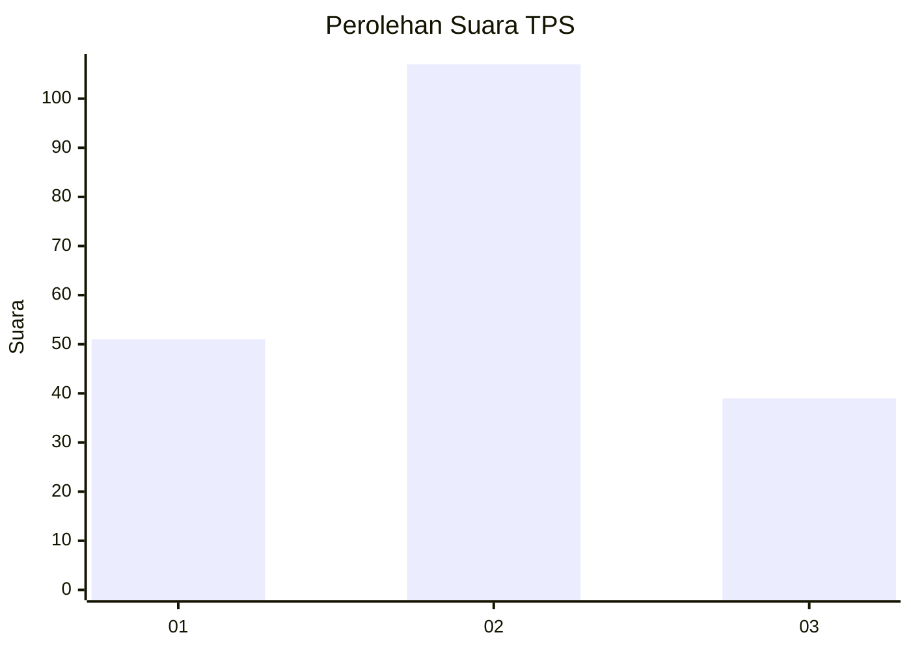
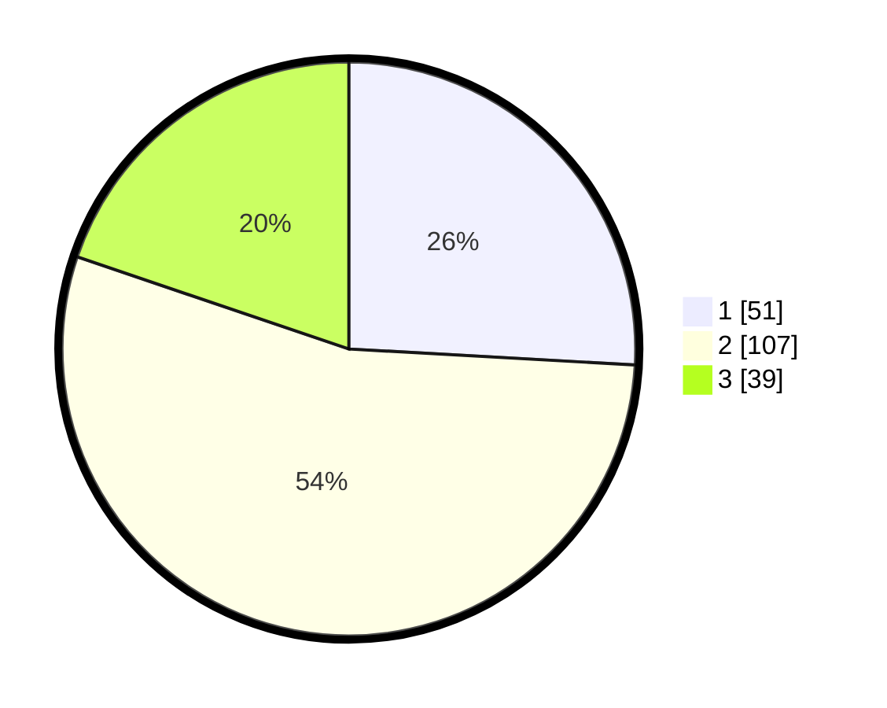

# Hasil

## Grafik

## Tabel

| No. | Nama Paslon    | Suara | Suara (raw) | Persentase |
|:--- |:-------------- | -----:| -----------:| ----------:|
| 1   | ANIES MUHAIMIN | 51    | [51][p-1]   | 25,89      |
| 2   | PRABOWO GIBRAN | 107   | [107][p-2]  | 54,31      |
| 3   | GANJAR MAHFUD  | 39    | [39][p-3]   | 19,80      |

[p-1]: https://github.com/gigit-pemilu/pemilu-2024/blob/main/pilpres/hitung-suara/sub/35-jawa-timur/sub/09-jember/sub/21-sumbersari/sub/1002-sumbersari/sub/065-tps/sub/paslon-1.txt
[p-2]: https://github.com/gigit-pemilu/pemilu-2024/blob/main/pilpres/hitung-suara/sub/35-jawa-timur/sub/09-jember/sub/21-sumbersari/sub/1002-sumbersari/sub/065-tps/sub/paslon-2.txt
[p-3]: https://github.com/gigit-pemilu/pemilu-2024/blob/main/pilpres/hitung-suara/sub/35-jawa-timur/sub/09-jember/sub/21-sumbersari/sub/1002-sumbersari/sub/065-tps/sub/paslon-3.txt

## Foto C Plano

https://sirekap-obj-formc.kpu.go.id/d532/pemilu/ppwp/35/09/21/10/02/3509211002065-20240215-000617--68bc21c5-c81b-454a-b8ef-1778549a263e.jpg

https://sirekap-obj-formc.kpu.go.id/d532/pemilu/ppwp/35/09/21/10/02/3509211002065-20240215-000701--259f3948-4c01-4076-8667-c694c56a9205.jpg

https://sirekap-obj-formc.kpu.go.id/d532/pemilu/ppwp/35/09/21/10/02/3509211002065-20240215-000803--116a457f-39b5-4ebd-9678-cc229ac2e775.jpg

## Metadata

| Key        | Value               |
| ---------- | ------------------- |
| Time Stamp | 2024-02-15 15:00:29 |

