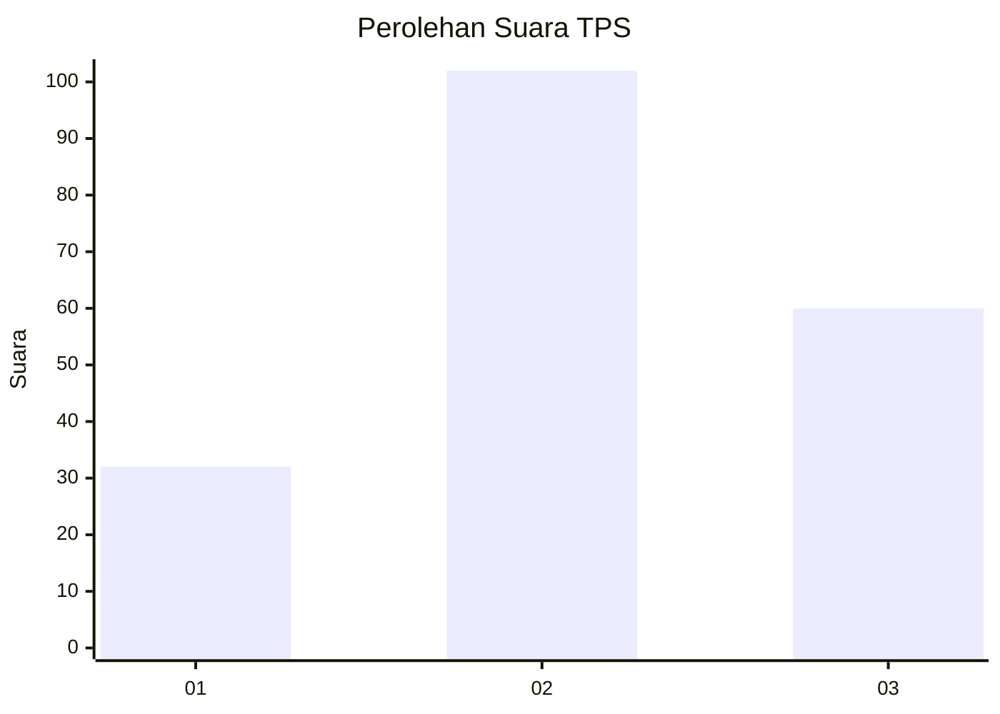
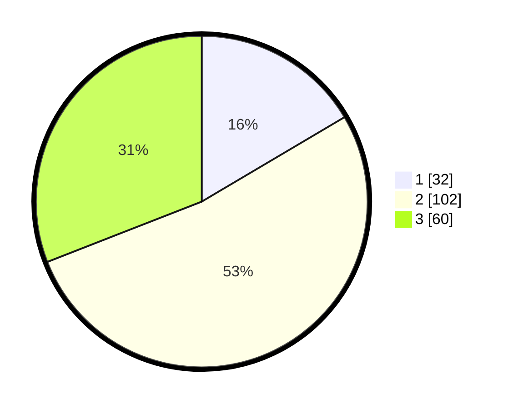

# Hasil

## Grafik

## Tabel

| No. | Nama Paslon    | Suara | Suara (raw) | Persentase |
|:--- |:-------------- | -----:| -----------:| ----------:|
| 1   | ANIES MUHAIMIN | 32    | [32][p-1]   | 16,49      |
| 2   | PRABOWO GIBRAN | 102   | [102][p-2]  | 52,58      |
| 3   | GANJAR MAHFUD  | 60    | [60][p-3]   | 30,93      |

[p-1]: https://github.com/gigit-pemilu/pemilu-2024/blob/main/pilpres/hitung-suara/sub/35-jawa-timur/sub/09-jember/sub/21-sumbersari/sub/1002-sumbersari/sub/071-tps/sub/paslon-1.txt
[p-2]: https://github.com/gigit-pemilu/pemilu-2024/blob/main/pilpres/hitung-suara/sub/35-jawa-timur/sub/09-jember/sub/21-sumbersari/sub/1002-sumbersari/sub/071-tps/sub/paslon-2.txt
[p-3]: https://github.com/gigit-pemilu/pemilu-2024/blob/main/pilpres/hitung-suara/sub/35-jawa-timur/sub/09-jember/sub/21-sumbersari/sub/1002-sumbersari/sub/071-tps/sub/paslon-3.txt

## Foto C Plano

https://sirekap-obj-formc.kpu.go.id/811b/pemilu/ppwp/35/09/21/10/02/3509211002071-20240215-013127--c58e1da8-0d62-4ced-9bd3-9e4c8fc53abe.jpg

https://sirekap-obj-formc.kpu.go.id/811b/pemilu/ppwp/35/09/21/10/02/3509211002071-20240215-013133--5aba6d3f-f3a8-4bc4-838e-f4d02ff4b6f9.jpg

https://sirekap-obj-formc.kpu.go.id/811b/pemilu/ppwp/35/09/21/10/02/3509211002071-20240215-013139--76dd7b1f-5365-4273-95ae-bceca1a6dd08.jpg

## Metadata

| Key        | Value               |
| ---------- | ------------------- |
| Time Stamp | 2024-02-15 15:00:29 |

