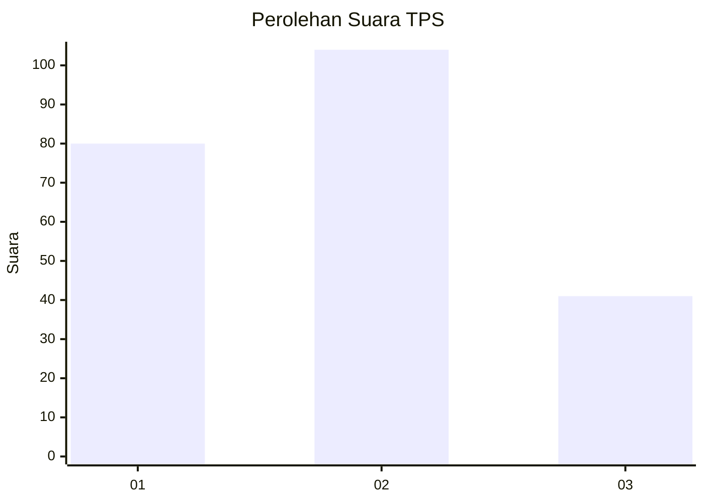
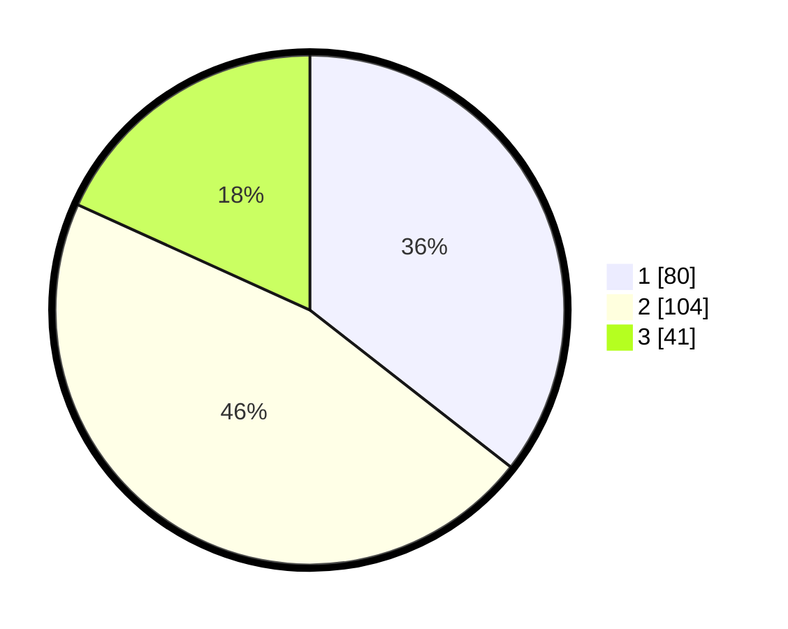

# Hasil

## Grafik

## Tabel

| No. | Nama Paslon    | Suara | Suara (raw) | Persentase |
|:--- |:-------------- | -----:| -----------:| ----------:|
| 1   | ANIES MUHAIMIN | 80    | [80][p-1]   | 35,56      |
| 2   | PRABOWO GIBRAN | 104   | [104][p-2]  | 46,22      |
| 3   | GANJAR MAHFUD  | 41    | [41][p-3]   | 18,22      |

[p-1]: https://github.com/gigit-pemilu/pemilu-2024/blob/main/pilpres/hitung-suara/sub/35-jawa-timur/sub/09-jember/sub/21-sumbersari/sub/1002-sumbersari/sub/082-tps/sub/paslon-1.txt
[p-2]: https://github.com/gigit-pemilu/pemilu-2024/blob/main/pilpres/hitung-suara/sub/35-jawa-timur/sub/09-jember/sub/21-sumbersari/sub/1002-sumbersari/sub/082-tps/sub/paslon-2.txt
[p-3]: https://github.com/gigit-pemilu/pemilu-2024/blob/main/pilpres/hitung-suara/sub/35-jawa-timur/sub/09-jember/sub/21-sumbersari/sub/1002-sumbersari/sub/082-tps/sub/paslon-3.txt

## Foto C Plano

https://sirekap-obj-formc.kpu.go.id/9fef/pemilu/ppwp/35/09/21/10/02/3509211002082-20240215-032901--dc44fb28-f269-4c45-85b5-809076f9cadf.jpg

https://sirekap-obj-formc.kpu.go.id/9fef/pemilu/ppwp/35/09/21/10/02/3509211002082-20240215-032925--a69991d1-6879-4a58-b8ee-44e0a9722b2f.jpg

https://sirekap-obj-formc.kpu.go.id/9fef/pemilu/ppwp/35/09/21/10/02/3509211002082-20240215-033022--cb4d2fa3-2388-45ac-90cf-afdfedc1b553.jpg

## Metadata

| Key        | Value               |
| ---------- | ------------------- |
| Time Stamp | 2024-02-15 15:00:29 |

