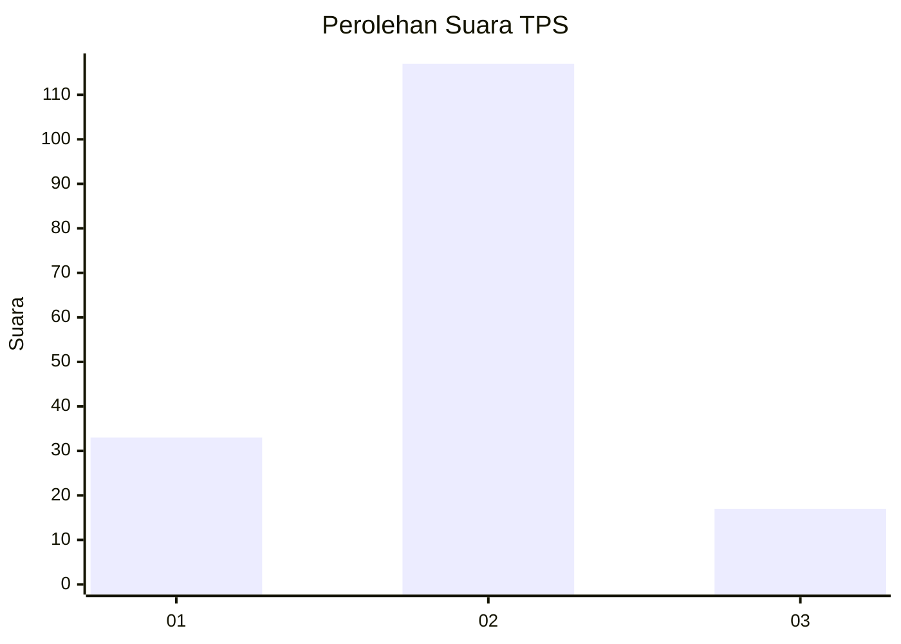
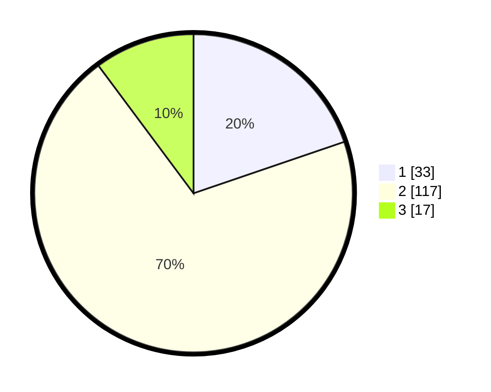

# Hasil

## Grafik

## Tabel

| No. | Nama Paslon    | Suara | Suara (raw) | Persentase |
|:--- |:-------------- | -----:| -----------:| ----------:|
| 1   | ANIES MUHAIMIN | 33    | [33][p-1]   | 19,76      |
| 2   | PRABOWO GIBRAN | 117   | [117][p-2]  | 70,06      |
| 3   | GANJAR MAHFUD  | 17    | [17][p-3]   | 10,18      |

[p-1]: https://github.com/gigit-pemilu/pemilu-2024/blob/main/pilpres/hitung-suara/sub/35-jawa-timur/sub/09-jember/sub/21-sumbersari/sub/1003-kranjingan/sub/009-tps/sub/paslon-1.txt
[p-2]: https://github.com/gigit-pemilu/pemilu-2024/blob/main/pilpres/hitung-suara/sub/35-jawa-timur/sub/09-jember/sub/21-sumbersari/sub/1003-kranjingan/sub/009-tps/sub/paslon-2.txt
[p-3]: https://github.com/gigit-pemilu/pemilu-2024/blob/main/pilpres/hitung-suara/sub/35-jawa-timur/sub/09-jember/sub/21-sumbersari/sub/1003-kranjingan/sub/009-tps/sub/paslon-3.txt

## Foto C Plano

https://sirekap-obj-formc.kpu.go.id/846f/pemilu/ppwp/35/09/21/10/03/3509211003009-20240215-011753--eaaf98c5-be20-4f17-bc1f-7dec533ebaf1.jpg

https://sirekap-obj-formc.kpu.go.id/846f/pemilu/ppwp/35/09/21/10/03/3509211003009-20240215-011839--11b8d3c6-5287-4aad-88f7-f443c1352aea.jpg

https://sirekap-obj-formc.kpu.go.id/846f/pemilu/ppwp/35/09/21/10/03/3509211003009-20240215-015844--45c7108e-ca94-4f84-8a7a-693d0ae5323a.jpg

## Metadata

| Key        | Value               |
| ---------- | ------------------- |
| Time Stamp | 2024-02-15 22:30:27 |

