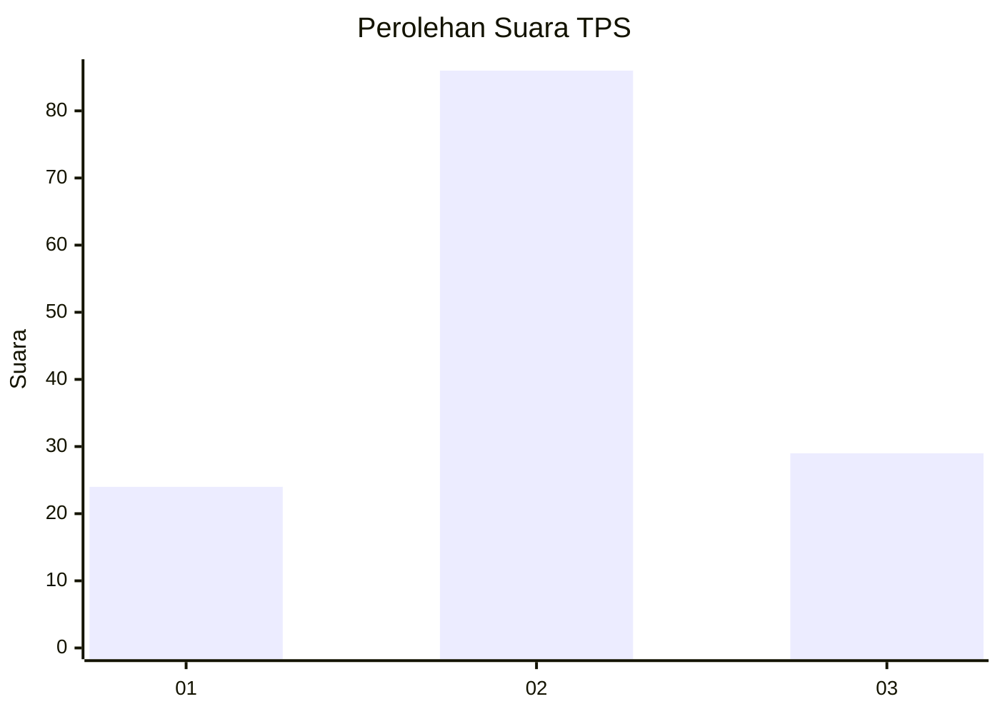
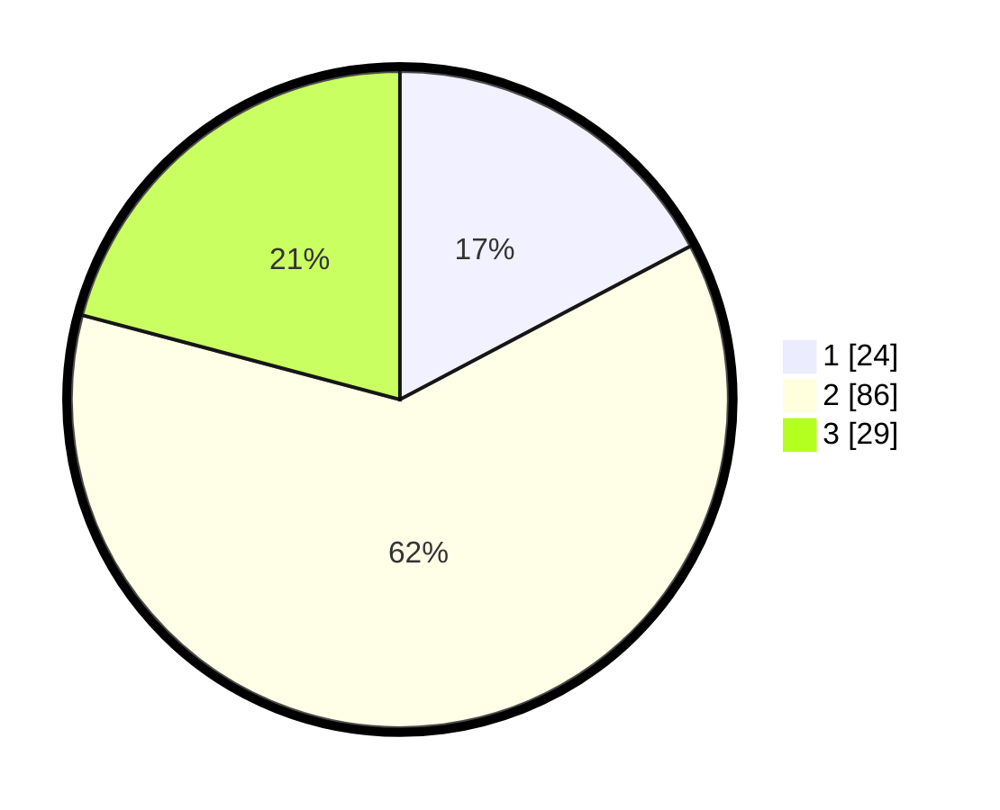

# Hasil

## Grafik

## Tabel

| No. | Nama Paslon    | Suara | Suara (raw) | Persentase |
|:--- |:-------------- | -----:| -----------:| ----------:|
| 1   | ANIES MUHAIMIN | 24    | [24][p-1]   | 17,27      |
| 2   | PRABOWO GIBRAN | 86    | [86][p-2]   | 61,87      |
| 3   | GANJAR MAHFUD  | 29    | [29][p-3]   | 20,86      |

[p-1]: https://github.com/gigit-pemilu/pemilu-2024-35-jawa-timur/blob/main/pilpres/hitung-suara/sub/35-jawa-timur/sub/09-jember/sub/21-sumbersari/sub/1003-kranjingan/sub/012-tps/sub/paslon-1.txt
[p-2]: https://github.com/gigit-pemilu/pemilu-2024-35-jawa-timur/blob/main/pilpres/hitung-suara/sub/35-jawa-timur/sub/09-jember/sub/21-sumbersari/sub/1003-kranjingan/sub/012-tps/sub/paslon-2.txt
[p-3]: https://github.com/gigit-pemilu/pemilu-2024-35-jawa-timur/blob/main/pilpres/hitung-suara/sub/35-jawa-timur/sub/09-jember/sub/21-sumbersari/sub/1003-kranjingan/sub/012-tps/sub/paslon-3.txt

## Foto C Plano

https://sirekap-obj-formc.kpu.go.id/0af8/pemilu/ppwp/35/09/21/10/03/3509211003012-20240214-200645--d8b2d89e-9bc4-4268-a65c-34349863314d.jpg

https://sirekap-obj-formc.kpu.go.id/0af8/pemilu/ppwp/35/09/21/10/03/3509211003012-20240214-200732--9c99f092-efcd-4980-83c1-4c98a3c660d5.jpg

https://sirekap-obj-formc.kpu.go.id/0af8/pemilu/ppwp/35/09/21/10/03/3509211003012-20240214-200831--a2500baf-50c7-4bea-8654-026dcb7a0d40.jpg

## Metadata

| Key        | Value               |
| ---------- | ------------------- |
| Time Stamp | 2024-02-15 22:30:27 |

