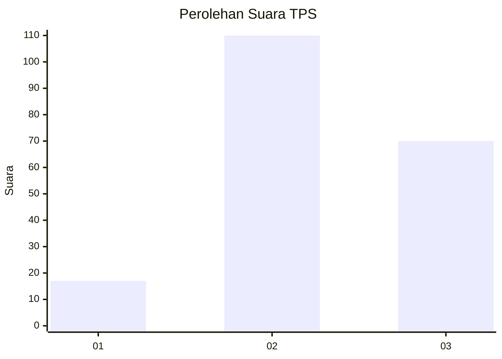
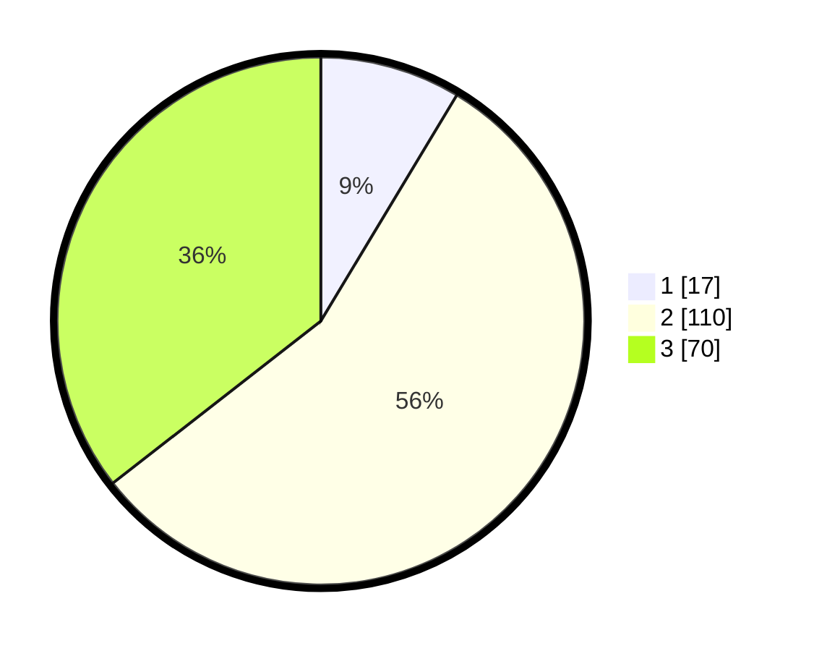

# Hasil

## Grafik

## Tabel

| No. | Nama Paslon    | Suara | Suara (raw) | Persentase |
|:--- |:-------------- | -----:| -----------:| ----------:|
| 1   | ANIES MUHAIMIN | 17    | [17][p-1]   | 8,63       |
| 2   | PRABOWO GIBRAN | 110   | [110][p-2]  | 55,84      |
| 3   | GANJAR MAHFUD  | 70    | [70][p-3]   | 35,53      |

[p-1]: https://github.com/gigit-pemilu/pemilu-2024/blob/main/pilpres/hitung-suara/sub/35-jawa-timur/sub/09-jember/sub/21-sumbersari/sub/1003-kranjingan/sub/016-tps/sub/paslon-1.txt
[p-2]: https://github.com/gigit-pemilu/pemilu-2024/blob/main/pilpres/hitung-suara/sub/35-jawa-timur/sub/09-jember/sub/21-sumbersari/sub/1003-kranjingan/sub/016-tps/sub/paslon-2.txt
[p-3]: https://github.com/gigit-pemilu/pemilu-2024/blob/main/pilpres/hitung-suara/sub/35-jawa-timur/sub/09-jember/sub/21-sumbersari/sub/1003-kranjingan/sub/016-tps/sub/paslon-3.txt

## Foto C Plano

https://sirekap-obj-formc.kpu.go.id/3614/pemilu/ppwp/35/09/21/10/03/3509211003016-20240215-063458--315b828a-fef9-4684-a8c0-0b0dacb693e3.jpg

https://sirekap-obj-formc.kpu.go.id/3614/pemilu/ppwp/35/09/21/10/03/3509211003016-20240215-015633--ad5b4946-7120-497b-8253-8aaad3d7042d.jpg

https://sirekap-obj-formc.kpu.go.id/3614/pemilu/ppwp/35/09/21/10/03/3509211003016-20240215-063816--b2a475d4-3be4-4c4c-a1a6-9077d479e306.jpg

## Metadata

| Key        | Value               |
| ---------- | ------------------- |
| Time Stamp | 2024-02-15 22:30:27 |

