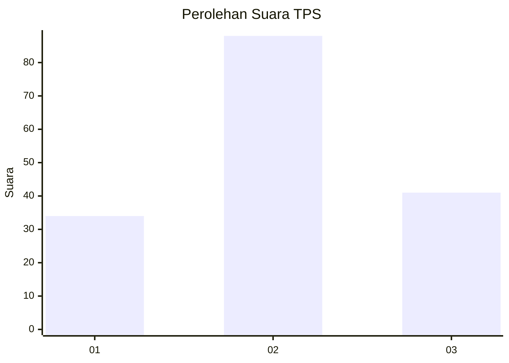
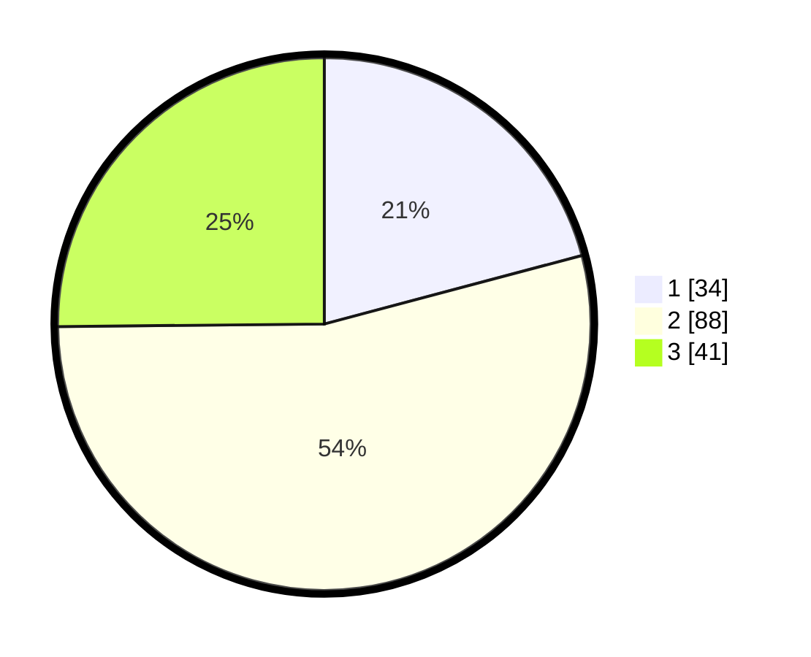

# Hasil

## Grafik

## Tabel

| No. | Nama Paslon    | Suara | Suara (raw) | Persentase |
|:--- |:-------------- | -----:| -----------:| ----------:|
| 1   | ANIES MUHAIMIN | 34    | [34][p-1]   | 20,86      |
| 2   | PRABOWO GIBRAN | 88    | [88][p-2]   | 53,99      |
| 3   | GANJAR MAHFUD  | 41    | [41][p-3]   | 25,15      |

[p-1]: https://github.com/gigit-pemilu/pemilu-2024-35-jawa-timur/blob/main/pilpres/hitung-suara/sub/35-jawa-timur/sub/09-jember/sub/21-sumbersari/sub/1003-kranjingan/sub/018-tps/sub/paslon-1.txt
[p-2]: https://github.com/gigit-pemilu/pemilu-2024-35-jawa-timur/blob/main/pilpres/hitung-suara/sub/35-jawa-timur/sub/09-jember/sub/21-sumbersari/sub/1003-kranjingan/sub/018-tps/sub/paslon-2.txt
[p-3]: https://github.com/gigit-pemilu/pemilu-2024-35-jawa-timur/blob/main/pilpres/hitung-suara/sub/35-jawa-timur/sub/09-jember/sub/21-sumbersari/sub/1003-kranjingan/sub/018-tps/sub/paslon-3.txt

## Foto C Plano

https://sirekap-obj-formc.kpu.go.id/ffb0/pemilu/ppwp/35/09/21/10/03/3509211003018-20240215-023104--60741ab1-1882-4040-8a69-a517ccc68405.jpg

https://sirekap-obj-formc.kpu.go.id/ffb0/pemilu/ppwp/35/09/21/10/03/3509211003018-20240215-023227--94d6f4e5-3e4b-488a-a82b-6b913e733c93.jpg

https://sirekap-obj-formc.kpu.go.id/ffb0/pemilu/ppwp/35/09/21/10/03/3509211003018-20240215-023348--468dcbdf-4b64-4975-a995-ccd9bcd4aa3d.jpg

## Metadata

| Key        | Value               |
| ---------- | ------------------- |
| Time Stamp | 2024-02-15 22:30:27 |

