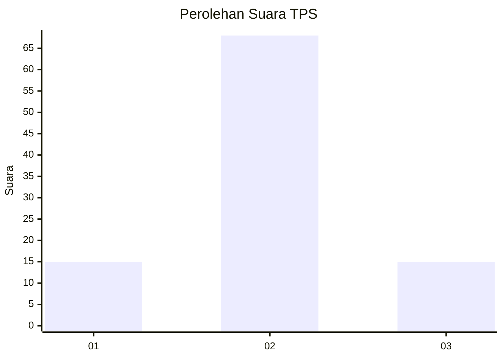
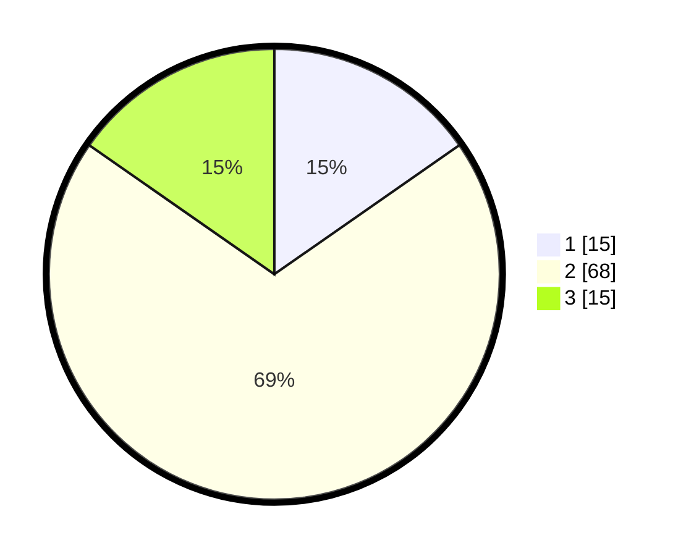

# Hasil

## Grafik

## Tabel

| No. | Nama Paslon    | Suara | Suara (raw) | Persentase |
|:--- |:-------------- | -----:| -----------:| ----------:|
| 1   | ANIES MUHAIMIN | 15    | [15][p-1]   | 15,31      |
| 2   | PRABOWO GIBRAN | 68    | [68][p-2]   | 69,39      |
| 3   | GANJAR MAHFUD  | 15    | [15][p-3]   | 15,31      |

[p-1]: https://github.com/gigit-pemilu/pemilu-2024/blob/main/pilpres/hitung-suara/sub/35-jawa-timur/sub/09-jember/sub/21-sumbersari/sub/1003-kranjingan/sub/032-tps/sub/paslon-1.txt
[p-2]: https://github.com/gigit-pemilu/pemilu-2024/blob/main/pilpres/hitung-suara/sub/35-jawa-timur/sub/09-jember/sub/21-sumbersari/sub/1003-kranjingan/sub/032-tps/sub/paslon-2.txt
[p-3]: https://github.com/gigit-pemilu/pemilu-2024/blob/main/pilpres/hitung-suara/sub/35-jawa-timur/sub/09-jember/sub/21-sumbersari/sub/1003-kranjingan/sub/032-tps/sub/paslon-3.txt

## Foto C Plano

https://sirekap-obj-formc.kpu.go.id/f02c/pemilu/ppwp/35/09/21/10/03/3509211003032-20240214-211557--2d0b60f0-581d-446b-a849-38e229f0e69a.jpg

https://sirekap-obj-formc.kpu.go.id/f02c/pemilu/ppwp/35/09/21/10/03/3509211003032-20240214-232625--d0319aa1-0b41-4444-bc74-40967aa213bb.jpg

https://sirekap-obj-formc.kpu.go.id/f02c/pemilu/ppwp/35/09/21/10/03/3509211003032-20240214-232725--b36afa5d-1a50-4d83-8226-d074db2c5814.jpg

## Metadata

| Key        | Value               |
| ---------- | ------------------- |
| Time Stamp | 2024-02-15 22:30:27 |

