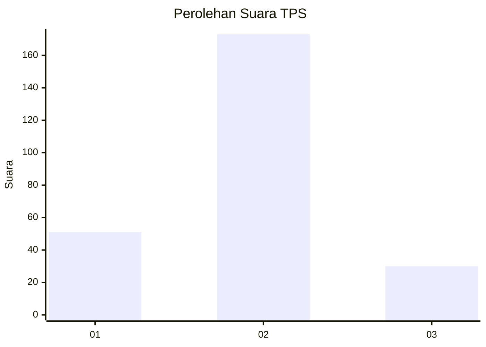
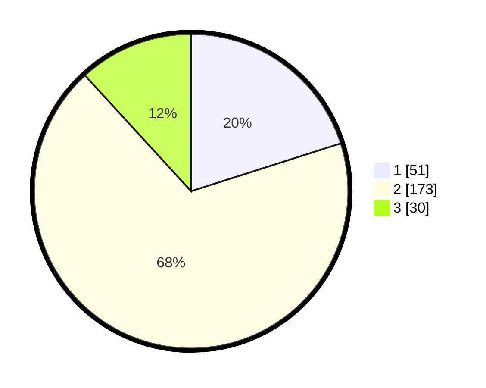

# Hasil

## Grafik

## Tabel

| No. | Nama Paslon    | Suara | Suara (raw) | Persentase |
|:--- |:-------------- | -----:| -----------:| ----------:|
| 1   | ANIES MUHAIMIN | 51    | [51][p-1]   | 20,08      |
| 2   | PRABOWO GIBRAN | 173   | [173][p-2]  | 68,11      |
| 3   | GANJAR MAHFUD  | 30    | [30][p-3]   | 11,81      |

[p-1]: https://github.com/gigit-pemilu/pemilu-2024-35-jawa-timur/blob/main/pilpres/hitung-suara/sub/35-jawa-timur/sub/09-jember/sub/21-sumbersari/sub/1004-karangrejo/sub/008-tps/sub/paslon-1.txt
[p-2]: https://github.com/gigit-pemilu/pemilu-2024-35-jawa-timur/blob/main/pilpres/hitung-suara/sub/35-jawa-timur/sub/09-jember/sub/21-sumbersari/sub/1004-karangrejo/sub/008-tps/sub/paslon-2.txt
[p-3]: https://github.com/gigit-pemilu/pemilu-2024-35-jawa-timur/blob/main/pilpres/hitung-suara/sub/35-jawa-timur/sub/09-jember/sub/21-sumbersari/sub/1004-karangrejo/sub/008-tps/sub/paslon-3.txt

## Foto C Plano

https://sirekap-obj-formc.kpu.go.id/527a/pemilu/ppwp/35/09/21/10/04/3509211004008-20240218-141552--39981545-688c-4912-ae22-f384f6fc4e17.jpg

https://sirekap-obj-formc.kpu.go.id/527a/pemilu/ppwp/35/09/21/10/04/3509211004008-20240218-141701--2490afa5-2cd0-46a8-9ef5-d150aa7f625d.jpg

https://sirekap-obj-formc.kpu.go.id/527a/pemilu/ppwp/35/09/21/10/04/3509211004008-20240218-141801--0f6d1510-7438-4f8a-85f7-28d6ab406c2b.jpg

## Metadata

| Key        | Value               |
| ---------- | ------------------- |
| Time Stamp | 2024-02-19 06:16:00 |

## DATA PEMILIH TETAP

Jumlah pemilih dalam DPT: **296**.
 * L: **134**.
 * P: **162**.

## DATA PENGGUNA HAK PILIH

Jumlah pengguna hak pilih dalam DPT: **273**.
 * L: **40**.
 * P: **123**.

Jumlah pengguna hak pilih dalam DPTb: **0**.
 * L: **800**.
 * P: **0**.

Jumlah pengguna hak pilih dalam DPK: **5**.
 * L: **2**.
 * P: **2**.

Jumlah pengguna hak pilih: **218**.
 * L: **42**.
 * P: **726**.

## JUMLAH SUARA SAH DAN TIDAK SAH

JUMLAH SELURUH SUARA SAH: **214**.

JUMLAH SUARA TIDAK SAH: **7**.

JUMLAH SELURUH SUARA SAH DAN SUARA TIDAK SAH: **218**.

