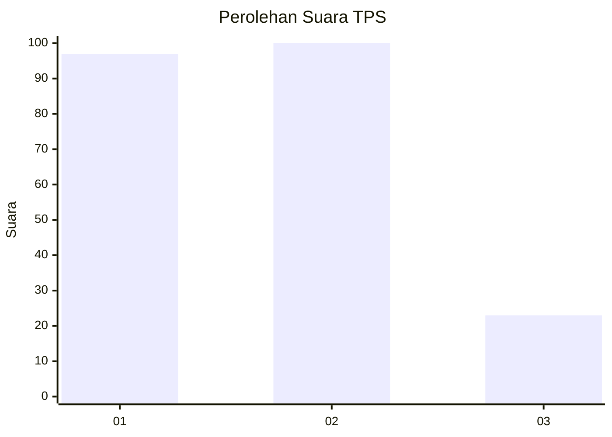
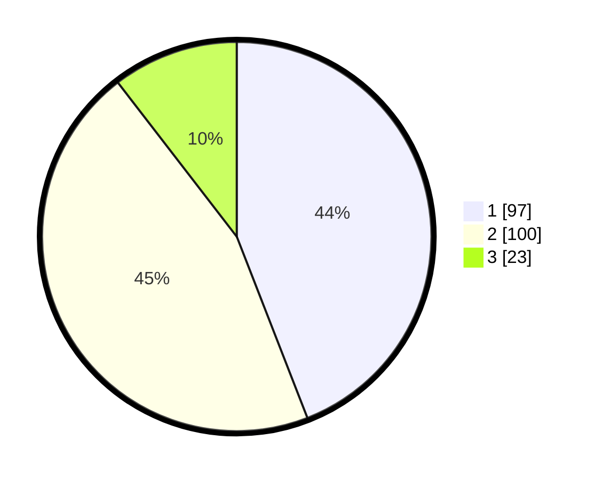

# Hasil

## Grafik

## Tabel

| No. | Nama Paslon    | Suara | Suara (raw) | Persentase |
|:--- |:-------------- | -----:| -----------:| ----------:|
| 1   | ANIES MUHAIMIN | 97    | [97][p-1]   | 44,09      |
| 2   | PRABOWO GIBRAN | 100   | [100][p-2]  | 45,45      |
| 3   | GANJAR MAHFUD  | 23    | [23][p-3]   | 10,45      |

[p-1]: https://github.com/gigit-pemilu/pemilu-2024/blob/main/pilpres/hitung-suara/sub/35-jawa-timur/sub/09-jember/sub/21-sumbersari/sub/1004-karangrejo/sub/014-tps/sub/paslon-1.txt
[p-2]: https://github.com/gigit-pemilu/pemilu-2024/blob/main/pilpres/hitung-suara/sub/35-jawa-timur/sub/09-jember/sub/21-sumbersari/sub/1004-karangrejo/sub/014-tps/sub/paslon-2.txt
[p-3]: https://github.com/gigit-pemilu/pemilu-2024/blob/main/pilpres/hitung-suara/sub/35-jawa-timur/sub/09-jember/sub/21-sumbersari/sub/1004-karangrejo/sub/014-tps/sub/paslon-3.txt

## Foto C Plano

https://sirekap-obj-formc.kpu.go.id/77c4/pemilu/ppwp/35/09/21/10/04/3509211004014-20240218-150314--4f18d80d-8ced-4527-9fab-52f26cd2be34.jpg

https://sirekap-obj-formc.kpu.go.id/77c4/pemilu/ppwp/35/09/21/10/04/3509211004014-20240218-150723--f3d9c861-83f9-4cc3-8315-8c1bd4bd560c.jpg

https://sirekap-obj-formc.kpu.go.id/77c4/pemilu/ppwp/35/09/21/10/04/3509211004014-20240218-150441--be553b89-9804-4d8e-862b-904d6d731475.jpg

## Metadata

| Key        | Value               |
| ---------- | ------------------- |
| Time Stamp | 2024-02-19 06:16:00 |

## DATA PEMILIH TETAP

Jumlah pemilih dalam DPT: **285**.
 * L: **140**.
 * P: **141**.

## DATA PENGGUNA HAK PILIH

Jumlah pengguna hak pilih dalam DPT: **212**.
 * L: **102**.
 * P: **110**.

Jumlah pengguna hak pilih dalam DPTb: **406**.
 * L: **7**.
 * P: **7**.

Jumlah pengguna hak pilih dalam DPK: **5**.
 * L: **742**.
 * P: **47**.

Jumlah pengguna hak pilih: **227**.
 * L: **107**.
 * P: **119**.

## JUMLAH SUARA SAH DAN TIDAK SAH

JUMLAH SELURUH SUARA SAH: **320**.

JUMLAH SUARA TIDAK SAH: **3**.

JUMLAH SELURUH SUARA SAH DAN SUARA TIDAK SAH: **7**.

