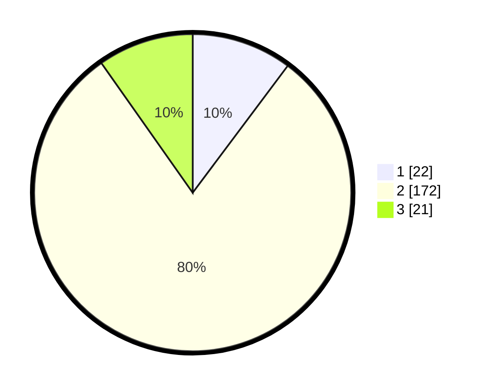

# Hasil

## Grafik

## Tabel

| No. | Nama Paslon    | Suara | Suara (raw) | Persentase |
|:--- |:-------------- | -----:| -----------:| ----------:|
| 1   | ANIES MUHAIMIN | 22    | [22][p-1]   | 10,23      |
| 2   | PRABOWO GIBRAN | 172   | [172][p-2]  | 80,00      |
| 3   | GANJAR MAHFUD  | 21    | [21][p-3]   | 9,77       |

[p-1]: https://github.com/gigit-pemilu/pemilu-2024-35-jawa-timur/blob/main/pilpres/hitung-suara/sub/35-jawa-timur/sub/09-jember/sub/21-sumbersari/sub/1004-karangrejo/sub/030-tps/sub/paslon-1.txt
[p-2]: https://github.com/gigit-pemilu/pemilu-2024-35-jawa-timur/blob/main/pilpres/hitung-suara/sub/35-jawa-timur/sub/09-jember/sub/21-sumbersari/sub/1004-karangrejo/sub/030-tps/sub/paslon-2.txt
[p-3]: https://github.com/gigit-pemilu/pemilu-2024-35-jawa-timur/blob/main/pilpres/hitung-suara/sub/35-jawa-timur/sub/09-jember/sub/21-sumbersari/sub/1004-karangrejo/sub/030-tps/sub/paslon-3.txt

## Foto C Plano

https://sirekap-obj-formc.kpu.go.id/308e/pemilu/ppwp/35/09/21/10/04/3509211004030-20240214-191539--7fb6c7bb-bd89-48ef-9eae-090bee3207e3.jpg

https://sirekap-obj-formc.kpu.go.id/308e/pemilu/ppwp/35/09/21/10/04/3509211004030-20240214-191553--9ce6e341-01b8-4fd1-9adb-1addc2161b0f.jpg

https://sirekap-obj-formc.kpu.go.id/308e/pemilu/ppwp/35/09/21/10/04/3509211004030-20240214-191602--f1882f81-0552-43f0-9228-0c841e15a9be.jpg

## Metadata

| Key        | Value               |
| ---------- | ------------------- |
| Time Stamp | 2024-02-15 15:00:29 |

