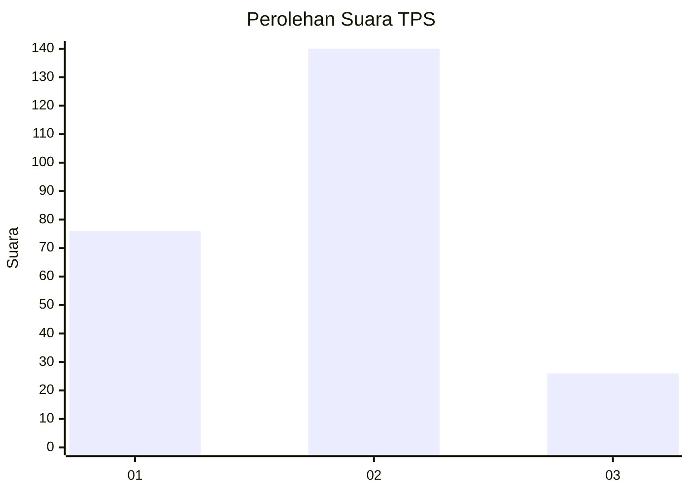
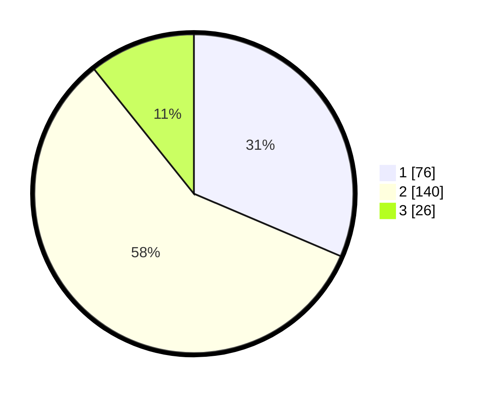

# Hasil

## Grafik

## Tabel

| No. | Nama Paslon    | Suara | Suara (raw) | Persentase |
|:--- |:-------------- | -----:| -----------:| ----------:|
| 1   | ANIES MUHAIMIN | 76    | [76][p-1]   | 31,40      |
| 2   | PRABOWO GIBRAN | 140   | [140][p-2]  | 57,85      |
| 3   | GANJAR MAHFUD  | 26    | [26][p-3]   | 10,74      |

[p-1]: https://github.com/gigit-pemilu/pemilu-2024/blob/main/pilpres/hitung-suara/sub/35-jawa-timur/sub/09-jember/sub/21-sumbersari/sub/1004-karangrejo/sub/048-tps/sub/paslon-1.txt
[p-2]: https://github.com/gigit-pemilu/pemilu-2024/blob/main/pilpres/hitung-suara/sub/35-jawa-timur/sub/09-jember/sub/21-sumbersari/sub/1004-karangrejo/sub/048-tps/sub/paslon-2.txt
[p-3]: https://github.com/gigit-pemilu/pemilu-2024/blob/main/pilpres/hitung-suara/sub/35-jawa-timur/sub/09-jember/sub/21-sumbersari/sub/1004-karangrejo/sub/048-tps/sub/paslon-3.txt

## Foto C Plano

https://sirekap-obj-formc.kpu.go.id/b61f/pemilu/ppwp/35/09/21/10/04/3509211004048-20240214-193012--5e336957-f83f-4ce4-9717-0b99311a48f3.jpg

https://sirekap-obj-formc.kpu.go.id/b61f/pemilu/ppwp/35/09/21/10/04/3509211004048-20240214-193142--9efc950f-08d6-44f4-ae0c-9a049e3fe0eb.jpg

https://sirekap-obj-formc.kpu.go.id/b61f/pemilu/ppwp/35/09/21/10/04/3509211004048-20240214-193233--5fca553c-e00a-4d40-96b7-c9a4a7488085.jpg

## Metadata

| Key        | Value               |
| ---------- | ------------------- |
| Time Stamp | 2024-02-21 21:00:04 |

