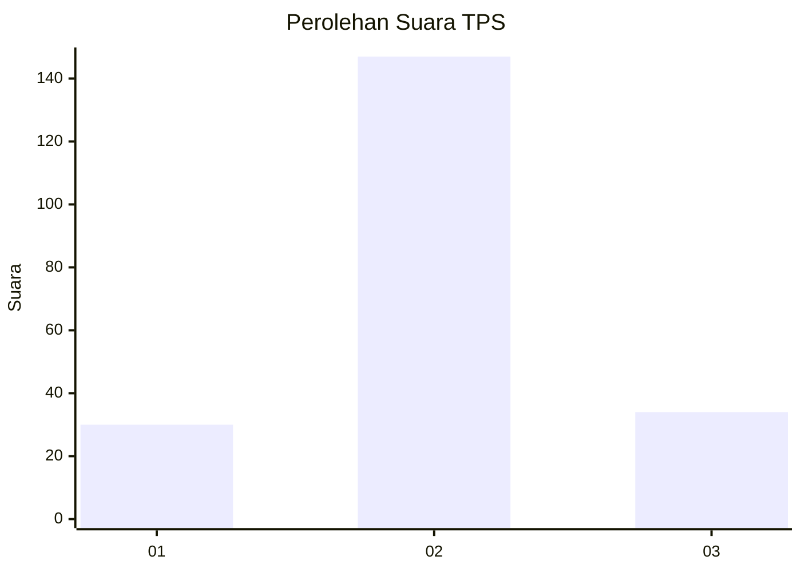
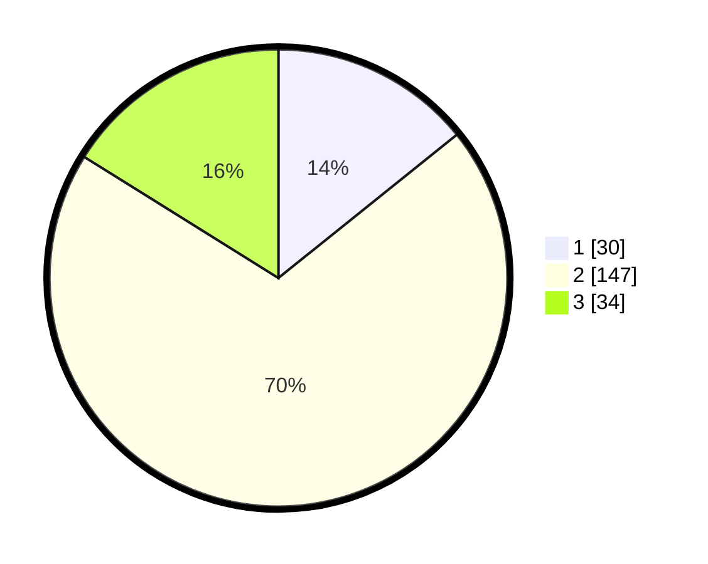

# Hasil

## Grafik

## Tabel

| No. | Nama Paslon    | Suara | Suara (raw) | Persentase |
|:--- |:-------------- | -----:| -----------:| ----------:|
| 1   | ANIES MUHAIMIN | 30    | [30][p-1]   | 14,22      |
| 2   | PRABOWO GIBRAN | 147   | [147][p-2]  | 69,67      |
| 3   | GANJAR MAHFUD  | 34    | [34][p-3]   | 16,11      |

[p-1]: https://github.com/gigit-pemilu/pemilu-2024/blob/main/pilpres/hitung-suara/sub/35-jawa-timur/sub/09-jember/sub/21-sumbersari/sub/1005-tegalgede/sub/004-tps/sub/paslon-1.txt
[p-2]: https://github.com/gigit-pemilu/pemilu-2024/blob/main/pilpres/hitung-suara/sub/35-jawa-timur/sub/09-jember/sub/21-sumbersari/sub/1005-tegalgede/sub/004-tps/sub/paslon-2.txt
[p-3]: https://github.com/gigit-pemilu/pemilu-2024/blob/main/pilpres/hitung-suara/sub/35-jawa-timur/sub/09-jember/sub/21-sumbersari/sub/1005-tegalgede/sub/004-tps/sub/paslon-3.txt

## Foto C Plano

https://sirekap-obj-formc.kpu.go.id/5d75/pemilu/ppwp/35/09/21/10/05/3509211005004-20240214-141631--0a2a1b24-a922-46eb-b5fc-9afea16a3b30.jpg

https://sirekap-obj-formc.kpu.go.id/5d75/pemilu/ppwp/35/09/21/10/05/3509211005004-20240215-005219--16ac2026-f5be-4c3d-8fcf-21f67bf42dbb.jpg

https://sirekap-obj-formc.kpu.go.id/5d75/pemilu/ppwp/35/09/21/10/05/3509211005004-20240215-005233--8d6aaaf6-a6dc-4939-92f9-f8454eec988b.jpg

## Metadata

| Key        | Value               |
| ---------- | ------------------- |
| Time Stamp | 2024-02-15 23:29:50 |

