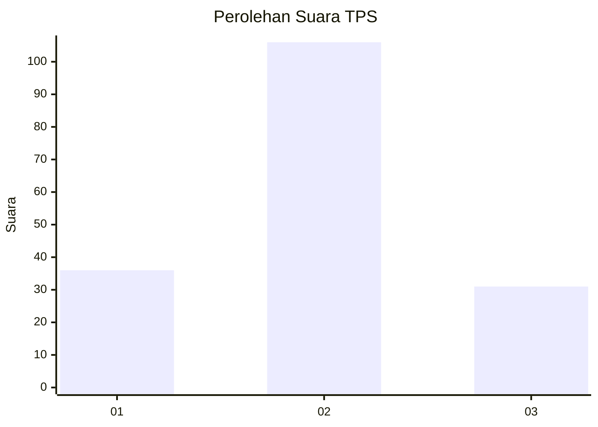

# Hasil

## Grafik

## Tabel

| No. | Nama Paslon    | Suara | Suara (raw) | Persentase |
|:--- |:-------------- | -----:| -----------:| ----------:|
| 1   | ANIES MUHAIMIN | 36    | [36][p-1]   | 20,81      |
| 2   | PRABOWO GIBRAN | 106   | [106][p-2]  | 61,27      |
| 3   | GANJAR MAHFUD  | 31    | [31][p-3]   | 17,92      |

[p-1]: https://github.com/gigit-pemilu/pemilu-2024/blob/main/pilpres/hitung-suara/sub/35-jawa-timur/sub/09-jember/sub/21-sumbersari/sub/1005-tegalgede/sub/013-tps/sub/paslon-1.txt
[p-2]: https://github.com/gigit-pemilu/pemilu-2024/blob/main/pilpres/hitung-suara/sub/35-jawa-timur/sub/09-jember/sub/21-sumbersari/sub/1005-tegalgede/sub/013-tps/sub/paslon-2.txt
[p-3]: https://github.com/gigit-pemilu/pemilu-2024/blob/main/pilpres/hitung-suara/sub/35-jawa-timur/sub/09-jember/sub/21-sumbersari/sub/1005-tegalgede/sub/013-tps/sub/paslon-3.txt

## Foto C Plano

https://sirekap-obj-formc.kpu.go.id/eb01/pemilu/ppwp/35/09/21/10/05/3509211005013-20240215-000040--db74ff05-26c2-48db-87e3-a08edaba089a.jpg

https://sirekap-obj-formc.kpu.go.id/eb01/pemilu/ppwp/35/09/21/10/05/3509211005013-20240214-235958--956901d9-2aa8-4570-bf4b-6b2cae51c556.jpg

https://sirekap-obj-formc.kpu.go.id/eb01/pemilu/ppwp/35/09/21/10/05/3509211005013-20240215-000053--2a8c1b51-bd95-47b1-80f8-71889ef49b60.jpg

## Metadata

| Key        | Value               |
| ---------- | ------------------- |
| Time Stamp | 2024-02-15 23:29:50 |

