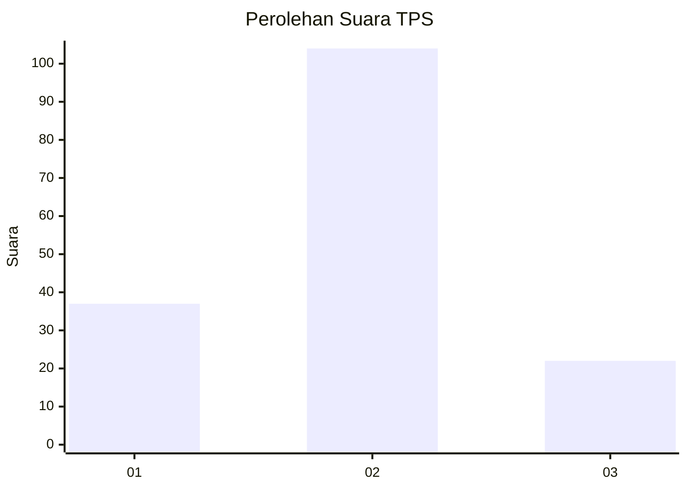
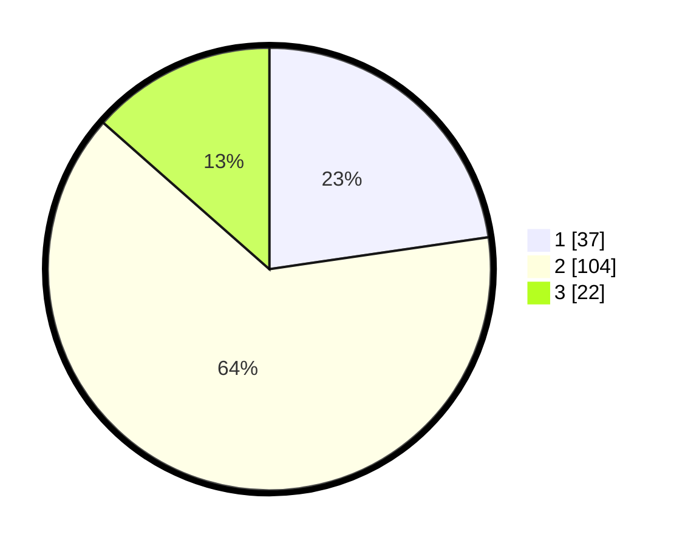

# Hasil

## Grafik

## Tabel

| No. | Nama Paslon    | Suara | Suara (raw) | Persentase |
|:--- |:-------------- | -----:| -----------:| ----------:|
| 1   | ANIES MUHAIMIN | 37    | [37][p-1]   | 22,70      |
| 2   | PRABOWO GIBRAN | 104   | [104][p-2]  | 63,80      |
| 3   | GANJAR MAHFUD  | 22    | [22][p-3]   | 13,50      |

[p-1]: https://github.com/gigit-pemilu/pemilu-2024-35-jawa-timur/blob/main/pilpres/hitung-suara/sub/35-jawa-timur/sub/09-jember/sub/21-sumbersari/sub/1005-tegalgede/sub/016-tps/sub/paslon-1.txt
[p-2]: https://github.com/gigit-pemilu/pemilu-2024-35-jawa-timur/blob/main/pilpres/hitung-suara/sub/35-jawa-timur/sub/09-jember/sub/21-sumbersari/sub/1005-tegalgede/sub/016-tps/sub/paslon-2.txt
[p-3]: https://github.com/gigit-pemilu/pemilu-2024-35-jawa-timur/blob/main/pilpres/hitung-suara/sub/35-jawa-timur/sub/09-jember/sub/21-sumbersari/sub/1005-tegalgede/sub/016-tps/sub/paslon-3.txt

## Foto C Plano

https://sirekap-obj-formc.kpu.go.id/ce41/pemilu/ppwp/35/09/21/10/05/3509211005016-20240214-204058--c69d83a3-ab59-41d7-ab2a-061e8436e797.jpg

https://sirekap-obj-formc.kpu.go.id/ce41/pemilu/ppwp/35/09/21/10/05/3509211005016-20240214-204508--2a9538af-d5e3-449e-ae7e-260d8513e9d0.jpg

https://sirekap-obj-formc.kpu.go.id/ce41/pemilu/ppwp/35/09/21/10/05/3509211005016-20240214-223840--c4f89ee8-65de-4c8c-9cb8-8bc37359f223.jpg

## Metadata

| Key        | Value               |
| ---------- | ------------------- |
| Time Stamp | 2024-02-25 15:00:00 |

