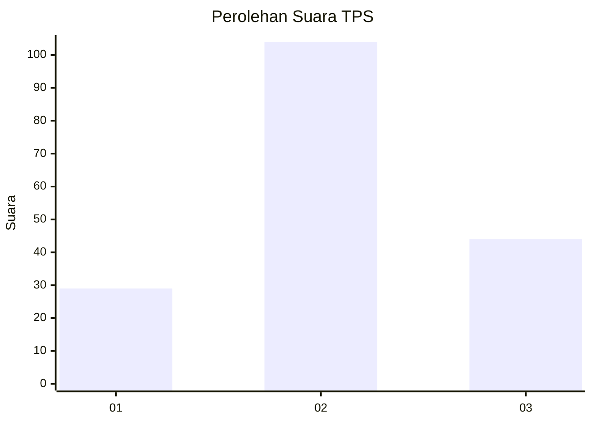
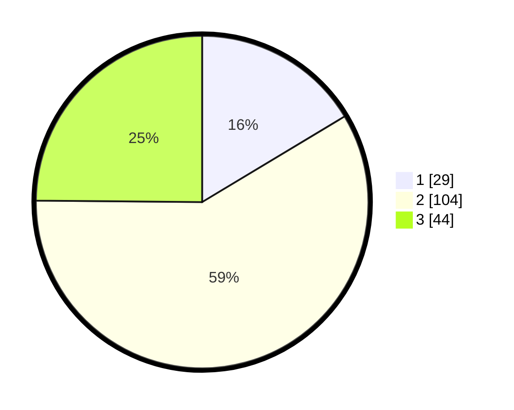

# Hasil

## Grafik

## Tabel

| No. | Nama Paslon    | Suara | Suara (raw) | Persentase |
|:--- |:-------------- | -----:| -----------:| ----------:|
| 1   | ANIES MUHAIMIN | 29    | [29][p-1]   | 16,38      |
| 2   | PRABOWO GIBRAN | 104   | [104][p-2]  | 58,76      |
| 3   | GANJAR MAHFUD  | 44    | [44][p-3]   | 24,86      |

[p-1]: https://github.com/gigit-pemilu/pemilu-2024/blob/main/pilpres/hitung-suara/sub/35-jawa-timur/sub/09-jember/sub/21-sumbersari/sub/1006-wirolegi/sub/005-tps/sub/paslon-1.txt
[p-2]: https://github.com/gigit-pemilu/pemilu-2024/blob/main/pilpres/hitung-suara/sub/35-jawa-timur/sub/09-jember/sub/21-sumbersari/sub/1006-wirolegi/sub/005-tps/sub/paslon-2.txt
[p-3]: https://github.com/gigit-pemilu/pemilu-2024/blob/main/pilpres/hitung-suara/sub/35-jawa-timur/sub/09-jember/sub/21-sumbersari/sub/1006-wirolegi/sub/005-tps/sub/paslon-3.txt

## Foto C Plano

https://sirekap-obj-formc.kpu.go.id/fd96/pemilu/ppwp/35/09/21/10/06/3509211006005-20240214-215305--09922315-1111-4a34-8f48-28101e918470.jpg

https://sirekap-obj-formc.kpu.go.id/fd96/pemilu/ppwp/35/09/21/10/06/3509211006005-20240214-215844--213d31b7-a8f9-4d11-a91d-898669fb5978.jpg

https://sirekap-obj-formc.kpu.go.id/fd96/pemilu/ppwp/35/09/21/10/06/3509211006005-20240214-220014--ced96b82-b5bc-4239-8aae-aa9d938dd2a6.jpg

## Metadata

| Key        | Value               |
| ---------- | ------------------- |
| Time Stamp | 2024-02-15 23:29:50 |

